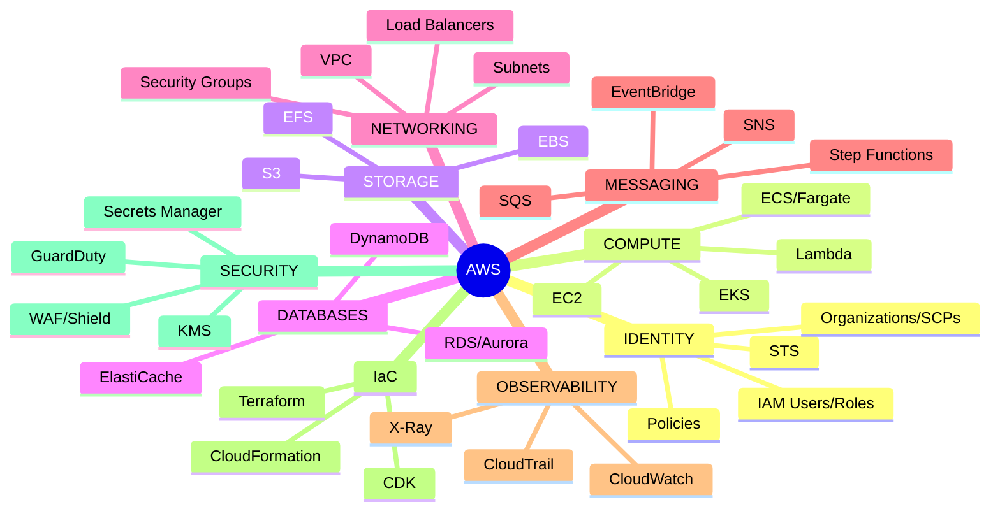
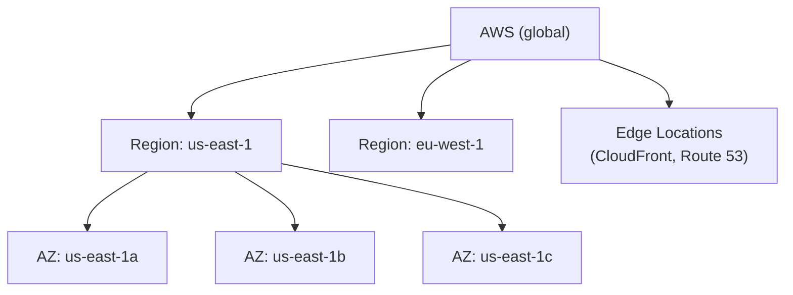
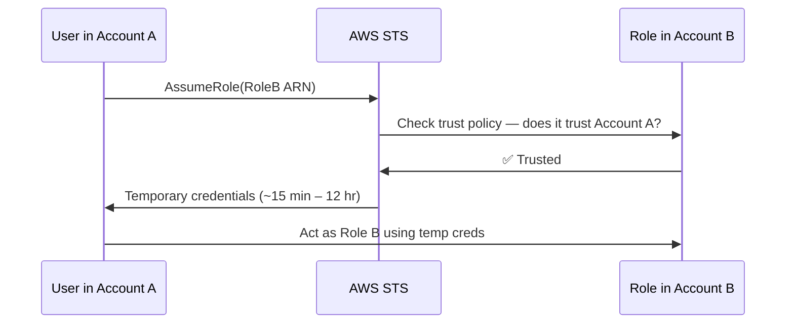
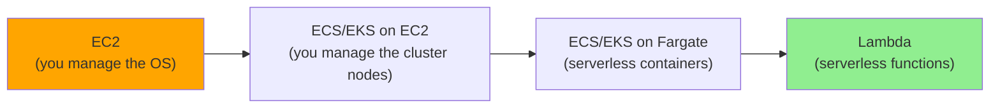
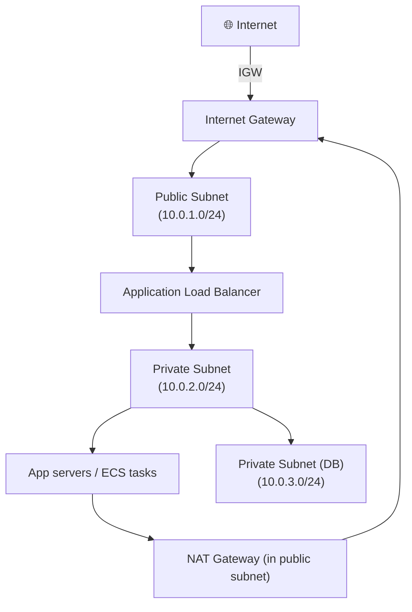
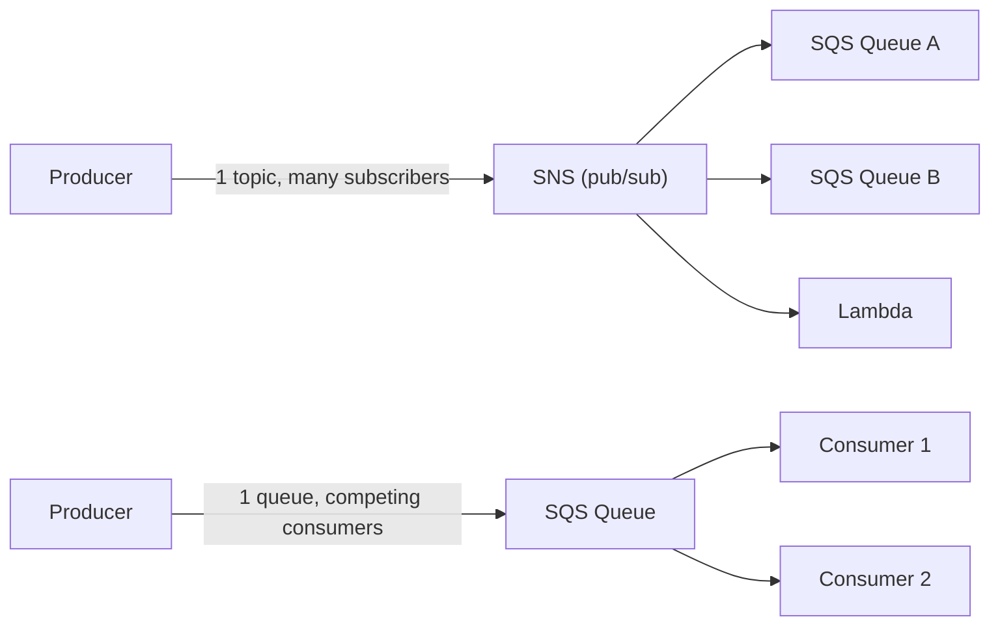
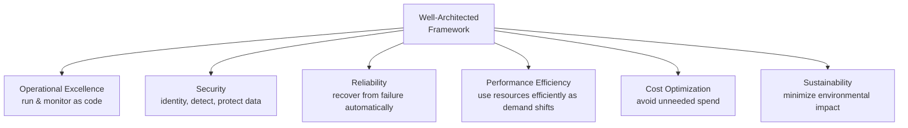

# The Complete Guide to AWS

*A senior-engineer reference: IAM, compute, storage, databases, networking, messaging, serverless, observability, IaC, security, cost, the Well-Architected Framework, debugging, and interview traps.*

> **How to read this guide.** Every topic starts with a plain **Definition**, then **Where it's used**, then the mechanics. Jargon gets a short definition in parentheses the first time it appears. Skim the mind map first to build the skeleton, then dive in.

---

## Table of Contents

1. [Mind Map — the whole landscape on one screen](#0-mindmap)
2. [Global Infrastructure](#1-global-infra)
3. [IAM — Identity & Access Management](#2-iam)
4. [Compute: EC2, Lambda, ECS, EKS, Fargate](#3-compute)
5. [Storage: S3, EBS, EFS](#4-storage)
6. [Databases: RDS, Aurora, DynamoDB, ElastiCache](#5-databases)
7. [Networking: VPC, Subnets, Gateways, Load Balancers](#6-networking)
8. [Messaging & Events: SQS, SNS, EventBridge, Step Functions](#7-messaging)
9. [Observability: CloudWatch, X-Ray, CloudTrail](#8-observability)
10. [Infrastructure as Code & Deployment](#9-iac)
11. [Security: KMS, Secrets Manager, WAF, GuardDuty](#10-security)
12. [The Well-Architected Framework](#11-well-architected)
13. [Cost Optimization](#12-cost)
14. [Common Problems & Debugging Playbook](#13-debugging)
15. [Tricky Interview Questions & Answers](#14-tricky-qa)
16. [Cheat Sheets & Decision Tables](#15-cheatsheets)

---

<a name="0-mindmap"></a>
## 1. Mind Map — the whole landscape on one screen



**Reading the map:** everything in AWS ultimately answers one of these questions — *who can do what* (IAM), *where does compute run* (EC2/Lambda/containers), *where does data live* (storage/databases), *how do things talk to each other* (networking/messaging), and *how do you know it's working* (observability). IaC and security cut across all of them.

---

<a name="1-global-infra"></a>
## 2. Global Infrastructure

**Definition.** AWS infrastructure is organized in a strict containment hierarchy: **Regions** (independent geographic areas, e.g. `us-east-1`) contain **Availability Zones** (**AZs** — physically separate data centers with independent power/networking, e.g. `us-east-1a`), and a global network of **Edge Locations** sits in front for content delivery and DNS.

**Where it's used.** Every resource you create is scoped to a region (most services) or a region + AZ (EC2, subnets) or is global (IAM, Route 53, CloudFront).



- **High availability** = spread resources across ≥2 AZs in a region, so a single data-center failure doesn't take you down.
- **Disaster recovery** = spread across regions, for when an entire region has an outage (rare, but it happens).
- **Route 53** — AWS's DNS service; also does health-checked failover routing between regions.
- **CloudFront** — AWS's **CDN** (Content Delivery Network — caches content at edge locations close to users for low latency).

---

<a name="2-iam"></a>
## 3. IAM — Identity & Access Management

**Definition.** **IAM** controls *who* (authentication) can do *what* (authorization) on *which* AWS resources. It's the AWS-specific instance of the AuthN/AuthZ split — see the [Auth/Identity guide](./Authentication-Authorization-Identity-Cryptography-Guide.md) for the general theory.

**Where it's used.** Every single AWS API call is authenticated and authorized by IAM, whether it comes from a human in the console, a script with access keys, or an EC2 instance calling S3.

### Core building blocks

| Concept | Definition |
|---|---|
| **IAM User** | A long-lived identity for a person or app, with its own credentials. ❌ Avoid for workloads — use roles. |
| **IAM Group** | A named collection of users; policies attach to the group, not each user. |
| **IAM Role** | An identity with **no permanent credentials** — anyone/anything that "assumes" it gets *temporary* credentials. ✅ The right primitive for workloads and cross-account access. |
| **Policy** | A JSON document: `{ Effect, Action, Resource, Condition }`. Attached to users/groups/roles. |
| **Trust policy** | A special policy on a *role* saying *who is allowed to assume it* (a service, an account, a user). |
| **STS** (Security Token Service) | Issues short-lived, auto-expiring credentials when a role is assumed. Short-lived = smaller blast radius if leaked. |

### Policy anatomy

```json
{
  "Version": "2012-10-17",
  "Statement": [
    {
      "Effect": "Allow",
      "Action": ["s3:GetObject", "s3:PutObject"],
      "Resource": "arn:aws:s3:::my-bucket/*",
      "Condition": {
        "StringEquals": { "aws:PrincipalTag/team": "payments" }
      }
    }
  ]
}
```
- **ARN** (Amazon Resource Name) — the globally unique ID for any AWS resource: `arn:aws:s3:::my-bucket/*`.
- **Condition keys** (like `aws:PrincipalTag`) turn IAM into **ABAC** (Attribute-Based Access Control, §14 of the Auth guide) — grant access based on tags instead of hand-listing every resource.
- **Explicit deny always wins** — if *any* applicable policy denies, the request is denied, no matter how many other policies allow it.
- **Default deny** — with no matching `Allow`, the request is denied. Permissions are additive only (except explicit `Deny`).

### Policy types
- **Identity-based policy** — attached to a user/group/role ("what can *I* do").
- **Resource-based policy** — attached to the resource itself, e.g. an S3 bucket policy ("who can access *me*"). The only way to grant *cross-account* access without the other account assuming a role.
- **Permissions boundary** — a policy that caps the *maximum* permissions a role/user can ever have, even if their identity policy grants more. Used to let teams self-serve IAM roles safely.
- **SCP** (Service Control Policy) — set at the **AWS Organizations** level; caps what an entire account (or OU) can do, regardless of any IAM policy inside it. SCPs never *grant* — they only narrow what's possible.

### Assuming a role (cross-account access)



**Best practice:** humans authenticate via **SSO/Identity Center** (federated, no long-lived IAM users); workloads use **IAM Roles** (EC2 instance profiles, Lambda execution roles, **IRSA** for EKS pods). Rotate/avoid static access keys entirely where possible — a leaked long-lived key is the #1 cause of AWS account compromise (classic incident: keys pushed to public GitHub → crypto-mining bill overnight).

---

<a name="3-compute"></a>
## 4. Compute: EC2, Lambda, ECS, EKS, Fargate

**Definition.** AWS's compute options span a spectrum from "you manage the OS" to "you manage nothing but code."



| Service | Definition | Best for |
|---|---|---|
| **EC2** (Elastic Compute Cloud) | Virtual machines (**instances**) you fully control | Long-running apps, custom OS/kernel needs, lift-and-shift |
| **Lambda** | Run a function in response to an event; you never see a server | Event-driven glue code, APIs with spiky/low traffic, short tasks (≤15 min) |
| **ECS** (Elastic Container Service) | AWS's own container orchestrator | Teams that want containers without Kubernetes complexity |
| **EKS** (Elastic Kubernetes Service) | Managed Kubernetes control plane | Teams standardized on Kubernetes / multi-cloud portability |
| **Fargate** | Serverless compute *for containers* — no EC2 nodes to patch, works with both ECS and EKS | Containerized workloads without managing servers |

### EC2 essentials
- **AMI** (Amazon Machine Image) — the template (OS + packages) an instance boots from.
- **Instance type** — `t3.micro`, `m5.large`, etc. Letter = family (t=burstable/general, m=general, c=compute-optimized, r=memory-optimized, g/p=GPU), number = generation, size = vCPU/RAM.
- **Instance store vs EBS** — instance store is ephemeral disk physically attached to the host (gone on stop/terminate); EBS (§5) is network-attached, persistent.
- **Auto Scaling Group (ASG)** — automatically adds/removes instances based on demand or schedule, keeps a minimum healthy count.
- **Launch template** — the reusable "recipe" (AMI, instance type, security groups, user data) an ASG uses to launch instances.
- **Spot instances** — spare EC2 capacity at up to ~90% discount; AWS can reclaim it with ~2 min notice. Great for fault-tolerant/batch workloads, never for stateful primary databases.

### Lambda essentials
- **Trigger** — what invokes the function: API Gateway, S3 event, SQS message, EventBridge schedule, etc.
- **Cold start** — the latency penalty when Lambda has to provision a fresh execution environment for the first invocation in a while. Mitigate with **provisioned concurrency** (pre-warmed instances) for latency-sensitive paths.
- **Execution role** — the IAM role the function assumes to call other AWS services; least-privilege this per function.
- **Concurrency limit** — caps how many instances of a function run simultaneously; a runaway function can exhaust the account-wide limit and starve other functions.

### Container orchestration
- **Task definition** (ECS) / **Pod spec** (EKS) — declares what container image(s), CPU/memory, and networking a unit of work needs.
- **Service** — keeps a desired number of tasks/pods running, replacing failed ones.
- **Sidecar** — a helper container running alongside the main one in the same task/pod (e.g., a service-mesh proxy, a log shipper).

---

<a name="4-storage"></a>
## 5. Storage: S3, EBS, EFS

**Definition.** Three storage services for three different attachment models: **object** (S3, accessed over HTTP, attached to nothing), **block** (EBS, a raw virtual disk attached to one instance), **file** (EFS, a shared network filesystem attached to many instances at once).

| | **S3** | **EBS** | **EFS** |
|---|---|---|---|
| Type | Object storage | Block storage (virtual disk) | Managed NFS file system |
| Attached to | Nothing — accessed via API/HTTP | One EC2 instance at a time (usually) | Many instances/AZs simultaneously |
| Durability | 11 nines, replicated across ≥3 AZs | Replicated within one AZ | Replicated across AZs |
| Typical use | Static assets, backups, data lakes, logs | Instance root/data volumes, databases | Shared config, home directories, CMS uploads |

### S3 essentials
- **Bucket** — a globally-named container for objects (key-value pairs, where the "key" is the full path-like string).
- **Storage classes** — trade cost against retrieval latency/frequency:

| Class | Use case |
|---|---|
| **S3 Standard** | Frequently accessed data |
| **S3 Standard-IA** (Infrequent Access) | Accessed monthly, needs millisecond retrieval |
| **S3 One Zone-IA** | Same, but you're OK losing it if one AZ fails (cheaper) |
| **S3 Glacier Instant/Flexible/Deep Archive** | Long-term archive; retrieval from minutes to hours, cheapest storage |
| **S3 Intelligent-Tiering** | AWS auto-moves objects between tiers based on access patterns |

- **Versioning** — keeps every version of an object; protects against accidental overwrite/delete.
- **Lifecycle policy** — automatically transitions/expires objects by age (e.g., move to Glacier after 90 days).
- **Bucket policy vs IAM policy** — a resource-based policy on the bucket itself; needed for cross-account or public access, and evaluated together with any IAM identity policy (both must allow).
- **Pre-signed URL** — a time-limited URL that grants temporary access to a private object without making it public or requiring the caller to have AWS credentials.
- **S3 is famously eventually-consistent for overwrite-then-read in the old model** — as of Dec 2020, S3 gives **strong read-after-write consistency** for all operations. (A frequently-outdated interview fact — know the current answer.)

### EBS essentials
- **Volume types** — `gp3` (general-purpose SSD, the default choice), `io2` (provisioned IOPS, for databases needing guaranteed performance), `st1`/`sc1` (throughput-optimized HDD, for big sequential workloads/logs).
- **Snapshot** — an incremental, point-in-time backup of a volume, stored in S3 behind the scenes.
- An EBS volume lives in **one AZ** — to survive an AZ failure you need a snapshot-restore or replication into another AZ.

---

<a name="5-databases"></a>
## 6. Databases: RDS, Aurora, DynamoDB, ElastiCache

**Definition.** Managed database services so you don't run your own DB server: **RDS/Aurora** for relational (SQL) workloads, **DynamoDB** for key-value/NoSQL at any scale, **ElastiCache** for in-memory caching.

| | **RDS** | **Aurora** | **DynamoDB** | **ElastiCache** |
|---|---|---|---|---|
| Model | Managed SQL (Postgres, MySQL, etc.) | AWS's own MySQL/Postgres-compatible engine | Managed NoSQL key-value/document | Managed Redis/Memcached |
| Scaling | Vertical (bigger instance) + read replicas | Storage auto-scales; fast read replicas | Horizontal, near-infinite, pay-per-request or provisioned | Vertical + cluster mode for horizontal |
| Best for | Traditional relational apps, existing SQL codebases | RDS workloads that need more scale/resilience | High-scale, low-latency key lookups, serverless apps | Session stores, leaderboard/rate-limit counters, query caching |

- **Multi-AZ** (RDS) — a synchronously replicated standby in another AZ; automatic failover on primary failure. This is for *availability*, not read scaling.
- **Read replica** — an asynchronously replicated copy you can query for read traffic; scales reads, doesn't help availability the same way (replica lag exists).
- **Aurora** decouples storage from compute — storage is a distributed, self-healing layer shared across up to 15 read replicas, which is why Aurora replicas are much faster to spin up/fail over to than plain RDS replicas.
- **DynamoDB partition key** — determines which physical partition an item lives on; a poorly chosen key (e.g., a low-cardinality status field) creates a **hot partition** that throttles under load.
- **DynamoDB Streams** — a change-log of item-level modifications, consumable like an event stream (commonly wired to Lambda).
- **DAX** (DynamoDB Accelerator) — an in-memory read-through cache purpose-built in front of DynamoDB.

---

<a name="6-networking"></a>
## 7. Networking: VPC, Subnets, Gateways, Load Balancers

**Definition.** A **VPC** (Virtual Private Cloud) is your own logically isolated network inside AWS — you define the IP range, subnets, routing, and who can reach what.



| Concept | Definition |
|---|---|
| **Subnet** | A slice of the VPC's IP range, pinned to one AZ. **Public** = has a route to an Internet Gateway. **Private** = doesn't. |
| **Route table** | Rules deciding where traffic from a subnet goes next. |
| **Internet Gateway (IGW)** | Lets a VPC's resources reach (and be reached from) the public internet. |
| **NAT Gateway** | Lets *private*-subnet resources initiate outbound internet traffic (e.g., to pull updates) without being reachable from the internet. |
| **Security Group** | A **stateful** virtual firewall attached to a resource (EC2, RDS, etc.) — if you allow inbound, the matching outbound response is automatically allowed. |
| **Network ACL (NACL)** | A **stateless** firewall attached to a *subnet* — inbound and outbound rules are evaluated independently. Rarely need to touch these beyond defaults. |
| **VPC Peering** | Direct, private network connection between two VPCs (non-transitive — peering A↔B and B↔C does *not* give A↔C). |
| **Transit Gateway** | A hub that connects many VPCs/on-prem networks together (transitively), replacing a mesh of peering connections. |
| **VPC Endpoint** | Lets resources reach an AWS service (S3, DynamoDB, etc.) without traffic leaving the VPC / crossing the public internet. |

### Load balancers

| Type | Layer | Use for |
|---|---|---|
| **ALB** (Application Load Balancer) | L7 (HTTP/HTTPS) | Web apps, path/host-based routing, WebSockets |
| **NLB** (Network Load Balancer) | L4 (TCP/UDP) | Extreme throughput/low latency, static IPs, non-HTTP protocols |
| **Classic LB** | Legacy | Don't use for new workloads |

**Security group vs NACL, the interview trap:** a security group can only *allow* (default deny, and it's stateful so you rarely write explicit outbound rules); a NACL can both *allow and deny*, and is stateless, so you must write rules for both directions. Most designs leave NACLs at their permissive default and do all the real filtering with security groups.

---

<a name="7-messaging"></a>
## 8. Messaging & Events: SQS, SNS, EventBridge, Step Functions

**Definition.** Decoupling services so producers and consumers don't need to know about each other, run at different speeds, or even be online at the same time.



| Service | Model | Definition |
|---|---|---|
| **SQS** (Simple Queue Service) | Point-to-point queue | A durable buffer; each message is processed by **one** consumer (competing-consumers pattern). **Standard** = at-least-once, best-effort ordering, near-infinite throughput. **FIFO** = exactly-once processing + strict ordering, capped throughput. |
| **SNS** (Simple Notification Service) | Pub/sub (fan-out) | One message published to a **topic** is delivered to *every* subscriber (SQS queues, Lambda, HTTP endpoints, email). |
| **EventBridge** | Event bus / router | Routes structured events by content-based rules to many targets; the backbone for event-driven architectures and SaaS-to-SaaS integrations. |
| **Step Functions** | Workflow orchestration | A state machine that chains Lambda/ECS/API calls with retries, branching, and parallel steps — for multi-step business processes, not just messaging. |

- **Visibility timeout** (SQS) — once a consumer reads a message, it becomes invisible to other consumers for this window; if the consumer doesn't delete it in time (crash, slow processing), it reappears for someone else to try. Set it comfortably above your worst-case processing time.
- **Dead-letter queue (DLQ)** — after a message fails processing N times, it's moved here instead of retried forever, so poison messages don't block the queue.
- **SNS + SQS fan-out** is the classic pattern for "many services need to react to the same event, independently and durably" (SNS alone doesn't persist messages for offline consumers; wrapping each subscriber in its own SQS queue does).

---

<a name="8-observability"></a>
## 9. Observability: CloudWatch, X-Ray, CloudTrail

**Definition.** Three different questions, three different tools: **CloudWatch** = "what's the system doing" (metrics/logs/alarms), **X-Ray** = "why was this one request slow" (distributed tracing), **CloudTrail** = "who did what" (API audit log).

| Service | Answers | Definition |
|---|---|---|
| **CloudWatch Metrics** | Is CPU/latency/error-rate healthy? | Time-series numeric data, with **Alarms** that trigger notifications/actions on thresholds |
| **CloudWatch Logs** | What did the app print? | Centralized log aggregation; **Logs Insights** lets you query them |
| **CloudWatch Dashboards** | What's the overall picture? | Custom visual boards combining metrics from many services |
| **X-Ray** | Where in this request's call chain did time go? | Distributed **tracing** — follows one request across service boundaries, shows a timeline/service-map |
| **CloudTrail** | Who called `DeleteBucket` and when? | An immutable audit log of every API call made in the account — essential for security investigations and compliance |

**A production rule of thumb:** if you can't answer "is it broken right now" and "why did that one request fail" within a couple of minutes, you don't have observability, you have logs.

---

<a name="9-iac"></a>
## 10. Infrastructure as Code & Deployment

**Definition.** **IaC** (Infrastructure as Code) means defining infrastructure in version-controlled files instead of clicking in a console, so it's repeatable, reviewable, and diffable.

| Tool | Definition | Notes |
|---|---|---|
| **CloudFormation** | AWS-native IaC, YAML/JSON templates | Deep AWS integration, free, verbose |
| **CDK** (Cloud Development Kit) | Write CloudFormation using a real programming language (TypeScript, Python, etc.) | Compiles down to CloudFormation; good when you want loops/abstractions IaC languages lack |
| **Terraform** | Multi-cloud IaC in **HCL** — see the [Terraform guide](./Terraform-Guide.md) | Not AWS-native, but the most common choice across mixed/multi-cloud shops |
| **SAM** (Serverless Application Model) | A CloudFormation extension focused on Lambda/API Gateway apps | Simplifies serverless-specific boilerplate |

**Deployment strategies:**
- **Blue/Green** — stand up a full parallel ("green") environment, cut traffic over once it's verified, keep the old ("blue") one ready to roll back to instantly.
- **Canary** — shift a small percentage of traffic to the new version first, watch metrics, ramp up if healthy.
- **Rolling** — replace instances/tasks a few at a time, old and new versions coexist briefly.

**Pipeline building blocks:** **CodeCommit/GitHub** (source) → **CodeBuild** (build/test) → **CodeDeploy** (deploy) → **CodePipeline** (orchestrates the stages). Most teams now use GitHub Actions or similar instead of the native CodeSuite, wired to AWS via an IAM role assumed with **OIDC federation** (no long-lived AWS keys stored in CI).

---

<a name="10-security"></a>
## 11. Security: KMS, Secrets Manager, WAF, GuardDuty

| Service | Definition |
|---|---|
| **KMS** (Key Management Service) | Manages encryption keys; other services (S3, EBS, RDS) call it to encrypt/decrypt data. Keys never leave KMS in plaintext. |
| **Secrets Manager** | Stores secrets (DB passwords, API keys) with automatic rotation support — see the [Auth guide's Secrets Management section](./Authentication-Authorization-Identity-Cryptography-Guide.md#15-cloud-prod) for the general pattern. |
| **WAF** (Web Application Firewall) | Filters HTTP requests at the edge (attached to CloudFront/ALB/API Gateway) — blocks SQLi, XSS, bad bots, rate-limits abusive IPs. |
| **Shield** | DDoS protection; Standard is free and automatic, Advanced adds 24/7 response support and cost protection. |
| **GuardDuty** | Continuous threat detection — analyzes CloudTrail/VPC Flow Logs/DNS logs for signs of compromise (e.g., an instance suddenly talking to a crypto-mining pool). |
| **Security Hub** | Aggregates findings from GuardDuty and other tools into one compliance/security dashboard. |
| **Config** | Records resource configuration over time and flags drift from a defined compliance rule (e.g., "no S3 bucket should be public"). |

**Envelope encryption** — encrypt your data with a fast, local **data key**, then encrypt *that* key with your slow, access-controlled **KMS master key**. This is why services like S3/EBS encryption barely cost any performance: the master key only ever touches a tiny data key, not your actual gigabytes.

---

<a name="11-well-architected"></a>
## 12. The Well-Architected Framework

**Definition.** AWS's own checklist for evaluating whether a workload is built well, organized into six pillars. Interviewers love asking "how would you evaluate this architecture" — this framework is the expected shape of the answer.



| Pillar | Core question |
|---|---|
| **Operational Excellence** | Can you deploy, monitor, and run this through code and automation, not tribal knowledge? |
| **Security** | Is access least-privilege, is data encrypted, can you detect and respond to incidents? |
| **Reliability** | Does it recover automatically from a failed component, AZ, or region? |
| **Performance Efficiency** | Are you using the right resource types, and can it adapt as load changes? |
| **Cost Optimization** | Are you paying for what you actually need, with visibility into spend? |
| **Sustainability** | Are you minimizing energy/resource footprint for the workload's value? |

---

<a name="12-cost"></a>
## 13. Cost Optimization

| Lever | How it saves money |
|---|---|
| **Right-sizing** | Match instance/DB size to actual usage (CloudWatch metrics tell you if you're over-provisioned) |
| **Reserved Instances / Savings Plans** | Commit to 1–3 years of usage for a steep discount vs on-demand pricing |
| **Spot Instances** | Use spare capacity at up to ~90% off for fault-tolerant/batch work |
| **Auto Scaling** | Only run the capacity you need right now, not peak capacity 24/7 |
| **S3 lifecycle policies** | Move cold data to cheaper storage classes automatically |
| **Serverless where it fits** | Pay per invocation instead of for idle servers |
| **Tagging + Cost Explorer/Budgets** | You can't optimize what you can't attribute — tag every resource by team/project, set budget alerts |

---

<a name="13-debugging"></a>
## 14. Common Problems & Debugging Playbook

| Symptom | Likely cause | Fix |
|---|---|---|
| `AccessDenied` despite a policy that looks right | An explicit `Deny` elsewhere (SCP, permissions boundary, resource policy) is overriding it | Use IAM's **Policy Simulator** / **Access Analyzer**; remember explicit deny always wins |
| EC2/Lambda can't reach the internet | In a private subnet with no NAT Gateway, or missing route | Add a NAT Gateway + route, or add a VPC endpoint if it's only talking to AWS services |
| `Connection timed out` to RDS/EC2 | Security group doesn't allow the port from the caller's SG/IP | Add an inbound rule referencing the *caller's* security group, not a broad CIDR |
| Lambda times out intermittently | Cold start, or downstream dependency (DB, another Lambda) is slow | Increase timeout, add provisioned concurrency, check downstream latency in X-Ray |
| S3 `403` on a public-looking file | Bucket has **Block Public Access** enabled (the modern default) | Explicitly allow via bucket policy + disable the specific Block Public Access setting needed |
| Auto Scaling Group won't scale down | Scale-in protection enabled, or an alarm stuck in `ALARM` state | Check ASG instance protection settings and the scaling policy's alarm history |
| DynamoDB `ProvisionedThroughputExceededException` | Hot partition, or under-provisioned capacity | Switch to on-demand billing, or fix a low-cardinality partition key |
| CloudFormation stack stuck `UPDATE_ROLLBACK_FAILED` | A resource failed to roll back cleanly | Manually fix/remove the offending resource, then `continue-update-rollback` |

---

<a name="14-tricky-qa"></a>
## 15. Tricky Interview Questions & Answers

**Q: Security Group vs NACL?** SG = stateful, instance-level, allow-only. NACL = stateless, subnet-level, allow *and* deny. Most designs rely on SGs and leave NACLs default.

**Q: How do you give an EC2 instance access to S3 without hardcoding credentials?** Attach an **IAM role** via an instance profile; the instance fetches temporary credentials from the instance metadata service automatically.

**Q: Multi-AZ vs Read Replica in RDS?** Multi-AZ = synchronous standby for *availability/failover*, not queryable directly. Read replica = asynchronous, queryable, for *read scaling* — has replication lag, so it can serve stale data.

**Q: How does Lambda scale?** Horizontally and automatically — AWS spins up a new execution environment per concurrent invocation, up to the account/function concurrency limit. There's no "instance size" to scale vertically, only memory (which also scales CPU proportionally).

**Q: SQS Standard vs FIFO?** Standard = at-least-once delivery, best-effort ordering, unlimited throughput. FIFO = exactly-once processing, strict ordering, throughput capped (though high-throughput mode raises this significantly).

**Q: What's the difference between horizontal and vertical scaling, and where does AWS push you?** Vertical = bigger instance (has a hard ceiling, brief downtime to resize). Horizontal = more instances (near-unlimited, no downtime, needs a stateless or shared-state design). AWS's managed services (ASG, Lambda, DynamoDB) are built to make horizontal scaling the default.

**Q: Why explicit deny over implicit deny?** Implicit deny is just "nothing said yes." Explicit deny is a rule that actively says no, and it beats *every* allow anywhere else in the evaluation, even in a different account's resource policy. Use it as a hard guardrail (e.g., "deny any action outside our approved region," commonly via an SCP).

**Q: When would you choose ECS over EKS, or vice versa?** ECS: simpler, fully AWS-native, smaller learning curve, no separate control plane to manage. EKS: standard Kubernetes API, portable across clouds, richer ecosystem (Helm, operators) — worth the complexity when you need that portability or your team already knows Kubernetes.

---

<a name="15-cheatsheets"></a>
## 16. Cheat Sheets & Decision Tables

### Pick a compute option
```
Need full OS control / custom kernel        → EC2
Event-driven, short-lived, spiky traffic     → Lambda
Containers, want AWS-native simplicity       → ECS (+ Fargate to avoid managing nodes)
Containers, need Kubernetes portability      → EKS (+ Fargate to avoid managing nodes)
```

### Pick a database
```
Relational, existing SQL app                 → RDS
Relational, need extra scale/HA              → Aurora
Key-value / document, need massive scale     → DynamoDB
Sub-millisecond cache / session store        → ElastiCache
```

### Pick a messaging pattern
```
One message → one consumer (work queue)      → SQS
One message → many independent subscribers   → SNS (+ SQS per subscriber for durability)
Route events by content across many services → EventBridge
Multi-step business process with branching   → Step Functions
```

### Security checklist (fast pass)
```
1. No long-lived IAM user access keys for workloads — use roles
2. S3 buckets: Block Public Access on by default, explicit exceptions only
3. Everything encrypted at rest (KMS) and in transit (TLS)
4. Least-privilege IAM policies, reviewed with Access Analyzer
5. CloudTrail on in every account/region, GuardDuty enabled
6. Secrets in Secrets Manager, never in code or environment files
```

### Final principles
1. **IAM roles over long-lived credentials, everywhere.**
2. **Design for AZ failure by default** — Multi-AZ isn't optional for anything that matters.
3. **Least privilege, and let SCPs be the guardrail humans can't override.**
4. **Everything as code** — if it's not in a template/HCL file, it isn't reproducible.
5. **You can't fix what you can't see** — wire up CloudWatch/X-Ray/CloudTrail before you need them, not after an incident.
6. **Tag everything** — cost attribution and cleanup both depend on it.
