# The Complete Guide to Authentication, Authorization, Identity & Crypto

*A senior-engineer reference: AuthN/AuthZ, OAuth2, OIDC, SAML, JWT, RBAC/ABAC, TLS/SSL, PKI, SSH, IAM providers, cloud identity, debugging, and interview traps.*

> **How to read this guide.** Every topic starts with a plain **Definition**, then **Where it's used**, then the mechanics. Jargon gets a short definition in parentheses the first time it appears. Each section ends with **📺 Watch** — 1–2 hand-picked videos. Skim the mind maps first to build the skeleton, then dive in.

---

## Table of Contents

1. [Mind Map — the whole landscape on one screen](#0-mindmap)
2. [The One Mental Model to Rule Them All](#1-mental-model)
3. [AuthN vs AuthZ](#2-authn-vs-authz)
4. [Cryptography Primitives](#3-crypto-primitives) — hashing, symmetric, asymmetric, signatures
5. [PKI, Certificates & the Chain of Trust](#4-pki)
6. [SSL/TLS — how HTTPS actually works](#5-tls)
7. [SSH Keys](#6-ssh)
8. [Sessions vs Tokens](#7-sessions-vs-tokens)
9. [JWT — Deep Dive](#8-jwt)
10. [OAuth 2.0](#9-oauth2)
11. [OpenID Connect (OIDC)](#10-oidc)
12. [SAML 2.0](#11-saml)
13. [SAML vs OIDC — when to use what](#12-saml-vs-oidc)
14. [Authorization Models: RBAC, ABAC, ReBAC, PBAC, ACL](#13-authz-models)
15. [IAM Providers: Okta, Ping, Auth0, Entra, Cognito, Keycloak](#14-iam-providers)
16. [Cloud & Production Identity](#15-cloud-prod)
17. [Common Problems & Debugging Playbook](#16-debugging)
18. [Tricky Interview Questions & Answers](#17-tricky-qa)
19. [Cheat Sheets & Decision Tables](#18-cheatsheets)

---

<a name="0-mindmap"></a>
## 1. Mind Map — the whole landscape on one screen

```
                          IDENTITY & SECURITY
                                  │
     ┌────────────────┬──────────┼───────────┬──────────────────┐
     │                │          │           │                  │
 AUTHENTICATION  AUTHORIZATION  TRANSPORT   TRUST/PKI        CRYPTO
 (who are you?)  (what can you  SECURITY    (prove an        PRIMITIVES
     │            do?)          (private    endpoint's       (the lego bricks)
     │                │          channel)    identity)            │
     │                │          │             │            ┌─────┼─────┐
  ┌──┴───┐        ┌───┴────┐  ┌──┴───┐    ┌────┴────┐    Hashing  Symmetric
  │      │        │        │  │      │    │         │    (SHA-256,  (AES-GCM)
Passwords MFA   RBAC    ABAC TLS   mTLS  Certs     CAs   bcrypt)      │
  │      │        │        │  │      │    │         │       │    Asymmetric
Sessions  │     ReBAC   Policy SSL  (both Chain-of  Root/    │    (RSA, ECC)
  │    Tokens/     │     as-code sides  trust   Inter-   Signatures     │
  │     JWT      OAuth2         verify)         mediate  (RS256)  Key exchange
  │      │      scopes                                            (Diffie-Hellman)
Federation/SSO  │
  │      │    ┌──┴──────┐
SAML   OIDC   Access / ID /
  │      │    Refresh tokens
  └──┬───┘
 IAM PROVIDERS (Okta, Ping, Auth0, Entra, Cognito, Keycloak)
     │
 CLOUD & PROD (AWS IAM/STS, secrets mgmt, key rotation, Zero Trust)
```

````mermaid
mindmap
  root((IDENTITY & SECURITY))
    AUTHENTICATION
      Passwords
      MFA
      Sessions
      Tokens/JWT
      Federation/SSO
        SAML
        OIDC
    AUTHORIZATION
      RBAC
      ReBAC
      ABAC
      Policy as-code
      OAuth2
        scopes
    TRANSPORT SECURITY
      TLS
      SSL
        both sides verify
      mTLS
    TRUST/PKI
      Certificates
      Certificate Authorities
      Chain-of-trust
      Root/Intermediate
    CRYPTO PRIMITIVES
      Hashing
        SHA-256
        bcrypt
      Symmetric
        AES-GCM
      Asymmetric
        RSA
        ECC
      Signatures
        RS256
      Key Exchange
        Diffie-Hellman
    IAM PROVIDERS
      Okta
      Ping
      Auth0
      Entra
      Cognito
      Keycloak
    CLOUD & PROD
      AWS IAM/STS
      Secrets Management
      Key Rotation
      Zero Trust
````


**Reading the map:** the five top branches are the five questions security answers. Everything else is an implementation of one of them. Notice the dependencies flow *upward*: TLS is built on crypto primitives; JWT/OAuth ride on top of TLS; IAM providers package authentication + authorization + federation together; cloud identity wires it all into infrastructure.

> 📺 **Watch (big-picture):** [OAuth 2.0 & OpenID Connect in plain English — Nate Barbettini (OktaDev)](https://www.youtube.com/watch?v=996OiexHze0) · [What Is Single Sign-On (SSO)? — ByteByteGo](https://www.youtube.com/watch?v=O1cRJWYF-g4)

---

<a name="1-mental-model"></a>
## 2. The One Mental Model to Rule Them All

**Definition.** Security online is really four separate concerns that people constantly blur together. Keeping them apart is the single most useful habit.

| Question | Concern | Tech that answers it |
|---|---|---|
| **Who are you?** | Authentication (AuthN) | passwords, MFA, SAML, OIDC, certificates |
| **What are you allowed to do?** | Authorization (AuthZ) | OAuth2 scopes, RBAC, ABAC, policies |
| **Is this channel private & untampered?** | Transport security | TLS/SSL, mTLS |
| **Can I prove a message/endpoint is authentic?** | Integrity & trust | hashing, digital signatures, PKI/certificates |

**Where it's used.** Every login button, every `https://`, every API call, every "Sign in with Google," every corporate SSO portal is some combination of these four. When debugging, always first ask *which of the four is failing* — it instantly narrows the search.

> **The nightclub analogy** (great for interviews):
> - **Authentication** = the bouncer checking your ID. *Are you who you say you are?*
> - **Authorization** = the wristband (VIP vs general). *What can you do inside?*
> - **TLS** = a private soundproof tunnel from the street to the door so nobody eavesdrops.
> - **PKI/certificates** = the government that issued your ID; the bouncer trusts it because he trusts the government, not because he knows you.
> - **SSO** (Single Sign-On — log in once, access many apps) = one wristband that works at every club in the group.

---

<a name="2-authn-vs-authz"></a>
## 3. AuthN vs AuthZ

**Definition.** **Authentication (AuthN)** proves *identity* ("you are Alice"). **Authorization (AuthZ)** decides *permissions* ("Alice may delete this file"). They are distinct steps, always in that order.

**Where it's used.** Every protected system. AuthN happens at login; AuthZ happens on every subsequent action. A common architecture bug is mixing them — e.g., checking "is the user logged in?" but never "is this *their* data?"

```
Request ──► [ AuthN ] ──► identity established ──► [ AuthZ ] ──► allowed? ──► resource
             (who?)                                 (can they?)
```

**Factors of authentication** — **MFA** (Multi-Factor Authentication) means combining ≥2 of these:
- **Something you know** — password, PIN.
- **Something you have** — phone (a one-time code or push), hardware key (e.g., a YubiKey — a USB security device), smart card.
- **Something you are** — fingerprint, face, retina (biometrics).
- (Sometimes) **somewhere you are** — geolocation / network context.

**Tricky confusion:** *"Is OAuth2 authentication?"* — **No.** OAuth2 is an **authorization** framework (delegated access). Authentication is added on top by **OIDC**. Using raw OAuth2 as a login mechanism is a classic anti-pattern: it tells you *what a token can access*, not *who the user is*.

> 📺 **Watch:** [OAuth 2.0 & OpenID Connect in plain English — OktaDev](https://www.youtube.com/watch?v=996OiexHze0) *(opens with exactly this AuthN-vs-AuthZ distinction)* · [Role-Based vs Attribute-Based Access Control — IBM Technology](https://www.youtube.com/watch?v=rvZ35YW4t5k)

---

<a name="3-crypto-primitives"></a>
## 4. Cryptography Primitives

**Definition.** The three low-level building blocks every security protocol is made from: **hashing** (one-way fingerprints), **symmetric encryption** (one shared key), and **asymmetric encryption** (a public/private key pair). TLS, JWT, and SSH are just clever combinations of these.

**Where it's used.** Passwords (hashing), disk/data encryption (symmetric), HTTPS setup and digital signatures (asymmetric), certificates and JWTs (signatures). Understand these and the rest of the guide stops being magic.

```
        CRYPTO PRIMITIVES
        ┌──────┬──────────┬──────────┐
     Hashing  Symmetric  Asymmetric  Signatures (built from hashing + asymmetric)
     one-way  1 key      key pair    prove authenticity + integrity
```

### 4.1 Hashing (one-way)

**Definition.** A **hash function** turns any input into a fixed-size fingerprint. Properties: **deterministic** (same input → same output), **one-way** (can't reverse it), **collision-resistant** (hard to find two inputs with the same output), and **avalanche effect** (change one bit → totally different output).

**Where it's used.** Verifying file integrity, digital signatures, certificates, blockchain, and — carefully — password storage.

| Algorithm | Output | Status | Use it for |
|---|---|---|---|
| **MD5** | 128-bit | ❌ Broken (collisions found) | Non-security checksums only |
| **SHA-1** | 160-bit | ❌ Broken (2017 "SHAttered" attack) | Legacy only; being removed everywhere |
| **SHA-256 / SHA-512** | 256/512-bit | ✅ Secure | Integrity, signatures, certs, blockchain, JWT signing (HS256) |
| **SHA-3** | variable | ✅ Secure | Alternative to SHA-2 (different internal design, "Keccak") |
| **bcrypt** | — | ✅ For passwords | Password storage (deliberately slow + salted) |
| **scrypt / Argon2** | — | ✅ Best for passwords | Memory-hard, resists GPU/ASIC cracking. **Argon2id** is the modern default |

**Critical distinction interviewers love:** *"Why not store passwords with SHA-256?"* Because SHA-256 is **fast** — a GPU computes billions/sec. Password hashes must be **deliberately slow** and **salted**. Use **bcrypt/scrypt/Argon2**, never a raw fast hash. SHA-256 is for *integrity/signatures*, not *password storage*.

- **Salt** = a unique random value added per password, stored next to the hash. Defeats **rainbow tables** (precomputed hash→password lookup tables).
- **Pepper** = a secret added to *all* passwords, stored separately from the DB (e.g., in an env var or HSM). Defeats a DB-only breach.
- **HMAC** (Hash-based Message Authentication Code) = `HMAC(key, message)` — proves both integrity *and* authenticity, because only someone with the key can produce it. This is what "HS256" JWTs use.

> 📺 **Watch:** [How NOT to Store Passwords! — Computerphile](https://www.youtube.com/watch?v=8ZtInClXe1Q) · [Adding Salt to Hashing — Auth0](https://www.youtube.com/watch?v=aXHmUHPXwb4)

### 4.2 Symmetric Encryption (same key both ways)

**Definition.** One shared secret key both encrypts and decrypts. **Fast** — used for bulk data.

**Where it's used.** Encrypting the actual data inside a TLS session, disk/database encryption, file encryption.

- **AES** (Advanced Encryption Standard) — the industry workhorse (AES-128 / AES-256).
- **Mode of operation matters more than key size in practice:**
  - **GCM** (Galois/Counter Mode) — **AEAD** (Authenticated Encryption with Associated Data): gives confidentiality *and* integrity in one step. **This is what you want.** TLS 1.3 uses AES-GCM or ChaCha20-Poly1305.
  - **CBC** (Cipher Block Chaining) — older, needs a separate integrity check; vulnerable to "padding-oracle" attacks if implemented badly.
  - ❌ **ECB** (Electronic Codebook) — never use it: identical plaintext blocks produce identical ciphertext (the infamous "ECB penguin" image leak).

**The problem it can't solve alone:** *key distribution* — how do two strangers agree on a shared key over an open network? → asymmetric crypto.

### 4.3 Asymmetric Encryption (a key pair)

**Definition.** Two mathematically linked keys: a **public key** (share freely) and a **private key** (never share). What one encrypts, only the other can decrypt.

**Where it's used.** Bootstrapping TLS, digital signatures, SSH login, code signing, certificates.

- **RSA** — based on the difficulty of factoring large primes. Big keys (2048/4096-bit), slower.
- **ECC** (Elliptic Curve Cryptography, e.g., Ed25519, P-256) — same security with far smaller keys (256-bit ECC ≈ 3072-bit RSA). Faster, less bandwidth. **Preferred for new systems.**

**Two distinct uses — don't conflate them:**

```
ENCRYPTION (confidentiality):
  Anyone encrypts with your PUBLIC key → only YOU decrypt with PRIVATE key.
  "Anyone drops mail in your mailbox; only you have the key to open it."

SIGNING (authenticity + integrity):
  YOU sign with your PRIVATE key → anyone verifies with your PUBLIC key.
  "Only you can make your wax seal; anyone can confirm it's yours."
```

**Because asymmetric is slow, real systems use a hybrid:** use asymmetric crypto *once* to agree on a symmetric session key, then use fast symmetric crypto for the actual data. **This is exactly what TLS and SSH do.**

### 4.4 Digital Signatures

**Definition.** Proof that a message came from a specific private-key holder and wasn't altered.

```
Sign:    signature = encrypt( SHA256(message), sender_private_key )
Verify:  SHA256(message)  ==  decrypt( signature, sender_public_key )  ?
```

If they match: (1) the message is unaltered (hash matches), and (2) it came from the private-key holder. This underpins **certificates, JWTs (RS256), code signing, and TLS**. Note: signing does **not** hide the message — encryption hides, signing proves.

> 📺 **Watch:** [Public Key Cryptography — Computerphile](https://www.youtube.com/watch?v=GSIDS_lvRv4) · [Secret Key Exchange (Diffie-Hellman) — Computerphile](https://www.youtube.com/watch?v=NmM9HA2MQGI)

---

<a name="4-pki"></a>
## 5. PKI, Certificates & the Chain of Trust

**Definition.** **PKI** (Public Key Infrastructure) is the system that lets you trust that a public key really belongs to whom it claims — via trusted third parties (**Certificate Authorities**) that vouch for it with digital signatures.

**Where it's used.** Every HTTPS website, code signing, email signing (S/MIME), document signing, mTLS between services, VPNs.

**The problem it solves:** public-key crypto lets a stranger send you an encrypted message, but *how do you know a public key really belongs to `bankofamerica.com` and not an attacker?* A CA vouches for it.

### Core components (with definitions)
- **Certificate (X.509)** — a document binding an **identity** (a domain name) to a **public key**, **signed by a CA**. Contains: subject, public key, issuer, validity dates, **SAN** (Subject Alternative Names — the list of hostnames the cert is valid for), and the CA's signature.
- **Certificate Authority (CA)** — a trusted org (DigiCert, Let's Encrypt, etc.) that signs certs after verifying you control the domain.
- **Root CA** — self-signed; its public keys ship pre-installed in your OS/browser **trust store** (the list of CAs your device trusts). This is the anchor of trust.
- **Intermediate CA** — signed by the root; issues the actual leaf certs (roots stay offline for safety).
- **Chain of trust:**

```
  Root CA        (in your browser's trust store, self-signed)
     │ signs
  Intermediate CA
     │ signs
  Leaf certificate  (yourdomain.com)
```

Your server presents the **leaf + intermediates**; the browser walks up until it hits a trusted root. **Forgetting to serve the intermediate cert is the #1 cause of "works in Chrome, fails in curl/Java"** — some clients won't fetch a missing intermediate.

### Certificate lifecycle
1. Generate a key pair + **CSR** (Certificate Signing Request — a file containing your public key and domain).
2. CA validates domain ownership (**DV** = Domain Validated, via a DNS/HTTP challenge; **OV/EV** also validate the organization).
3. CA issues the signed cert.
4. Install on the server (leaf + chain).
5. **Renew** before expiry (Let's Encrypt = 90 days → automate with **ACME**/certbot; ACME is the automated cert-issuance protocol).
6. **Revoke** if the private key leaks → **CRL** (Certificate Revocation List — a published list of revoked certs) or **OCSP** (Online Certificate Status Protocol — a live "is this cert still valid?" check). **OCSP stapling** = the server attaches a fresh signed "still valid" proof so the client needn't call the CA.

### Cert types (use cases)
- **DV** — proves domain control. Fast, free (Let's Encrypt). Most sites.
- **OV / EV** — also validates the company. Enterprises, finance.
- **Wildcard** — `*.example.com`, covers all subdomains.
- **SAN / multi-domain** — several domains in one cert.
- **Self-signed** — you act as your own CA. Fine for internal/dev; browsers won't trust it by default.

> **War story:** A mobile app started rejecting API calls after a year. Cause: they had pinned (**certificate pinning** = hard-coding which cert to trust) the *intermediate* CA cert, and the CA rotated it. Lesson: pin the **public key** (SPKI hash), not the cert, and always pin a backup — pinning stops man-in-the-middle attacks but is a self-inflicted outage if you don't plan rotation.

> 📺 **Watch:** [Transport Layer Security (TLS) — Computerphile](https://www.youtube.com/watch?v=0TLDTodL7Lc) *(covers certs & the chain of trust)* · [Public Key Cryptography — Computerphile](https://www.youtube.com/watch?v=GSIDS_lvRv4)

---

<a name="5-tls"></a>
## 6. SSL/TLS — How HTTPS Actually Works

**Definition.** **TLS** (Transport Layer Security) — and its dead predecessor **SSL** (Secure Sockets Layer) — is the protocol that encrypts data between a client and server. It provides three things: **confidentiality** (encryption), **integrity** (tamper detection), and **authentication** (you're really talking to the right server, via its certificate). People still say "SSL cert" out of habit; it's really TLS.

**Where it's used.** Every `https://` page, secure email, VoIP, VPNs, API traffic — essentially all internet communication.

### 6.1 What happens when you hit `https://example.com`

```
1. DNS resolve example.com → IP address
2. TCP handshake (SYN, SYN-ACK, ACK)   ← reliable connection established
3. TLS handshake                        ← encryption established (below)
4. Encrypted HTTP request/response flows through the tunnel
```

### 6.2 The TLS 1.2 handshake (the classic interview answer)

# TLS Handshake Sequence Diagram
 
## Basic TLS 1.2 Handshake
 
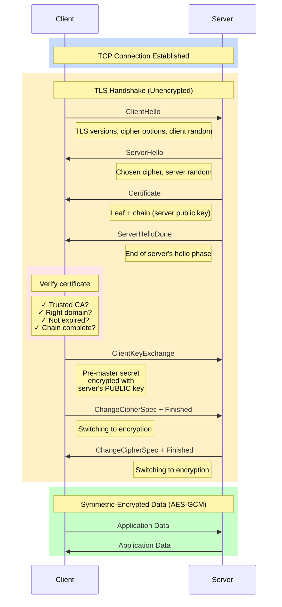
 
## TLS 1.3 Faster Handshake
 
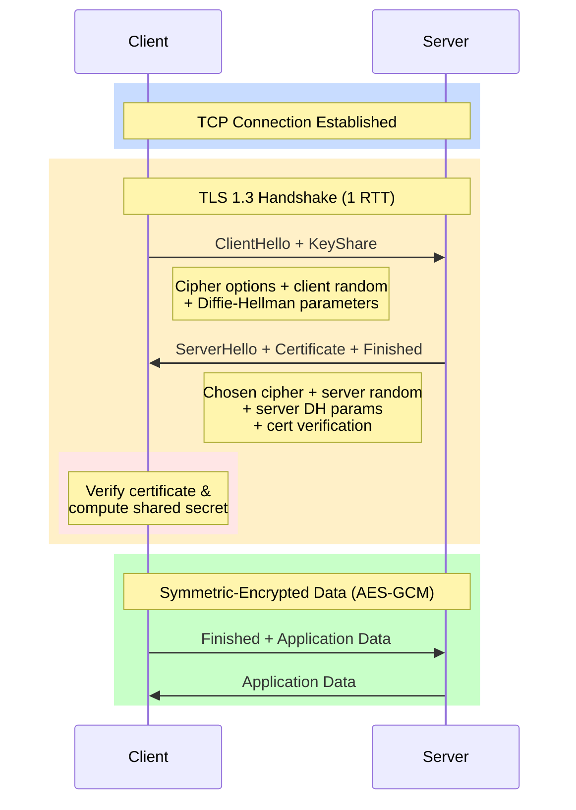
 
## Detailed Flow with Key Exchange
 
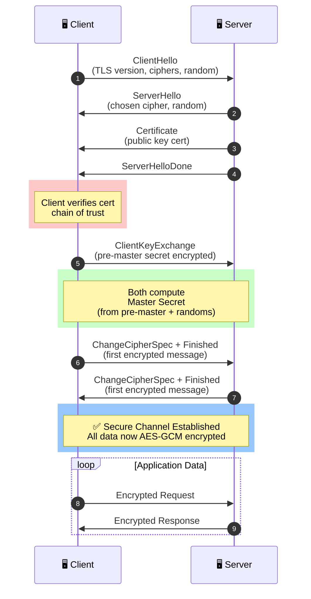

**What's really happening:** both sides derive the same **symmetric session key** from `client random + server random + pre-master secret`. Only the server (with its private key) can decrypt the pre-master secret. After that, fast AES does the work. **Asymmetric to bootstrap, symmetric for bulk** — the hybrid model in action.

### 6.3 TLS 1.3 — what changed
- **1 round trip** instead of 2 (faster); **0-RTT** resumption for repeat visits.
- **Forward secrecy is mandatory** — always uses **ECDHE** (Elliptic-Curve Diffie-Hellman Ephemeral — a key-exchange that generates a throwaway key per session). Even if the server's private key leaks *later*, past recorded sessions stay safe.
- Dropped all weak/legacy ciphers (no RSA key exchange, no CBC, no SHA-1).

> **Forward secrecy (PFS)** — a favorite interview concept. Old TLS with RSA key exchange: steal the private key → decrypt all recorded past traffic. With ECDHE: each session used an ephemeral (throwaway) key that was never transmitted, so recorded traffic can't be decrypted later. Always want PFS.

### 6.4 Cipher suite, decoded
`TLS_ECDHE_RSA_WITH_AES_128_GCM_SHA256`
- `ECDHE` — key exchange (ephemeral → forward secrecy)
- `RSA` — authentication (how the server proves identity, i.e., the cert type)
- `AES_128_GCM` — symmetric bulk encryption + built-in integrity (AEAD)
- `SHA256` — hash used in the handshake / key derivation

### 6.5 mTLS (mutual TLS)
**Definition.** Normal TLS: the *client* verifies the *server*. **mTLS**: **both** verify each other — the client also presents a certificate.

**Where it's used.** Service-to-service calls in microservices, **service meshes** (Istio, Linkerd — infra layers that manage service networking), Zero-Trust networks, high-security B2B/banking APIs. The mesh sidecar auto-issues and rotates short-lived certs so humans never touch them.

> 📺 **Watch:** [Transport Layer Security (TLS) — Computerphile](https://www.youtube.com/watch?v=0TLDTodL7Lc) · [TLS 1.2 & 1.3 Explained by Example — Hussein Nasser](https://www.youtube.com/watch?v=AlE5X1NlHgg)

---

<a name="6-ssh"></a>
## 7. SSH Keys

**Definition.** **SSH** (Secure Shell) is a protocol for secure remote login and command execution. **SSH key authentication** logs you in by proving you hold a private key that matches a public key stored on the server — no password sent over the wire.

**Where it's used.** Logging into servers, `git push`/`pull` over SSH, secure file transfer (SCP/SFTP), CI/CD deploys, tunneling.

### Generate a key pair
```bash
# Ed25519 (modern, preferred — small, fast, secure)
ssh-keygen -t ed25519 -C "you@example.com"

# RSA if you must support older servers
ssh-keygen -t rsa -b 4096 -C "you@example.com"
```
Produces:
- `~/.ssh/id_ed25519` — **private key** (guard it; `chmod 600`; add a passphrase).
- `~/.ssh/id_ed25519.pub` — **public key** (safe to share).

### Install & connect
```bash
ssh-copy-id user@server     # copies your public key into the server's authorized_keys
ssh user@server             # connect
```

### What happens on connect
```
1. TCP connect to port 22
2. Server sends its host key → client checks known_hosts
   ("authenticity of host can't be established" = first-time trust,
    known as TOFU — Trust On First Use)
3. A session key is negotiated (Diffie-Hellman) → encrypted channel
4. Client proves identity: server sends a random challenge, client SIGNS it
   with its private key, server verifies with the public key in authorized_keys
5. Shell/session granted
```

**Gotchas (with fixes):**
- `Permissions 0644 for id_ed25519 are too open` → `chmod 600` the private key.
- `WARNING: REMOTE HOST IDENTIFICATION HAS CHANGED` → the server's host key changed (rebuilt server — *or* a man-in-the-middle). Verify before editing `known_hosts`.
- Use `ssh-agent` + a passphrase so you're not typing it constantly but the key isn't unprotected on disk.

> 📺 **Watch:** [Understanding how SSH works — public & private keys](https://www.youtube.com/watch?v=mlxy7IEYE_g) · [How SSH Works — Keys, Encryption & Real-World Examples](https://www.youtube.com/watch?v=s-vhqtyUF4I)

---

<a name="7-sessions-vs-tokens"></a>
## 8. Sessions vs Tokens

**Definition.** Two ways to remember a logged-in user after authentication. **Sessions** are *stateful* (the server remembers you). **Tokens** are *stateless* (you carry proof of who you are).

**Where it's used.** Sessions: traditional server-rendered web apps. Tokens: APIs, single-page apps (SPAs), mobile apps, microservices.

| | **Session (stateful)** | **Token / JWT (stateless)** |
|---|---|---|
| Where state lives | Server (DB/Redis); client holds only a session-ID cookie | All data is *inside* the token; server stores nothing |
| Scaling | Needs a shared session store across servers | Any server verifies with the public key |
| Revocation | ✅ Easy — delete server-side | ❌ Hard — valid until it expires |
| Size on the wire | Tiny (just an ID) | Larger (whole payload every request) |
| Best for | Traditional web apps; when instant revocation matters | APIs, microservices, mobile, SPAs, cross-service auth |

> **The revocation trade-off is the single most important thing here.** Sessions are trivially revocable; JWTs are not. This drives the entire "short access token + refresh token" design in the next section.

---

<a name="8-jwt"></a>
## 9. JWT — Deep Dive

**Definition.** A **JWT** (JSON Web Token, pronounced "jot") is a **signed, self-contained** container of claims (facts about a user). It's **not encrypted** by default — the payload is only **base64url-encoded** (readable by anyone) and **signed** so it can't be tampered with.

**Where it's used.** Stateless API authentication, access/ID tokens in OAuth2/OIDC, passing verified identity between microservices, short-lived credentials.

### Structure: `header.payload.signature`
```
eyJhbGci...  .  eyJzdWIiOiI...  .  SIGNATURE
└─ header ─┘    └─ payload ──┘    └ signature ┘
```

**Header** — `{ "alg": "RS256", "typ": "JWT", "kid": "key-id-1" }`
(`alg` = signing algorithm; `kid` = Key ID, tells the verifier which public key to use.)

**Payload (claims):**
```json
{
  "iss": "https://auth.example.com",   // issuer — who minted the token
  "sub": "user-123",                    // subject — who it's about
  "aud": "api.example.com",             // audience — who it's for
  "exp": 1735689600,                    // expiry (epoch seconds)
  "iat": 1735686000,                    // issued-at
  "nbf": 1735686000,                    // not-before
  "jti": "unique-token-id",             // JWT ID — for blocklisting
  "scope": "read:orders write:orders",  // custom: permissions
  "roles": ["admin"]                    // custom: roles
}
```

**Signature** — `Sign(base64(header) + "." + base64(payload), key)`.

### Signing algorithms (use cases)
- **HS256** — HMAC + a shared secret (symmetric). Signer and verifier share one secret. Simple, but anyone who can verify can also *forge*. Fine within a single trusted service.
- **RS256 / ES256** — RSA/ECDSA (asymmetric). The auth server signs with its **private key**; any service verifies with the **public key** (fetched from a **JWKS** endpoint — JSON Web Key Set, a URL publishing the issuer's public keys). **Use this for microservices** — resource servers can verify but can't mint tokens.

### Validating a JWT (checklist — miss one and it's a vulnerability)
1. **Verify the signature** with the correct key (selected via `kid` from the JWKS endpoint).
2. **Check `exp`** (not expired) and `nbf`/`iat`.
3. **Check `iss`** matches your expected issuer.
4. **Check `aud`** matches your service (a token for service A must not work on service B).
5. **Pin the `alg`** — never let the token pick its own verification algorithm.

### Famous JWT attacks
- **`alg: none`** — attacker sets the algorithm to "none" and drops the signature; a naive library accepts it. **Fix:** never allow `none`; whitelist algorithms.
- **RS256 → HS256 confusion** — server expects asymmetric RS256. Attacker switches the header to HS256 and signs using the *public key* (which is public!) as the HMAC secret. A library that auto-selects the algorithm from the token will verify it. **Fix:** hard-code the expected algorithm.
- **Not checking `aud`/`iss`** — token replay across services.
- **Putting secrets/PII in the payload** — it's *readable*. Never do this.

### Access token + refresh token (the whole game)
```
Access token:  a JWT, short-lived (5–15 min), sent on every API call. Stateless, fast.
Refresh token: opaque (a random string, not self-describing), long-lived (days/weeks),
               stored securely, used ONLY to obtain new access tokens. Revocable.
```
**Why:** a short access-token lifetime limits the damage if it leaks (you can't instantly revoke a JWT), while the refresh token keeps the user logged in *and* can be revoked server-side. **Refresh token rotation** (issue a new refresh token on each use, invalidate the old) detects theft: reuse of an old token signals a leak, so you kill the whole chain.

> **Where to store tokens in a browser** (perennial debate):
> - `localStorage` — vulnerable to **XSS** (Cross-Site Scripting — injected JS can read it).
> - Cookie with `HttpOnly; Secure; SameSite` — safe from XSS reads, but needs **CSRF** (Cross-Site Request Forgery) protection.
> - Best practice for SPAs: refresh token in an **HttpOnly cookie**, access token in memory (not persisted), or a **BFF** (Backend-for-Frontend — a small server that holds tokens for the SPA).

> 📺 **Watch:** [What Is JWT and Why Should You Use It — Web Dev Simplified](https://www.youtube.com/watch?v=7Q17ubqLfaM) · [What is JWT? — Java Brains](https://www.youtube.com/watch?v=soGRyl9ztjI)

---

<a name="9-oauth2"></a>
## 10. OAuth 2.0 — Delegated Authorization

**Definition.** **OAuth 2.0** is a framework that lets app A access your data in service B *without* giving app A your password — via a limited-scope access token you consent to. It's about **delegated authorization**, not login.

**Where it's used.** "Let this app read my Google Photos / Calendar / GitHub repos," API access for third-party apps, machine-to-machine service calls.

### The four roles
```
Resource Owner       = you (own the data)
Client               = the app wanting access (the photo printer)
Authorization Server = issues tokens (Google's OAuth server)
Resource Server      = holds the data & accepts tokens (Google Photos API)
```

### Scopes
**Definition.** Fine-grained permission strings you consent to: `photos.read`, `email`, `calendar.write`. The token carries the granted scopes; the resource server enforces them. Scopes are the "what can this token do" of OAuth.

### Grant types (flows) — pick by client type

**1. Authorization Code + PKCE** — *the default for basically everything now* (web apps, SPAs, mobile).
# OAuth 2.0 Flows (Mermaid Diagrams)
 
## 1. Authorization Code + PKCE (Modern Default)
 
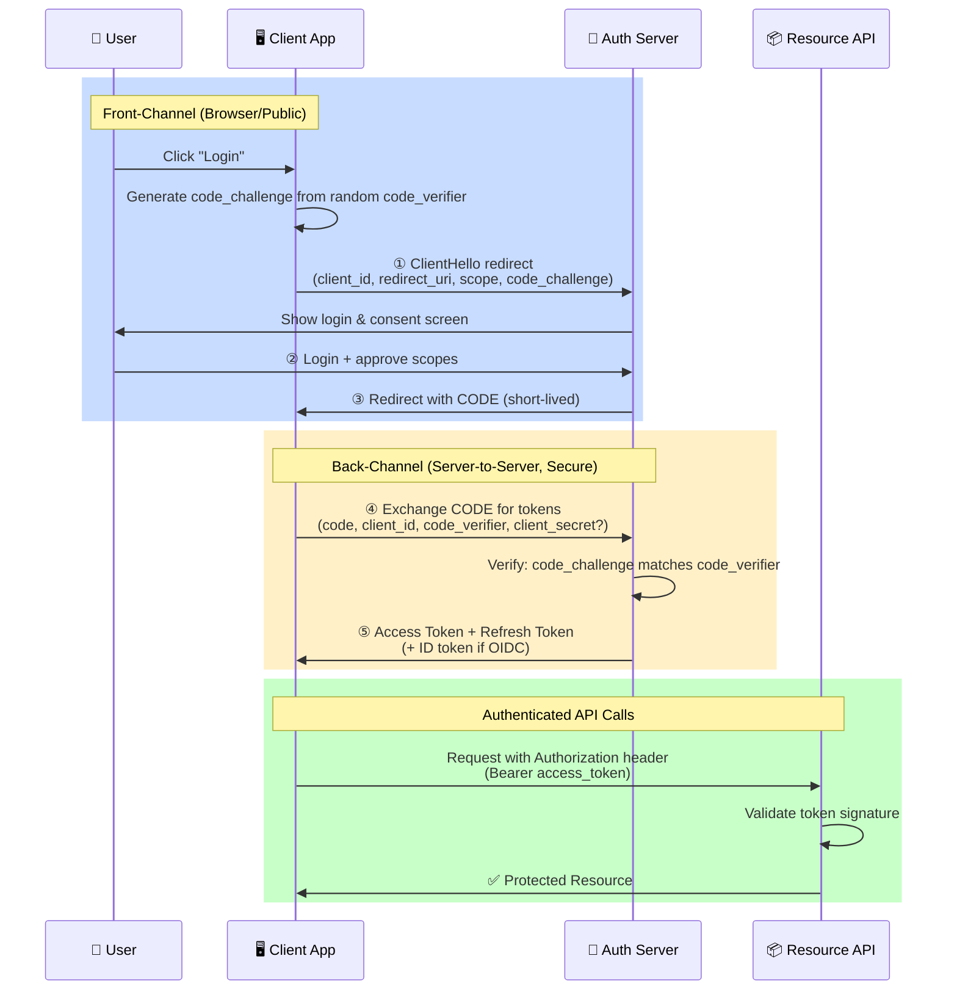
 
## 2. PKCE Details (Why It's Secure)
 
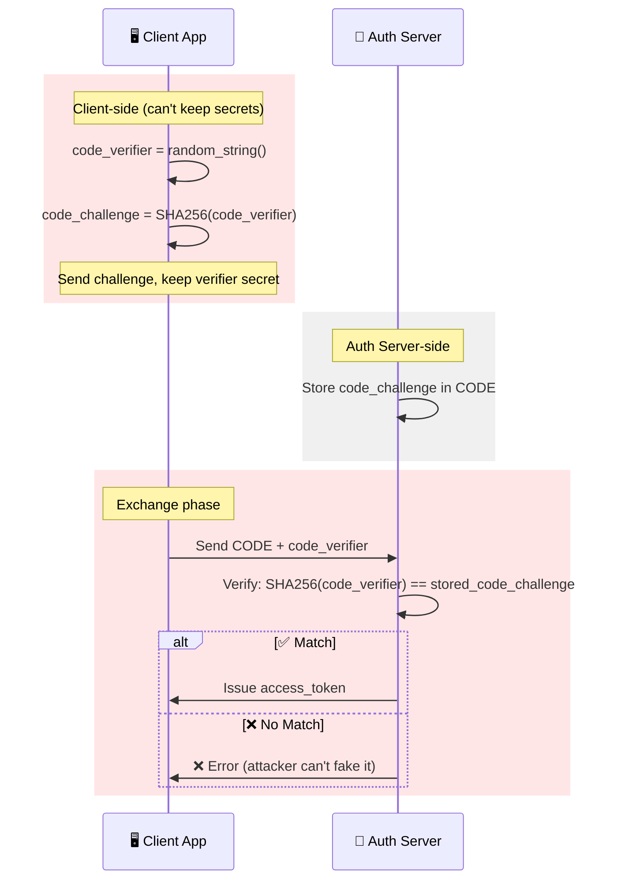
 
## 3. Refresh Token Flow
 
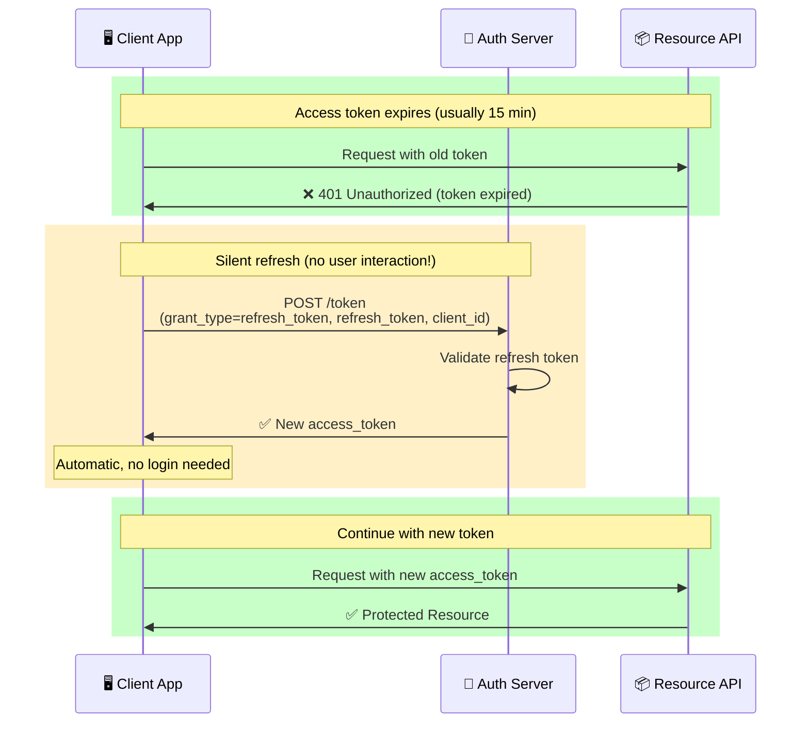
 
## 4. Implicit Flow (DEPRECATED ❌)
 
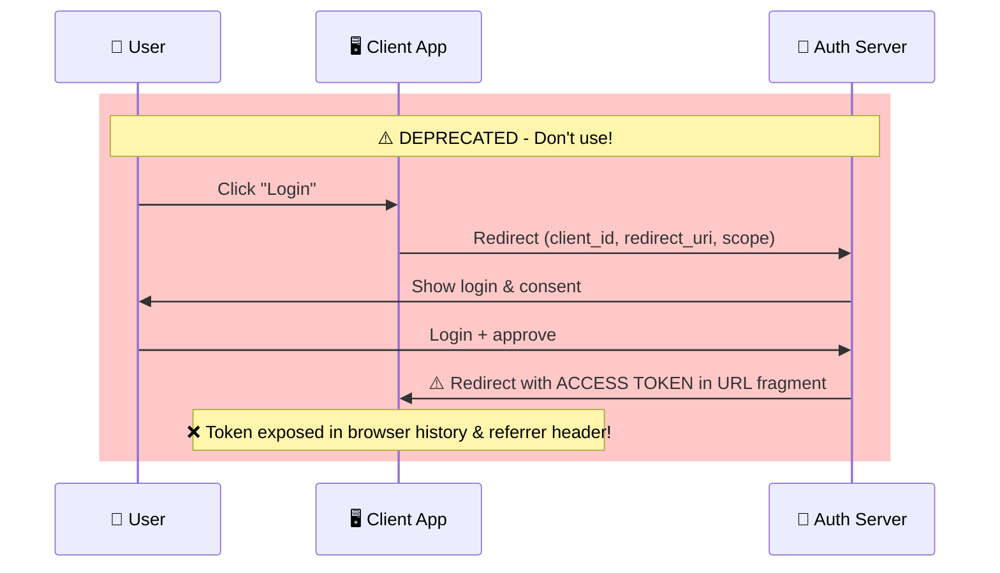
 
## 5. Client Credentials (Service-to-Service)
 
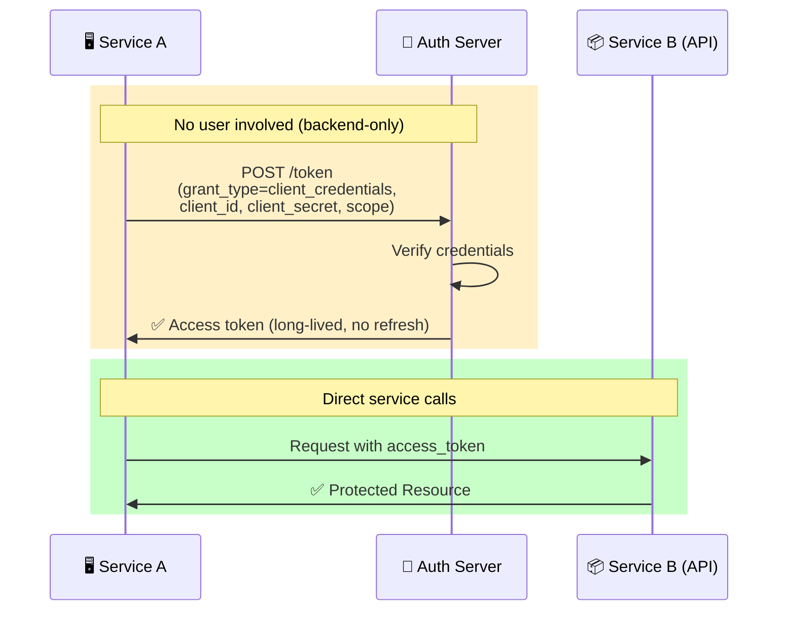
 
## 6. Full OAuth 2.0 Grant Types Comparison
 
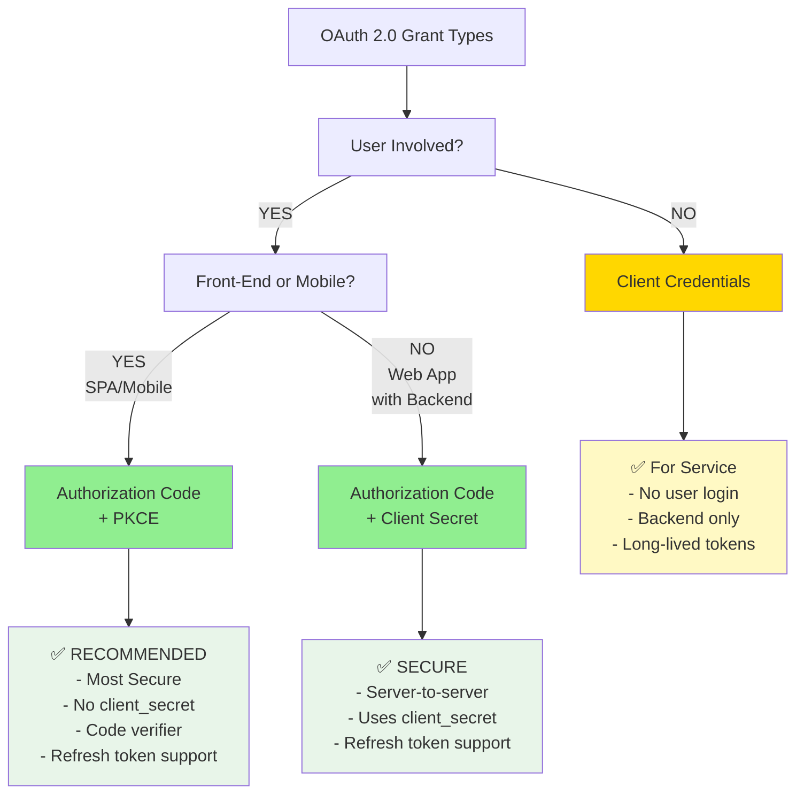
 
**Quick reference:**
- **Use Authorization Code + PKCE** for SPAs, mobile apps, web apps
- **Use Client Credentials** for service-to-service calls
- **Never use Implicit flow** (deprecated)
- **Always use refresh tokens** for long-lived sessions

- The **code** (not the token) travels through the browser redirect, so tokens never appear in the URL or browser history.
- **PKCE** (Proof Key for Code Exchange, said "pixie") — the client generates a random `code_verifier`, sends its hash (`code_challenge`) up front, then proves it holds the verifier when redeeming the code. **Stops authorization-code interception** on public clients (mobile/SPA that can't keep a secret). Now recommended for *all* clients.

**2. Client Credentials** — machine-to-machine, no user involved.
```
Service A ─► Auth Server (client_id + client_secret) ─► access token ─► Service B
```
Use for backend cron jobs and service-to-service calls.

**3. Refresh Token** — exchange a refresh token for a fresh access token (see §9).

**Deprecated / avoid:**
- ❌ **Implicit flow** — returned tokens directly in the URL fragment. Replaced by PKCE.
- ❌ **ROPC** (Resource Owner Password Credentials) — the app collects the user's actual password. Defeats OAuth's whole purpose; only for legacy migration.

### Opaque vs JWT access tokens
- **Opaque token** (random string) → resource server calls the auth server's **introspection endpoint** to validate (stateful, revocable, one extra network hop).
- **JWT access token** → resource server validates locally with the public key (stateless, fast, but hard to revoke). Same trade-off as sessions vs tokens.

> 📺 **Watch:** [OAuth 2.0 & OpenID Connect in plain English — OktaDev](https://www.youtube.com/watch?v=996OiexHze0) · [An Introduction to OAuth and OpenID — Okta](https://www.youtube.com/watch?v=1wVgZY1agUE)

---

<a name="10-oidc"></a>
## 11. OpenID Connect (OIDC)

**Definition.** **OIDC** is a thin **authentication** layer built on top of OAuth 2.0. OAuth2 grants *access*; OIDC adds *"who is this user."* If you build "Sign in with Google/Apple/Microsoft," you're using OIDC.

**Where it's used.** Consumer social login, modern web/mobile/SPA login, SSO for new apps, anywhere you need both login *and* API access.

**What OIDC adds:**
- **ID Token** — a **JWT** specifically about the *user's identity* (`sub`, `name`, `email`, plus `aud` and `nonce`). This is the piece OAuth2 lacked.
- **`openid` scope** — request it to trigger OIDC behavior.
- **UserInfo endpoint** — fetch more profile claims using the access token.
- **Discovery** — `/.well-known/openid-configuration` publishes every endpoint + the JWKS URL, enabling auto-configuration.
- **`nonce`** (number used once) — a client-generated value echoed back in the ID token to prevent replay.

> **The clean mental split:**
> - **Access token** → sent to APIs. *"What can I do?"* (authorization). The client should treat it as opaque.
> - **ID token** → consumed by the *client itself*. *"Who logged in?"* (authentication). Never send an ID token to an API as your credential.

**Why raw OAuth2 for login is broken:** an access token proves the client can *access some resource*, not *who the user is* or that they logged in *to your app*. An attacker could swap in a token issued for a different app. OIDC's ID token (with `aud` + `nonce`) fixes this. **Need login? Use OIDC, not bare OAuth2.**

> 📺 **Watch:** [OAuth 2.0 & OpenID Connect in plain English — OktaDev](https://www.youtube.com/watch?v=996OiexHze0) · [An Introduction to OAuth and OpenID — Okta](https://www.youtube.com/watch?v=1wVgZY1agUE)

---

<a name="11-saml"></a>
## 12. SAML 2.0

**Definition.** **SAML** (Security Assertion Markup Language) is the XML-based **enterprise SSO** standard (from ~2005). One corporate identity provider logs employees into many apps.

**Where it's used.** Corporate/B2B SSO — logging employees into Salesforce, Workday, Zoom, Google Workspace, etc., through one company login. Universities/education federations. Legacy enterprise SaaS.

### Roles
- **Principal** — the user.
- **Identity Provider (IdP)** — authenticates the user & issues assertions (Okta, Ping, ADFS, Microsoft Entra).
- **Service Provider (SP)** — the app the user wants (Salesforce, your SaaS).

### The SAML assertion
**Definition.** An XML document, **digitally signed by the IdP**, stating "this user authenticated; here are their attributes (email, groups, roles); valid until time T."

### SP-initiated flow (most common)
```
1. User hits the SP (app) ─► not logged in
2. SP builds a SAML AuthnRequest, redirects the browser to the IdP
3. IdP authenticates the user (password + MFA)
4. IdP builds a signed SAML Assertion, POSTs it back to the SP's ACS URL
   (ACS = Assertion Consumer Service — the SP endpoint that receives assertions)
5. SP verifies the signature (with the IdP's public cert), reads attributes,
   creates a local session ─► user is in
```
(There's also **IdP-initiated**: the user starts at the IdP portal and clicks an app tile.)

### Bindings (how messages travel)
**HTTP-Redirect** (the request, in the URL) and **HTTP-POST** (the assertion, as an auto-submitting form). The browser relays messages — SP and IdP often never talk directly.

**Config you'll actually deal with:**
- **Metadata XML** — both sides exchange this (entity IDs, endpoints, signing certs). Misconfigured metadata causes ~90% of SAML pain.
- **ACS URL** — where the IdP sends the assertion.
- **Entity ID** — unique identifier for the SP and IdP.
- **Signing certificate** — the IdP's cert the SP uses to verify assertions. **Cert expiry = sudden org-wide login outage** (a very common incident).

> 📺 **Watch:** [What is SAML? A Comprehensive Guide with Examples](https://www.youtube.com/watch?v=4ULlJEupV-I) · [What Is Single Sign-On (SSO)? — ByteByteGo](https://www.youtube.com/watch?v=O1cRJWYF-g4)

---

<a name="12-saml-vs-oidc"></a>
## 13. SAML vs OIDC — When to Use What

**Definition.** Both enable SSO/federation. **SAML** = XML, enterprise-era. **OIDC** = JSON/JWT, modern, built on OAuth2.

| | **SAML 2.0** | **OIDC** |
|---|---|---|
| Format | XML | JSON / JWT |
| Origin | 2005, enterprise | 2014, on top of OAuth2 |
| Best for | Enterprise/corporate SSO, legacy SaaS, B2B | Modern web/mobile/SPA, consumer login, APIs |
| Mobile support | Poor (XML + browser POST) | Excellent (native, PKCE) |
| Transport | Browser redirects/POST | REST + JSON |
| API authorization | No (auth only) | Yes (pairs with OAuth2 tokens) |
| Complexity | Heavy (XML signatures, canonicalization) | Lighter |

**Decision guide (where to use each):**
- **New app / mobile / SPA / need API access** → **OIDC (+ OAuth2)**.
- **Selling B2B SaaS to enterprises** → you'll be *forced* to support **SAML** (their IT runs Okta/Ping/ADFS). Support both.
- **Consumer "Sign in with Google/Apple"** → **OIDC**.
- **Internal corporate SSO to old vendors** → **SAML**.

> **Reality for a SaaS founder/engineer:** enterprise deals put "SSO via SAML" in the security questionnaire as a hard requirement. That's why "Enterprise SSO" is usually a paid tier (the informal "SSO tax") — supporting many IdPs is operationally expensive.

> 📺 **Watch:** [OAuth 2.0 & OpenID Connect in plain English — OktaDev](https://www.youtube.com/watch?v=996OiexHze0) · [What is SAML? A Comprehensive Guide](https://www.youtube.com/watch?v=4ULlJEupV-I)

---

<a name="13-authz-models"></a>
# Authorization Models: RBAC, ABAC, ReBAC, PBAC, ACL

## 1. Evolution from Simple to Flexible

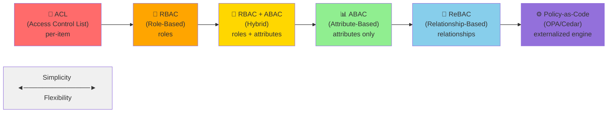

## 2. Detailed Comparison Table

```mermaid
graph TD
    subgraph ACL ["🔐 ACL (Access Control List)<br/>Simplest"]
        ACL1["user:alice → file:doc1 → read<br/>user:bob → file:doc1 → write<br/>Stored per resource<br/>(unscalable for 1000s users)"]
    end
    
    subgraph RBAC ["👤 RBAC (Role-Based)<br/>Most Common"]
        RBAC1["user → role → permissions<br/>alice → Editor → read,write<br/>bob → Viewer → read<br/>Simple, manageable, scales better<br/>No context (e.g., 'only on weekdays')"]
    end
    
    subgraph RBAC_ABAC ["🎯 RBAC + ABAC (Hybrid)<br/>Practical"]
        RA1["Roles + Attributes<br/>alice has role=Editor<br/>+ time=business-hours<br/>+ ip=internal-network<br/>Balance of simplicity & flexibility"]
    end
    
    subgraph ABAC ["📊 ABAC (Attribute-Based)<br/>Flexible"]
        ABAC1["Everything is an attribute<br/>user.dept='Engineering'<br/>resource.sensitivity='high'<br/>environment.time='9-5'<br/>Policy: if user.dept=='Eng' AND<br/>resource.sensitivity=='high' THEN read"]
    end
    
    subgraph ReBAC ["🔗 ReBAC (Relationship-Based)<br/>Modern Graph-Based"]
        ReBAC1["alice is 'owner' of doc1<br/>bob is 'collaborator' of doc1<br/>alice is 'parent' of child_user<br/>Graph-based relationships<br/>Ex: Figma, Google Docs, Notion"]
    end
    
    subgraph Policy ["⚙️ Policy-as-Code (OPA/Cedar)<br/>Most Flexible"]
        Policy1["External policy engine<br/>Written in Rego/Cedar<br/>rule: 'user can read doc if<br/>  user.role==editor AND<br/>  doc.classification==public AND<br/>  now < doc.expiry'<br/>Testable, versioned, audit trail"]
    end
    
    style ACL fill:#FFE4E1
    style RBAC fill:#FFE4CD
    style RBAC_ABAC fill:#FFFACD
    style ABAC fill:#E0FFE0
    style ReBAC fill:#E0F0FF
    style Policy fill:#F0E0FF
```

## 3. Real-World Examples per Model

```mermaid
mindmap
  root((Authorization Models))
    🔐 ACL
      Google Drive
        Share with specific person
        Direct item-level perms
      Unix File System
        chmod 755
        Per-file ownership
    👤 RBAC
      Admin Dashboard
        Admin, Editor, Viewer roles
        Simple role assignment
      SaaS App
        Owner, Member, Guest
        Role-based feature access
    🎯 RBAC + ABAC
      Healthcare Platform
        Role: Doctor
        + Attribute: Department==Cardiology
        + Context: Time==business-hours
    📊 ABAC
      Enterprise Data Platform
        Policy engine evaluates attributes
        Complex conditional rules
        Heavy on policy writing
    🔗 ReBAC
      Figma
        owner → doc
        collaborator → doc
        comment_thread → {reply, edit}
      Slack
        member → workspace
        owner → channel
    ⚙️ Policy-as-Code
      Kubernetes (OPA)
        Policies: enforce pod security
        Policies: network policies
        Policies: resource quotas
      HashiCorp Sentinel
        Policy on Terraform runs
        Compliance enforcement
```

## 4. Decision Tree: Which Model?

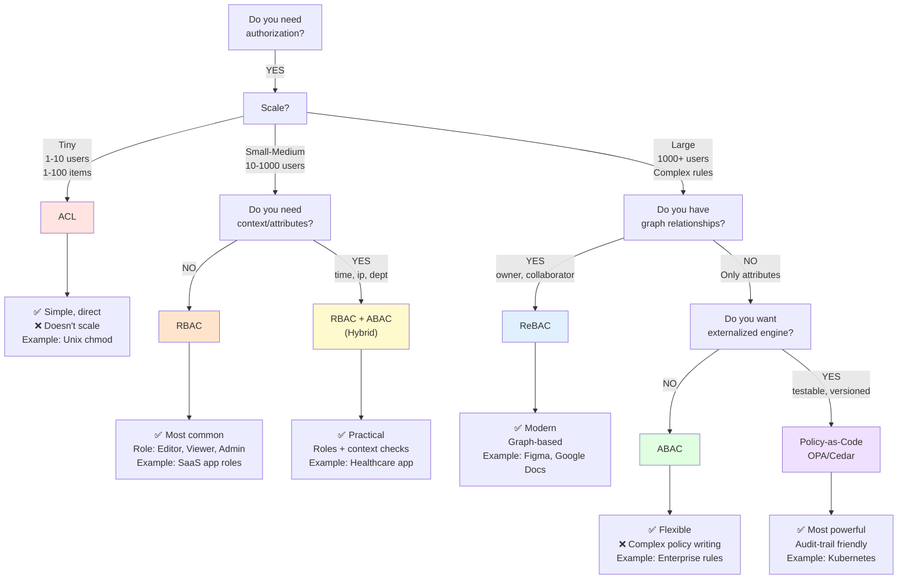

## 5. Code Examples: Each Model

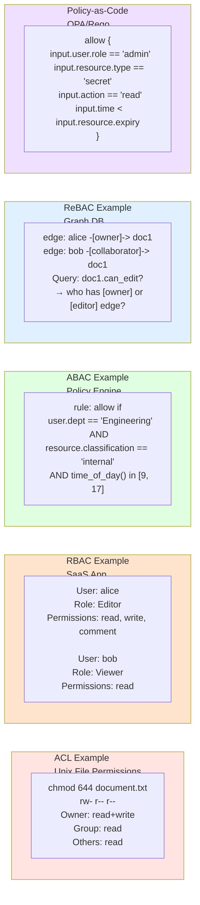

## 6. Comparison: Feature Matrix

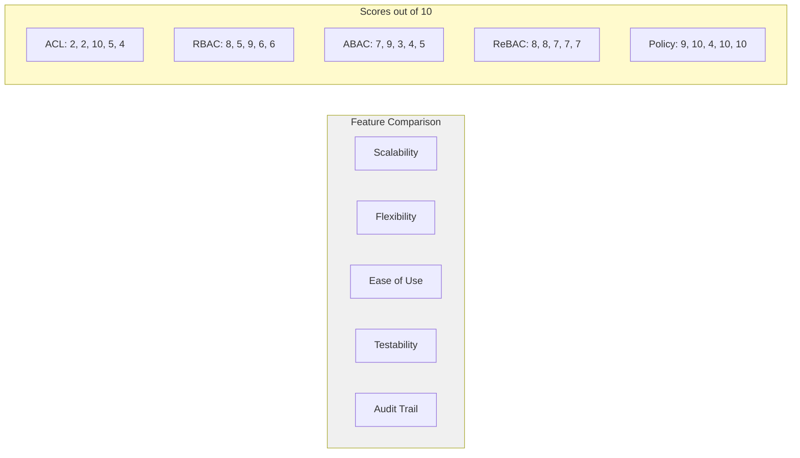

## When to Use Each

| Model | Best For | Example | Gotchas |
|-------|----------|---------|---------|
| **ACL** | Tiny systems, file perms | Unix chmod, basic WordPress | Doesn't scale |
| **RBAC** | Most SaaS apps | Admin/Editor/Viewer roles | No context (time, location, etc.) |
| **RBAC+ABAC** | Medium complexity | Healthcare + time-based access | Policy sprawl if too many attributes |
| **ABAC** | Complex rules | Enterprise data classification | Hard to manage, easy to misconfigure |
| **ReBAC** | Graph relationships | Figma, Google Docs, Slack | Need graph DB expertise |
| **Policy-as-Code** | Highly regulated | Kubernetes, financial services | Overkill for simple apps, steep learning curve |

## Usage in GitHub

Paste any diagram into your `.md` file.

**Key takeaways:**
- ✅ **Start with RBAC** — simplest for most apps
- ➕ **Add ABAC** when you need context (time, location, IP)
- 🔗 **Use ReBAC** when permissions follow graph relationships (owner, collaborator, parent)
- ⚙️ **Use Policy-as-Code** for highly regulated systems with audit requirements

### ACL (Access Control List)
**Definition.** A per-resource list of who can do what: `file.txt → {alice: read, bob: write}`. Simple and granular, but doesn't scale to millions of resources × users.

### RBAC (Role-Based Access Control) — the workhorse
**Definition.** Users get **roles**; roles carry **permissions**. You assign roles, not individual permissions.
```
User → Role(s) → Permissions → Resources
alice → "editor" → {posts.create, posts.edit}
```
- ✅ Simple, auditable, matches org structure ("all managers can approve").
- ❌ **Role explosion** — when you need "editors, but only in marketing, only during business hours," you end up minting `marketing-editor-business-hours` roles. The classic failure that pushes teams to ABAC.
- **Use it when:** roles are clear and stable (most small/medium apps). Start here.

### ABAC (Attribute-Based Access Control) — flexible & contextual
**Definition.** Decisions come from **attributes** of the user, resource, action, and environment, evaluated by a policy.
```
ALLOW if user.department == resource.department
       AND user.clearance >= resource.classification
       AND request.time in business_hours
       AND request.ip in corporate_range
```
- ✅ Fine-grained, context-aware, no role explosion.
- ❌ Harder to reason about/audit ("why *can* Alice see this?"). Needs a policy engine.
- **Use it when:** context matters (time, location, ownership, data sensitivity).

### ReBAC (Relationship-Based Access Control) — Google Zanzibar model
**Definition.** Permissions come from **relationships** in a graph: "you can edit a doc if you own it, or belong to a group with editor access to its parent folder." (**Zanzibar** = Google's internal authorization system that inspired this.)
- Powers Google Drive, GitHub, Notion-style sharing.
- Open-source implementations: **SpiceDB, OpenFGA, Ory Keto.**
- **Use it when:** nested sharing/hierarchies ("who has access to this document?").

### PBAC / Policy-as-Code
**Definition.** Move authorization out of app code into a dedicated **policy engine**, so the app just asks "can X do Y on Z?"
- **OPA** (Open Policy Agent) + **Rego** (its policy language) — a CNCF standard, great for infra/Kubernetes + app authz.
- **AWS Cedar** — a purpose-built authz language (powers Amazon Verified Permissions).
- **Oso, Casbin** — embeddable libraries.

**The PDP/PEP/PAP mental model** (worth knowing for interviews):
```
PEP (Policy Enforcement Point) — intercepts the request (your API middleware)
PDP (Policy Decision Point)    — evaluates policy, returns allow/deny (e.g., OPA)
PAP (Policy Administration Point) — where policies are authored
PIP (Policy Information Point)  — supplies attributes (user dept, resource owner)
```

### Decision guide
- **Clear roles, small/medium app** → **RBAC**.
- **Need context** → **ABAC** (usually RBAC+ABAC hybrid).
- **Sharing/nesting** → **ReBAC** (SpiceDB/OpenFGA).
- **Many services, consistent policy** → externalize with **OPA/Cedar**.

> **Real pattern:** most mature systems are **RBAC + ABAC hybrid** — the role says "editor," the attribute policy says "only for resources in your tenant." Multi-tenant SaaS *always* needs a tenant-isolation attribute check on top of roles; forgetting it is the classic **IDOR** (Insecure Direct Object Reference — accessing another user's data by changing an ID) / cross-tenant leak.

> 📺 **Watch:** [RBAC vs ABAC — IBM Technology](https://www.youtube.com/watch?v=rvZ35YW4t5k) · [RBAC vs ABAC: What's the Difference?](https://www.youtube.com/watch?v=e6G6cmusKpQ)

---

<a name="14-iam-providers"></a>
## 15. IAM Providers: Okta, Ping, Auth0, Entra, Cognito, Keycloak

**Definition.** **IAM** (Identity & Access Management) providers are Identity-as-a-Service platforms that implement everything above (OIDC, SAML, MFA, user store, SSO, user lifecycle) so you don't build it yourself.

**Where it's used.** Employee login (workforce identity), customer login (**CIAM** — Customer IAM), SSO across a company's apps, MFA, passwordless.

| Provider | Sweet spot | Notes |
|---|---|---|
| **Okta** | Enterprise workforce IAM, SSO to thousands of SaaS apps | Market leader for employee identity; huge app catalog; owns Auth0 |
| **Auth0** (Okta-owned) | Developer-first CIAM, B2C/B2B apps | Great developer experience; quick to integrate; pricier at scale |
| **Ping Identity** | Large/complex enterprises, on-prem + hybrid | Strong in banking/regulated; PingFederate, PingAccess |
| **Microsoft Entra ID** (was Azure AD) | Anything Microsoft/O365; workforce | Default in the MS ecosystem; strong Conditional Access |
| **AWS Cognito** | Consumer apps on AWS | Cheap, AWS-integrated; rougher developer experience |
| **Keycloak** | Self-hosted, open-source | Free and powerful, but you run/patch/scale it |
| **ForgeRock** (Ping-owned) | Very large enterprise, IoT/CIAM at scale | Heavyweight |

**What they all give you (why buy vs build):**
- Hosted login pages, social login, **MFA** (one-time codes, push, **WebAuthn/passkeys** — phishing-resistant hardware/biometric login), passwordless.
- **SSO** across your apps (acting as an IdP for OIDC + SAML).
- User lifecycle via **SCIM** (System for Cross-domain Identity Management — the standard for auto-creating/disabling accounts when employees join/leave).
- Adaptive/risk-based auth, brute-force protection, audit logs, compliance (SOC 2 / HIPAA).

```
Your App ──OIDC──► Okta/Auth0 (acts as IdP) ──SAML/OIDC──► upstream enterprise IdP
   │                     │
   └── validates JWT ◄── issues tokens, hosts login, runs MFA
```

> **Build vs buy heuristic:** buying is almost always right for auth (password reset, MFA, breach detection, and compliance are deceptively hard). Exceptions: extreme cost at huge user counts (→ self-hosted **Keycloak**), hard data-residency/air-gap needs, or auth *being* your product.

> 📺 **Watch:** [An Introduction to OAuth and OpenID — Okta](https://www.youtube.com/watch?v=1wVgZY1agUE) · [What Is Single Sign-On (SSO)? — ByteByteGo](https://www.youtube.com/watch?v=O1cRJWYF-g4)

---

<a name="15-cloud-prod"></a>
## 16. Cloud & Production Identity

**Definition.** How identity works for *infrastructure and workloads* (not just human logins): cloud IAM, secrets, key rotation, and the Zero-Trust model. The part most guides skip and most senior interviews probe.

**Where it's used.** Every cloud deployment, every microservice that calls a database or another service, every CI/CD pipeline.

### 16.1 Cloud IAM (AWS as the example)
- **IAM Users** — long-lived credentials. ❌ Avoid for workloads; humans should use SSO.
- **IAM Roles** — *assumable* identities that grant **temporary** credentials. ✅ The right primitive.
- **STS** (Security Token Service) — mints those temporary, auto-expiring credentials when a role is assumed. Short-lived = smaller blast radius if leaked.
- **Policies** — JSON documents (effect / action / resource / condition). This is ABAC in practice — condition keys like `aws:PrincipalTag` enable attribute-based access.
- **Assume-role / cross-account** — Account A's role trusts Account B; B assumes it to get scoped temp creds. Backbone of multi-account setups.

**Workload identity (kill long-lived secrets):**
- **IRSA** (IAM Roles for Service Accounts) on AWS EKS, **Workload Identity** on Google GKE — pods get an IAM role via a projected OIDC token, with no stored keys.
- **Instance profiles** — an EC2 VM fetches creds from the metadata service.
- The universal pattern: **short-lived, auto-rotated, identity-bound credentials instead of static keys.**

### 16.2 Secrets Management
**Definition.** Securely storing and distributing secrets (API keys, DB passwords, certs) instead of hard-coding them. (The classic incident: AWS keys pushed to public GitHub → crypto-mining bill overnight.)
- Tools: **AWS Secrets Manager / Parameter Store, HashiCorp Vault, GCP Secret Manager, Azure Key Vault.**
- Want: encryption at rest, access policies, audit logging, automatic rotation, and **dynamic secrets** (Vault can generate a short-lived DB credential on demand).
- **KMS** (Key Management Service) — manages encryption keys. **HSM** (Hardware Security Module) — tamper-resistant hardware where private keys never leave (used for CAs and high-value signing). **Envelope encryption** — encrypt data with a data key, then encrypt that data key with a KMS master key.

### 16.3 Key & Certificate Rotation
**Definition.** Regularly replacing keys/certs (and on suspected compromise) so a leak has a limited window.
- **JWKS + `kid`** enables zero-downtime key rotation: publish the new public key, sign new tokens with the new `kid`, keep the old key available until old tokens expire.
- Automate cert renewal (ACME/certbot; AWS ACM auto-renews). **Cert expiry is a top production outage** — alert at 30/14/7 days out.

### 16.4 Zero Trust
**Definition.** "**Never trust, always verify.**" No implicit trust from network location — being "inside the VPN" doesn't make you trusted. Every request is authenticated, authorized, and encrypted based on identity + device posture + context.

**Where it's used.** Modern enterprise security, remote/hybrid work, cloud-native architectures.
- Enforced via **mTLS** everywhere, short-lived credentials, per-request authorization (OPA), device attestation, continuous verification.
- Google **BeyondCorp** is the canonical implementation. Service meshes (Istio) provide mTLS + service identity relatively cheaply.

> 📺 **Watch:** [Finally Understand AWS IAM — Users, Roles, Policies & Trust](https://www.youtube.com/watch?v=I_Uh1ra3RYU) · [Zero Trust Explained in 4 mins — IBM](https://www.youtube.com/watch?v=yn6CPQ9RioA)

---

<a name="16-debugging"></a>
## 17. Common Problems & Debugging Playbook

### JWT / OAuth / OIDC
| Symptom | Likely cause | Fix |
|---|---|---|
| `401` with a fresh token | Wrong `aud`/`iss`, or clock skew (`exp` fails) | Match `aud`/`iss`; sync clocks via NTP; allow small `leeway` |
| Signature verification fails intermittently | Key rotated; old JWKS cached | Refresh JWKS on an unknown `kid`; cache with sane TTL |
| Works, then 401 mid-session | Access token expired | Implement refresh-token flow |
| `redirect_uri_mismatch` | Registered URI ≠ sent one (trailing slash, http vs https, port) | Exact-match the registered callback |
| `invalid_grant` on token exchange | Code already used/expired, or PKCE verifier mismatch | Codes are single-use & short-lived; check verifier↔challenge |
| CORS error on token endpoint from SPA | Calling a back-channel endpoint from the browser | Use Auth Code + PKCE correctly; some endpoints aren't CORS-enabled by design |
| Infinite redirect loop | Session cookie not set (SameSite/Secure), or clock skew | Fix cookie flags (`SameSite=None; Secure` for cross-site) |

### TLS / Certificates
| Symptom | Likely cause | Fix |
|---|---|---|
| Works in browser, fails in curl/Java | Missing **intermediate** cert | Serve the full chain; test `openssl s_client -connect host:443 -showcerts` |
| `certificate has expired` | Past validity | Renew; automate (ACME/ACM); add expiry alerts |
| `unable to verify the first certificate` | Chain incomplete/wrong order | Fix order (leaf → intermediate); include intermediates |
| Hostname mismatch | Cert SAN ≠ requested host | Reissue with the correct SAN |
| Handshake failure after enabling TLS 1.3 | Old client/library | Update client; keep TLS 1.2 fallback if needed |
| mTLS `handshake failure` | Client cert missing/untrusted, or wrong CA | Ensure server trusts the client cert's CA and client presents its cert |

**Go-to diagnostic commands:**
```bash
# Inspect a live server's cert & chain
openssl s_client -connect example.com:443 -servername example.com -showcerts

# Decode a cert
openssl x509 -in cert.pem -text -noout

# Check expiry
echo | openssl s_client -connect example.com:443 2>/dev/null | openssl x509 -noout -dates

# Decode a JWT payload (no verification) — or paste into jwt.io
echo "$JWT" | cut -d. -f2 | base64 -d 2>/dev/null | jq
```

### SAML
| Symptom | Cause | Fix |
|---|---|---|
| Sudden org-wide login failure | IdP **signing cert expired** | Rotate cert in SP config; monitor IdP cert expiry |
| `Invalid signature` on assertion | SP has wrong/old IdP cert, or clock skew | Re-import IdP metadata; sync clocks |
| Attributes missing (no email/roles) | IdP attribute mapping misconfigured | Fix attribute/claim mapping |
| `AudienceRestriction` failure | Entity ID mismatch | Align SP Entity ID with the IdP's value |

---

<a name="17-tricky-qa"></a>
## 18. Tricky Interview Questions & Answers

**Q: Is a JWT encrypted?** No — **signed, not encrypted** by default. The payload is base64url-encoded and readable. For confidentiality use **JWE** (JSON Web Encryption). Never put secrets in a standard JWT.

**Q: Is OAuth2 authentication or authorization?** Authorization (delegated access). Authentication is added by **OIDC**. Bare OAuth2 for login is an anti-pattern.

**Q: Access vs ID vs refresh token?** Access = sent to APIs ("what can I do"). ID = read by the client ("who logged in," OIDC). Refresh = long-lived, only used to get new access tokens.

**Q: Why not store passwords with SHA-256?** Too fast → brute-forceable. Use slow, salted, memory-hard hashes (**Argon2id/bcrypt/scrypt**). SHA-256 is for integrity/signatures.

**Q: How do you revoke a JWT?** Not natively (stateless). Options: short TTL + refresh tokens; a denylist keyed on `jti`; or a per-user `tokenVersion`/`notBefore` you bump on logout/compromise. If instant revocation is mandatory, sessions may fit better.

**Q: What is forward secrecy?** Ephemeral per-session keys (ECDHE) mean a later private-key compromise can't decrypt previously recorded traffic. TLS 1.3 mandates it.

**Q: HS256 vs RS256 — when?** HS256 (shared secret) inside one trusted service. RS256 (asymmetric) across services — signer holds the private key; verifiers only need the public key.

**Q: What does PKCE prevent?** Authorization-code interception on public clients (mobile/SPA). The stolen code is useless without the `code_verifier`.

**Q: Why does TLS use both symmetric and asymmetric crypto?** Asymmetric solves key distribution but is slow; symmetric is fast. TLS uses asymmetric to agree on a symmetric session key, then symmetric for bulk data.

**Q: SAML vs OIDC?** SAML = XML, enterprise/legacy, browser-based. OIDC = JSON/JWT on OAuth2, modern web/mobile/API. New builds → OIDC; enterprise B2B → also support SAML.

**Q: Where should a browser store tokens?** Prefer HttpOnly+Secure+SameSite cookies (or in-memory access token + HttpOnly refresh cookie, or a BFF). `localStorage` is XSS-exposed; cookies need CSRF protection.

**Q: What are `alg:none` and RS/HS confusion?** JWT signature-bypass attacks. Defense: pin the expected algorithm; never let the token choose; never accept `none`.

**Q: What is SCIM?** The standard for automated user provisioning/deprovisioning between an IdP and SaaS apps.

**Q: When does RBAC break?** When you need contextual/fine-grained rules (time, location, ownership) — you hit **role explosion**. Move to ABAC or an RBAC+ABAC hybrid.

**Q: Multi-tenant SaaS — the one check you must never forget?** Tenant isolation: every query/authz decision must scope to the caller's tenant, or you get a cross-tenant leak (IDOR).

---

<a name="18-cheatsheets"></a>
## 19. Cheat Sheets & Decision Tables

### Pick a login/identity protocol
```
Consumer app / mobile / SPA / need API access → OIDC + OAuth2 (Auth Code + PKCE)
"Sign in with Google/Apple"                   → OIDC
Selling B2B SaaS to enterprises               → also support SAML
Internal corporate SSO to legacy vendors      → SAML
Service-to-service (no user)                   → OAuth2 Client Credentials / mTLS
```

### Pick an authorization model
```
Clear roles, small/medium app        → RBAC
Need context (time/location/owner)   → ABAC (or RBAC+ABAC hybrid)
Sharing / nested resources           → ReBAC (SpiceDB/OpenFGA)
Many services, consistent policy      → OPA/Cedar (policy-as-code)
```

### Crypto quick-pick
```
Password storage       → Argon2id (or bcrypt)
Integrity / signature  → SHA-256 + RSA/ECDSA
Bulk encryption        → AES-256-GCM (or ChaCha20-Poly1305)
Key exchange           → ECDHE (forward secrecy)
New key pairs (SSH/sign)→ Ed25519
```

### "What token where"
```
Access token  → Authorization: Bearer header to APIs. Short-lived. Opaque to client.
ID token      → Client reads it to know who the user is. Never send to an API.
Refresh token → Secure storage; only to the token endpoint. Rotate on use.
```

### Layer map (how it all stacks)
```
┌──────────────────────────────────────────────────────────┐
│ Authorization: RBAC / ABAC / ReBAC / OAuth2 scopes        │  what you can do
├──────────────────────────────────────────────────────────┤
│ Authentication: OIDC / SAML / passwords + MFA             │  who you are
├──────────────────────────────────────────────────────────┤
│ Tokens/Sessions: JWT / opaque / cookies                   │  remembering it
├──────────────────────────────────────────────────────────┤
│ Transport: TLS 1.3 / mTLS                                 │  private channel
├──────────────────────────────────────────────────────────┤
│ Trust/PKI: certificates, CAs, chain of trust             │  proving endpoint identity
├──────────────────────────────────────────────────────────┤
│ Crypto: hashing, symmetric, asymmetric, signing          │  the primitives
└──────────────────────────────────────────────────────────┘
```

### Final principles
1. **AuthN before AuthZ, always separate them.**
2. **Don't roll your own auth or crypto** — use OIDC providers and vetted libraries.
3. **Asymmetric to bootstrap, symmetric for bulk** (TLS, JWT-RS256).
4. **Short-lived credentials + rotation** beat long-lived secrets everywhere.
5. **The JWT revocation trade-off drives your token design.**
6. **Validate everything on a JWT:** signature, `alg`, `exp`, `iss`, `aud`.
7. **Cert/key expiry is a top outage** — automate and alert.
8. **Zero Trust:** verify by identity + context, not network location.

---

### 📺 Full video index (by topic)
- **AuthN/AuthZ, OAuth2, OIDC:** [OktaDev — plain English](https://www.youtube.com/watch?v=996OiexHze0) · [Okta — intro to OAuth/OpenID](https://www.youtube.com/watch?v=1wVgZY1agUE)
- **Hashing & passwords:** [Computerphile — How NOT to Store Passwords](https://www.youtube.com/watch?v=8ZtInClXe1Q) · [Auth0 — Adding Salt to Hashing](https://www.youtube.com/watch?v=aXHmUHPXwb4)
- **Public-key crypto & key exchange:** [Computerphile — Public Key Cryptography](https://www.youtube.com/watch?v=GSIDS_lvRv4) · [Computerphile — Diffie-Hellman](https://www.youtube.com/watch?v=NmM9HA2MQGI)
- **TLS/SSL & PKI:** [Computerphile — TLS](https://www.youtube.com/watch?v=0TLDTodL7Lc) · [Hussein Nasser — TLS 1.2 & 1.3 by example](https://www.youtube.com/watch?v=AlE5X1NlHgg)
- **SSH:** [Understanding SSH — public & private keys](https://www.youtube.com/watch?v=mlxy7IEYE_g) · [How SSH Works](https://www.youtube.com/watch?v=s-vhqtyUF4I)
- **JWT:** [Web Dev Simplified — What Is JWT](https://www.youtube.com/watch?v=7Q17ubqLfaM) · [Java Brains — What is JWT](https://www.youtube.com/watch?v=soGRyl9ztjI)
- **SAML & SSO:** [What is SAML? Comprehensive Guide](https://www.youtube.com/watch?v=4ULlJEupV-I) · [ByteByteGo — What Is SSO?](https://www.youtube.com/watch?v=O1cRJWYF-g4)
- **RBAC/ABAC:** [IBM — RBAC vs ABAC](https://www.youtube.com/watch?v=rvZ35YW4t5k)
- **Cloud IAM & Zero Trust:** [AWS IAM — Users, Roles, Policies, Trust](https://www.youtube.com/watch?v=I_Uh1ra3RYU) · [IBM — Zero Trust in 4 mins](https://www.youtube.com/watch?v=yn6CPQ9RioA)