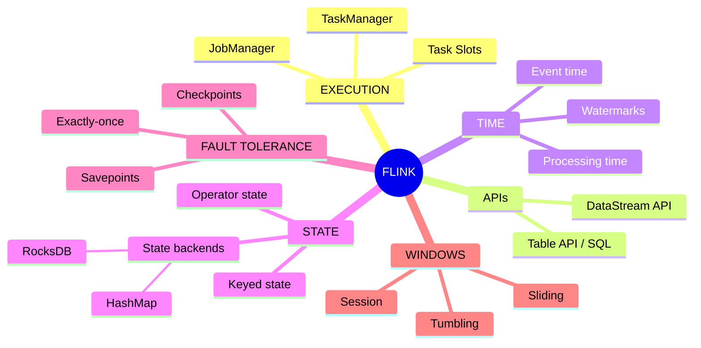
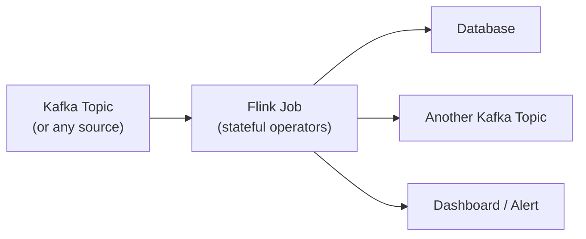
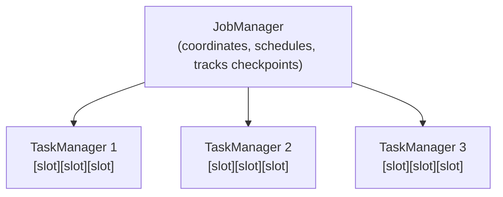
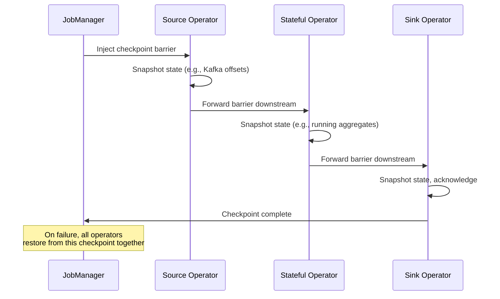
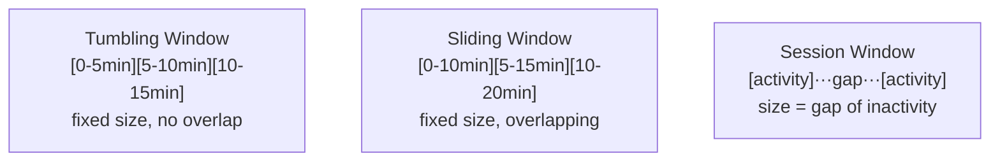

# The Complete Guide to Apache Flink

*A senior-engineer reference: the streaming model, state & checkpointing, event time & watermarks, windowing, exactly-once semantics, deployment, and interview traps.*

> **How to read this guide.** Every topic starts with a plain **Definition**, then **Where it's used**, then the mechanics. Jargon gets a short definition in parentheses the first time it appears. Skim the mind map first to build the skeleton, then dive in. This guide assumes familiarity with the general event-streaming model — see the [Kafka guide](./Kafka-Guide.md) if that's new.

---

## Table of Contents

1. [Mind Map — the whole landscape on one screen](#0-mindmap)
2. [What Flink Actually Is](#1-what-is-flink)
3. [Core Architecture: JobManager, TaskManager, Jobs](#2-architecture)
4. [The DataStream API](#3-datastream)
5. [State Management](#4-state)
6. [Checkpointing & Fault Tolerance](#5-checkpointing)
7. [Event Time, Processing Time & Watermarks](#6-time)
8. [Windowing](#7-windowing)
9. [Exactly-Once Semantics](#8-exactly-once)
10. [Flink vs Spark Streaming vs Kafka Streams](#9-comparison)
11. [Deployment Modes](#10-deployment)
12. [Common Problems & Debugging Playbook](#11-debugging)
13. [Tricky Interview Questions & Answers](#12-tricky-qa)
14. [Cheat Sheets & Decision Tables](#13-cheatsheets)

---

<a name="0-mindmap"></a>
## 1. Mind Map — the whole landscape on one screen



**Reading the map:** Flink's whole design answers one question — *how do you process an unbounded stream of events, correctly, exactly once, even when machines fail and events arrive late or out of order?* State, checkpointing, and watermarks are the three mechanisms that make that possible.

---

<a name="1-what-is-flink"></a>
## 2. What Flink Actually Is

**Definition.** Apache Flink is a distributed engine for **stateful stream processing** — it treats streaming as the fundamental case (not a special case of batch), continuously computing over unbounded data with low latency, exactly-once state consistency, and native handling of out-of-order/late events.

**Where it's used.** Real-time fraud detection, streaming ETL/ CDC pipelines, real-time analytics dashboards, complex event processing (detecting patterns across a stream), continuous aggregation feeding operational systems.

**The core distinction from batch processing:** batch (classic MapReduce/Spark batch) assumes a bounded, complete dataset — read it all, compute, done. Flink assumes the data **never ends** — the job runs forever, continuously producing updated results as new events arrive, and must maintain correct running state indefinitely without ever seeing "the whole dataset" at once.



---

<a name="2-architecture"></a>
## 3. Core Architecture: JobManager, TaskManager, Jobs

| Component | Definition |
|---|---|
| **JobManager** | The cluster's brain — coordinates job execution, schedules tasks, tracks checkpoints, handles failure recovery. One active JobManager per job (with standbys for HA). |
| **TaskManager** | A worker process that actually executes the job's operators; a cluster typically has many. |
| **Task Slot** | A TaskManager is divided into slots — the unit of resource isolation/parallelism a task runs in. |
| **Job Graph** | Your program (sources → transformations → sinks) compiled into a DAG of operators. |
| **Parallelism** | How many parallel instances of each operator run — determines how many task slots the job needs. |



A job's operators (source → map → keyBy → window → sink) are chained and parallelized across the available task slots; Flink decides how to distribute them unless you explicitly control it.

---

<a name="3-datastream"></a>
## 4. The DataStream API

**Definition.** Flink's core programming abstraction for streaming — you build a pipeline by chaining transformations on an unbounded stream, similar in feel to functional collection operations but running continuously.

```
source                     → read from Kafka, files, sockets, etc.
  .map() / .filter()       → stateless per-event transforms
  .keyBy()                 → partition the stream by a key (like a GROUP BY)
  .window()                → group events within a keyed stream into time/count buckets
  .aggregate() / .reduce() → compute over the window
  .sink()                  → write to Kafka, a database, a file, etc.
```

- **`keyBy`** is the pivot point for almost everything stateful — it logically partitions the stream so that all events for the same key are processed by the same parallel task instance, which is what lets Flink maintain per-key state correctly and in parallel.
- **Table API / SQL** — a higher-level, declarative alternative to the DataStream API; write `SELECT ... GROUP BY ... WINDOW` style queries instead of hand-chaining operators. Compiles down to the same underlying execution engine. Good for teams that want streaming without every developer learning the low-level API.

---

<a name="4-state"></a>
## 5. State Management

**Definition.** **State** is data a Flink operator remembers across events — a running count, the last-seen value per key, items waiting for a join partner. This is what separates real stream processing from simple stateless filtering.

| State type | Definition |
|---|---|
| **Keyed state** | State scoped to the current key in a `keyBy`'d stream (e.g., "running total per user ID"). The common case. |
| **Operator state** | State scoped to a parallel operator instance, not tied to a key (e.g., a Kafka source's list of partition offsets it owns). |
| **State backend** | Where state actually lives and how it's checkpointed. **HashMapStateBackend** — in-memory, fast, limited by heap size. **RocksDB** — an embedded on-disk key-value store, handles state far larger than memory, at some latency cost. |

**Why this matters operationally:** state size is often the real capacity constraint on a Flink job, not raw event throughput. A job with unbounded state growth (e.g., keeping state forever for every key that's ever appeared) will eventually run out of memory/disk — state needs a **TTL** (Time To Live) or windowing strategy that bounds it.

---

<a name="5-checkpointing"></a>
## 6. Checkpointing & Fault Tolerance

**Definition.** A **checkpoint** is a consistent, distributed snapshot of the entire job's state (every operator's state, plus the source's read position) taken periodically while the job keeps running — so if a machine dies, Flink can restart the job from the last checkpoint instead of from scratch.



- **Checkpoint barrier** — a special marker injected into the stream that flows through every operator alongside the real data, triggering each operator to snapshot its state at a globally consistent point — this is Flink's implementation of the **Chandy-Lamport distributed snapshot algorithm**.
- **Savepoint** — a manually triggered, user-managed checkpoint used for planned operations: upgrading the job, changing parallelism, or migrating between clusters. Same mechanism as a checkpoint, but meant to be kept and restored from deliberately rather than auto-managed/expired.
- **Checkpoint interval** — how often to snapshot; shorter = less reprocessing on failure but more overhead, longer = the reverse.

---

<a name="6-time"></a>
## 7. Event Time, Processing Time & Watermarks

**Definition.** Streaming systems must pick *which clock* defines "when" an event happened, because in the real world events arrive late, out of order, or in bursts.

| Time notion | Definition |
|---|---|
| **Event time** | The timestamp embedded in the event itself (when it actually happened, e.g., a sensor reading's own timestamp) |
| **Processing time** | The wall-clock time when Flink happens to process the event — simplest, but results change depending on system load/lag, not reproducible |
| **Ingestion time** | The timestamp when the event entered Flink's source — a middle ground, rarely the right default choice |

**Event time is almost always the correct choice** for correctness (it makes results reproducible and consistent regardless of processing delays), but it requires solving one hard problem: *how do you know you've seen all the events for a given time window, when events can arrive late?*

**Watermark** — a special marker flowing through the stream asserting "I don't expect to see any more events with an event-time timestamp earlier than X." When a watermark for time X passes an operator, any window ending at or before X can be safely finalized/computed. Watermarks are Flink's answer to out-of-order data: they let the system make a *bounded* wait for lateness instead of waiting forever for a stream that never technically "ends."

- **Allowed lateness** — a grace period after a window would otherwise close, during which further-late events still update the result (at the cost of possibly emitting an updated/corrected result later).
- **Side output for late data** — instead of silently dropping events that arrive after even the allowed lateness, route them to a separate output stream for inspection/reprocessing.

---

<a name="7-windowing"></a>
## 8. Windowing

**Definition.** Since a stream never ends, aggregations (`sum`, `count`, `average`) need a bounded slice of the stream to operate over — a **window**.



| Window type | Definition | Use case |
|---|---|---|
| **Tumbling** | Fixed-size, non-overlapping, back-to-back | "Orders per 5-minute bucket" |
| **Sliding** | Fixed-size, overlapping (a new window starts every *slide* interval) | "Rolling 10-minute average, updated every minute" |
| **Session** | Size defined by a gap of inactivity, not a fixed duration | "Group a user's clicks into one session, ending after 30 min idle" |
| **Global window** | Never closes on its own — you supply a custom trigger to decide when to fire | Custom logic that doesn't map to a standard window shape |

**Trigger** — the rule deciding *when* a window actually computes and emits a result (by default, when the watermark passes the window's end — but you can trigger early/repeatedly, e.g., for a live-updating dashboard).

---

<a name="8-exactly-once"></a>
## 9. Exactly-Once Semantics

**Definition.** Flink guarantees **exactly-once state consistency** internally via checkpointing (state is never double-counted or lost on recovery), and can extend that guarantee **end-to-end** to sinks that support transactions.

- **Internal exactly-once** — always available, via checkpoint/restore: after a failure, the job resumes exactly where its last checkpoint left off, with no double-processing of already-checkpointed state.
- **End-to-end exactly-once** — requires the source to be replayable (Kafka, with offset tracking) *and* the sink to support transactional/idempotent writes coordinated with Flink's checkpoints (the **two-phase commit sink**, e.g., Flink's Kafka sink in exactly-once mode). Writing to a sink that can't participate in that protocol (e.g., a plain non-transactional REST call) can only realistically achieve at-least-once — make the downstream write idempotent instead.

This mirrors the same practical trade-off as Kafka's own exactly-once story (see the [Kafka guide, §7](./Kafka-Guide.md#6-delivery-semantics)): exactly-once is achievable end-to-end only when every hop in the pipeline participates in the same transactional protocol.

---

<a name="9-comparison"></a>
## 10. Flink vs Spark Streaming vs Kafka Streams

| | **Flink** | **Spark Structured Streaming** | **Kafka Streams** |
|---|---|---|---|
| Processing model | True streaming (event-by-event) | Micro-batch (processes small batches on an interval) | True streaming, embedded in your app |
| Latency | Milliseconds | Seconds (bounded by micro-batch interval) | Milliseconds |
| Deployment | Its own cluster (JobManager/TaskManager) | Runs on a Spark cluster | No separate cluster — a library inside your app |
| State/CEP | Rich, native (state TTL, complex event processing) | Good, less mature for complex event patterns | Good for Kafka-to-Kafka use cases |
| Best for | Low-latency, complex, high-scale stream processing | Teams already on Spark for batch + streaming | Kafka-native services that don't want to run a separate cluster |

**Rule of thumb:** reach for **Kafka Streams** when your pipeline is Kafka-to-Kafka and you'd rather not operate another cluster. Reach for **Flink** when you need the lowest latency, the richest windowing/state/CEP features, or sources/sinks beyond just Kafka. Reach for **Spark Structured Streaming** mainly when your org is already deeply invested in Spark for batch analytics and near-real-time (seconds, not milliseconds) is acceptable.

---

<a name="10-deployment"></a>
## 11. Deployment Modes

| Mode | Definition |
|---|---|
| **Session cluster** | A long-running cluster that many jobs submit to and share resources on — simple ops, but jobs can affect each other's stability |
| **Per-job / Application cluster** | A dedicated cluster spun up for exactly one job and torn down when it finishes — stronger isolation, the standard choice for production on Kubernetes |
| **Kubernetes deployment** | Flink's native Kubernetes operator manages JobManager/TaskManager pods, checkpointing to durable storage (e.g., S3), and job upgrades via savepoints |

---

<a name="11-debugging"></a>
## 12. Common Problems & Debugging Playbook

| Symptom | Likely cause | Fix |
|---|---|---|
| Checkpoints keep timing out/failing | State too large for the checkpoint interval, slow state backend, or backpressure | Increase checkpoint timeout, switch to RocksDB for large state, find and fix the backpressure source |
| Growing "backpressure" in the UI | A downstream operator (often the sink) can't keep up | Scale up that operator's parallelism, or investigate why the sink is slow |
| Watermark never advances / windows never fire | An idle source partition, or a source that never produces new watermarks | Configure idle-source detection, verify all partitions are producing events |
| Job state grows unbounded over time | No TTL on keyed state, unbounded key cardinality | Set `StateTtlConfig` on state descriptors, or window/expire old keys deliberately |
| Job fails to restart from checkpoint after a code change | Operator UIDs weren't set, so Flink can't map old state to new operators | Explicitly assign stable `uid()`s to every stateful operator before first deploy |
| Duplicate records at the sink | Sink isn't participating in Flink's two-phase commit protocol | Use a transactional/exactly-once sink connector, or make the sink idempotent |

---

<a name="12-tricky-qa"></a>
## 13. Tricky Interview Questions & Answers

**Q: Why event time over processing time?** Processing time makes results depend on system load and arrival order — rerun the same input and you can get different results. Event time makes results deterministic and correct regardless of delay, at the cost of needing watermarks to know when a window is "done enough" to compute.

**Q: What exactly does a watermark guarantee?** It's a *heuristic*, not an absolute guarantee — it asserts "I don't expect events older than X anymore," but a very late event can still arrive after that. That's why `allowedLateness` and side outputs exist: to handle the cases where the watermark's assumption turns out wrong.

**Q: How does Flink achieve exactly-once without pausing the whole pipeline for every checkpoint?** Checkpoint barriers flow through the stream *asynchronously*, interleaved with normal data — each operator snapshots when the barrier arrives, without a global stop-the-world pause (this is the Chandy-Lamport algorithm in action).

**Q: Checkpoint vs Savepoint?** Same underlying mechanism, different purpose/lifecycle. Checkpoints are automatic, managed by Flink, and typically expired/cleaned up (kept just enough to recover from a recent failure). Savepoints are manually triggered, meant to be kept indefinitely, and used for planned operations like upgrading a job or changing its parallelism.

**Q: Why is stream processing considered a superset of batch, in Flink's model?** A bounded batch is just a stream that happens to end — Flink can run the exact same DataStream program against a finite source and get correct batch-style results, rather than needing a fundamentally different engine for batch vs streaming (this is the "streaming-first" philosophy, vs Spark's historically batch-first, streaming-as-micro-batches approach).

**Q: What causes backpressure, and how does Flink expose it?** A downstream operator processing slower than upstream operators produce data. Flink propagates backpressure upstream automatically (so the pipeline doesn't buffer unboundedly and blow memory) and surfaces per-operator backpressure indicators in the web UI, which is the first place to look when a job's throughput mysteriously drops.

---

<a name="13-cheatsheets"></a>
## 14. Cheat Sheets & Decision Tables

### Pick a window type
```
Fixed, non-overlapping buckets           → Tumbling
Rolling/overlapping aggregate            → Sliding
Group by bursts of activity              → Session
Fully custom firing logic                → Global window + custom trigger
```

### Pick a state backend
```
State fits comfortably in memory          → HashMapStateBackend
State is large / unpredictable growth     → RocksDB (embedded, disk-backed)
```

### Pick a streaming engine
```
Kafka-to-Kafka, avoid another cluster     → Kafka Streams
Lowest latency, richest state/CEP needs   → Flink
Already deep in the Spark ecosystem       → Spark Structured Streaming
```

### Final principles
1. **Event time + watermarks, not processing time**, for anything where correctness matters.
2. **Bound your state** — TTL or windowing, or it grows forever and eventually breaks the job.
3. **Assign stable operator UIDs before first deploy** — or you can't restore state after a code change.
4. **Checkpoints give you internal exactly-once for free; end-to-end exactly-once needs a transactional sink.**
5. **Watch backpressure, not just throughput** — it tells you *where* the pipeline is actually constrained.
6. **Use savepoints for anything planned** (upgrades, rescaling) — checkpoints are for unplanned failure recovery.
