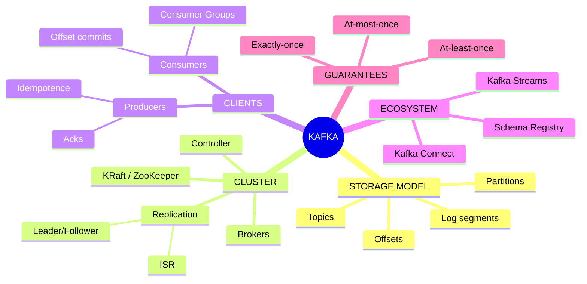
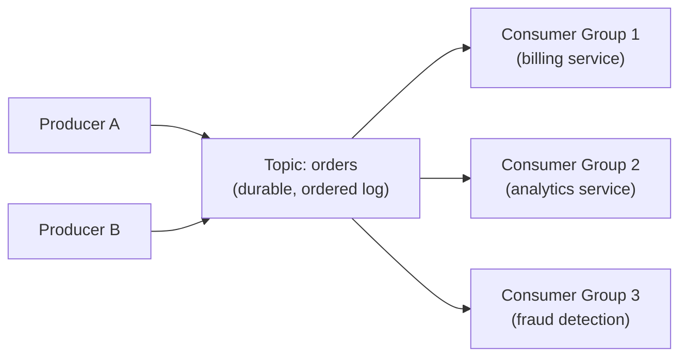
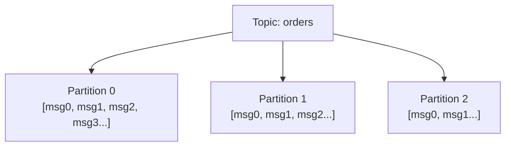
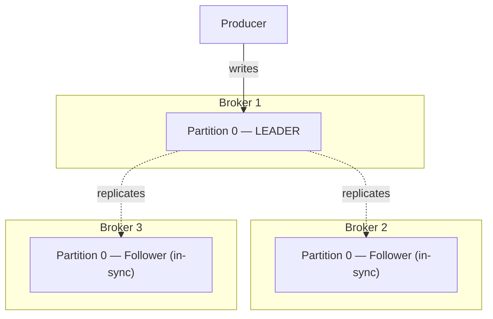
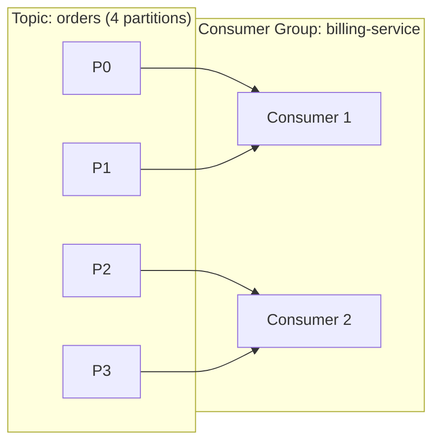

# The Complete Guide to Apache Kafka

*A senior-engineer reference: architecture, partitions & replication, producers & consumers, delivery semantics, Kafka Streams/Connect, schema registry, performance tuning, debugging, and interview traps.*

> **How to read this guide.** Every topic starts with a plain **Definition**, then **Where it's used**, then the mechanics. Jargon gets a short definition in parentheses the first time it appears. Skim the mind map first to build the skeleton, then dive in.

---

## Table of Contents

1. [Mind Map — the whole landscape on one screen](#0-mindmap)
2. [What Kafka Actually Is](#1-what-is-kafka)
3. [Core Architecture: Brokers, Topics, Partitions](#2-architecture)
4. [Replication & Fault Tolerance](#3-replication)
5. [Producers](#4-producers)
6. [Consumers & Consumer Groups](#5-consumers)
7. [Delivery Semantics](#6-delivery-semantics)
8. [Kafka Streams](#7-streams)
9. [Kafka Connect](#8-connect)
10. [Schema Registry](#9-schema-registry)
11. [Performance & Tuning](#10-performance)
12. [Kafka vs Other Messaging Systems](#11-comparison)
13. [Common Problems & Debugging Playbook](#12-debugging)
14. [Tricky Interview Questions & Answers](#13-tricky-qa)
15. [Cheat Sheets & Decision Tables](#14-cheatsheets)

---

<a name="0-mindmap"></a>
## 1. Mind Map — the whole landscape on one screen



**Reading the map:** Kafka is, at its core, a **distributed, append-only log** (storage model). Everything else — brokers replicating that log, producers writing to it, consumers reading from it, Streams/Connect processing it — is built on top of that one idea.

---

<a name="1-what-is-kafka"></a>
## 2. What Kafka Actually Is

**Definition.** Apache Kafka is a **distributed event streaming platform**: a durable, ordered, append-only log that many producers can write to and many consumers can read from independently, at their own pace, without the producer and consumer ever talking to each other directly.

**Where it's used.** Event-driven microservices, activity/clickstream pipelines, log aggregation, real-time analytics, CDC (**Change Data Capture** — streaming a database's row-level changes as events), decoupling services at high throughput.

**The key mental shift from a traditional queue:** in something like RabbitMQ, a message is typically consumed and then it's gone. In Kafka, a message is **retained** on disk for a configured period (or forever) regardless of whether it's been read — consumers just keep a bookmark (**offset**, defined below) of how far they've read. This means the same message can be re-read, replayed from the beginning, or read independently by ten different consumer groups.



Each consumer group reads the *entire* topic independently, at its own offset — one slow consumer never blocks another.

---

<a name="2-architecture"></a>
## 3. Core Architecture: Brokers, Topics, Partitions

| Concept | Definition |
|---|---|
| **Broker** | One Kafka server; a cluster is a set of brokers working together. |
| **Topic** | A named stream of records — think of it as a table name or a category. |
| **Partition** | A topic is split into ordered, immutable logs called partitions, each hosted on brokers and appended-to sequentially. Order is guaranteed **within** a partition, never across the whole topic. |
| **Offset** | The position of a record within its partition — a simple, ever-increasing integer per partition. This is a consumer's "bookmark." |
| **Segment** | Partitions are physically stored as a series of segment files on disk, rolled over by size/time, which is how old data gets deleted/compacted efficiently. |



**Why partitions matter:** they're Kafka's unit of *parallelism*. More partitions = more consumers can read the topic in parallel = higher throughput. But partitions are also the unit of *ordering* — so if you need strict ordering for a given entity (e.g., all events for one `order_id`), that entity's events must always land in the same partition.

**Partitioning key.** A producer picks a partition per message — usually by hashing a **key** (`hash(key) % num_partitions`). Same key → same partition, every time → ordering preserved *for that key*. No key → round-robin/sticky distribution for max throughput, no ordering guarantee.

**Cluster coordination.** Someone has to track which broker leads which partition, handle broker failures, and manage metadata. Historically this was **ZooKeeper** (a separate coordination service); modern Kafka (3.x+) uses **KRaft** (Kafka's own **Raft**-based consensus built into the brokers themselves), removing the ZooKeeper dependency entirely.

---

<a name="3-replication"></a>
## 4. Replication & Fault Tolerance

**Definition.** Each partition is replicated across multiple brokers so the topic survives a broker failure without losing data.



| Term | Definition |
|---|---|
| **Replication factor** | How many copies of each partition exist across the cluster (commonly 3 in production). |
| **Leader** | The one replica that handles all reads and writes for a partition at any given time. |
| **Follower** | A replica that passively copies the leader's log, ready to take over if the leader fails. |
| **ISR** (In-Sync Replica set) | The subset of replicas that are fully caught up with the leader — only ISR members are eligible to be elected the new leader on failover, so no committed data is lost. |
| **Unclean leader election** | Allowing an out-of-sync replica to become leader anyway (data loss, but keeps the partition writable). Disabled by default in modern Kafka for good reason. |

**Durability knobs that trade off latency vs safety:**
- `replication.factor` — how many copies exist.
- `min.insync.replicas` — how many ISR members must acknowledge a write before it's considered committed (paired with producer `acks=all`, below).

---

<a name="4-producers"></a>
## 5. Producers

**Definition.** A producer publishes records to a topic, choosing (directly or via a partitioner) which partition each record lands on.

| Setting | Definition | Trade-off |
|---|---|---|
| `acks=0` | Fire and forget — don't wait for any broker confirmation | Fastest, can silently lose data |
| `acks=1` | Wait for the **leader** to write the record | Balanced — safe unless the leader fails before followers replicate |
| `acks=all` (or `-1`) | Wait for **all** ISR members (per `min.insync.replicas`) to write it | Safest, highest latency |
| `enable.idempotence=true` | Producer attaches a sequence number so the broker can detect and drop duplicate retries | Prevents duplicates caused by network retries — turn this on |
| `linger.ms` / `batch.size` | How long/how much to buffer before sending a batch | Higher = better throughput, more latency per message |
| `compression.type` | Compress batches before sending (`snappy`, `lz4`, `zstd`) | Big throughput/cost win, small CPU cost |

**Idempotent producer + `acks=all`** is the standard "don't lose or duplicate messages" baseline configuration. Combine idempotence with **transactions** (`transactional.id`) to get atomic writes across multiple partitions/topics — the foundation of Kafka's exactly-once semantics (§7).

---

<a name="5-consumers"></a>
## 6. Consumers & Consumer Groups

**Definition.** A **consumer group** is a named set of consumer instances that cooperatively read a topic — Kafka automatically splits the topic's partitions among the group's members, so each partition is read by exactly *one* consumer in the group at a time.



- **You can never usefully have more consumers in a group than partitions** — the extras sit idle. This is the main reason partition count is a capacity-planning decision, not an afterthought.
- **Rebalance** — when a consumer joins/leaves a group (or crashes), Kafka reassigns partitions among the remaining members. Frequent, disruptive rebalances (a "rebalance storm") are a top production headache — usually caused by consumers taking longer than `max.poll.interval.ms` to process a batch and getting kicked from the group.
- **Offset commit** — a consumer periodically records the last offset it successfully processed, per partition, so it can resume there after a restart/rebalance instead of re-reading everything (or skipping data).
  - **Auto-commit** — Kafka commits on a timer, regardless of whether you've actually finished processing. Simple, but risks "commit before you're done" (lose data on crash) or "commit way behind" (reprocess a lot on restart).
  - **Manual commit** — you commit explicitly after processing succeeds, giving you control over the exact at-least-once/at-most-once trade-off.
- **Consumer lag** — how far behind the latest offset a consumer group is. The single most important Kafka health metric; sustained/growing lag means consumers can't keep up with producers.

---

<a name="6-delivery-semantics"></a>
## 7. Delivery Semantics

**Definition.** How many times a given message is guaranteed to be *processed* by a consumer, in the presence of failures and retries.

| Semantic | Definition | How you get it |
|---|---|---|
| **At-most-once** | A message might be lost, but is never processed twice | Commit offset *before* processing |
| **At-least-once** | A message is never lost, but might be processed twice | Commit offset *after* processing (the default, safe baseline) |
| **Exactly-once (EOS)** | Each message affects the end result exactly once, even after retries/failures | Idempotent producer + transactions + a consumer that commits offsets as part of the same transaction as its output |

**The practical reality:** true exactly-once is easiest to reason about **within Kafka** (e.g., a Kafka Streams app reading from one topic and writing to another, using Kafka's transactional API end-to-end). The moment output goes to an external system (a database, an API call), you're usually back to **at-least-once + idempotent downstream writes** (e.g., an upsert keyed by message ID) as the practical way to achieve effectively-once behavior.

---

<a name="7-streams"></a>
## 8. Kafka Streams

**Definition.** A Java library (not a separate cluster to run) for building stream-processing applications directly on top of Kafka — read from a topic, transform/aggregate/join, write to another topic.

**Where it's used.** Real-time aggregations, joining two event streams, stateful transformations, without standing up a separate processing cluster like Flink/Spark.

- **KStream** — a record stream (every event is independent, like an insert-only log).
- **KTable** — a changelog stream interpreted as a table (each record is an upsert keyed by its key — "current state," not "history").
- **State store** — local, disk-backed storage (RocksDB) Streams uses for aggregations/joins, continuously backed up to a Kafka topic (the **changelog topic**) so state can be rebuilt on a node failure.
- **Topology** — the DAG of processing steps (map, filter, join, aggregate) an application is built from.

---

<a name="8-connect"></a>
## 9. Kafka Connect

**Definition.** A framework for streaming data **into** Kafka from external systems (**source connectors** — e.g., a database's CDC stream) and **out of** Kafka into external systems (**sink connectors** — e.g., writing to S3 or Elasticsearch) — configuration-driven, no custom code required for common integrations.

**Where it's used.** Wiring up a database, data warehouse, or search index to Kafka without hand-writing a producer/consumer. Runs as its own cluster of **workers**, each executing one or more connector **tasks** in parallel.

---

<a name="9-schema-registry"></a>
## 10. Schema Registry

**Definition.** A separate service that stores and versions the schemas (Avro, Protobuf, or JSON Schema) for the data flowing through Kafka topics, so producers and consumers agree on the shape of a message without shipping the full schema in every single record.

**Where it's used.** Any team running Kafka past a handful of ad-hoc JSON topics — it's what prevents "a producer changed a field type and silently broke five consumers" incidents.

- **Compatibility modes** — `BACKWARD` (new schema can read old data), `FORWARD` (old schema can read new data), `FULL` (both). Enforced at registration time so an incompatible schema change is rejected before it ships.
- A message on the wire typically carries just a small **schema ID**; consumers fetch the actual schema from the registry (and cache it) to deserialize.

---

<a name="10-performance"></a>
## 11. Performance & Tuning

| Lever | Effect |
|---|---|
| **More partitions** | More parallelism (more consumers can work at once) — but too many adds broker overhead and slower leader elections |
| **Batching (`linger.ms`, `batch.size`)** | Fewer, bigger network round-trips — higher throughput, slightly higher per-message latency |
| **Compression** | Smaller network/disk footprint, small CPU cost — almost always worth enabling |
| **`min.insync.replicas` + `acks=all`** | Stronger durability, higher write latency — set based on how much data loss is tolerable |
| **Consumer `fetch.min.bytes` / `fetch.max.wait.ms`** | Consumer waits to accumulate a bigger batch before returning — trades latency for fewer, more efficient fetches |
| **Right-sized retention (`retention.ms`/`retention.bytes`)** | Controls disk usage; use **compaction** instead of time-based deletion for "latest value per key" topics (e.g., a changelog) |

**Log compaction** — an alternative to deleting old data by age: Kafka keeps only the *latest* record per key in the partition, deleting older records with the same key. Perfect for topics that represent current state (e.g., "latest profile per user ID") rather than a history of events.

---

<a name="11-comparison"></a>
## 12. Kafka vs Other Messaging Systems

| | **Kafka** | **RabbitMQ** | **SQS** |
|---|---|---|---|
| Model | Distributed log, retained regardless of consumption | Traditional message broker/queue | Managed queue (AWS) |
| Ordering | Per-partition, strict | Per-queue, with caveats under concurrency | FIFO queues only |
| Replay | Yes — re-read from any offset | No — once consumed (acked), it's gone | No |
| Throughput | Very high (millions/sec across a cluster) | High, but generally lower than Kafka | High, fully managed, no ops |
| Best for | Event streaming, log aggregation, high-throughput pipelines, event sourcing | Complex routing (exchanges), task queues, RPC-style messaging | Simple decoupling in an AWS-native stack, zero ops |

See the [RabbitMQ guide](./RabbitMQ-Guide.md) for RabbitMQ's routing model in detail.

---

<a name="12-debugging"></a>
## 13. Common Problems & Debugging Playbook

| Symptom | Likely cause | Fix |
|---|---|---|
| Growing consumer lag | Consumers too slow, or under-partitioned/under-scaled | Add consumers (up to partition count), speed up processing, check for downstream call latency |
| Frequent rebalances | Consumer processing exceeds `max.poll.interval.ms` | Increase the interval, reduce `max.poll.records`, offload slow work asynchronously |
| `NOT_LEADER_FOR_PARTITION` errors | Client's metadata is stale after a leader election | Client should auto-refresh metadata and retry; check broker health if persistent |
| Uneven partition load ("hot partition") | Poor key choice, or too few distinct keys | Pick a higher-cardinality partition key, or explicitly rebalance partition assignment |
| Duplicate records downstream | Producer retries without idempotence, or at-least-once semantics without idempotent consumers | Enable `enable.idempotence=true`; make downstream writes idempotent (upsert by message ID) |
| Disk filling up on brokers | Retention set too long for the data volume | Tune `retention.ms`/`retention.bytes`, or switch to compaction for state-style topics |
| Consumer stuck reprocessing the same messages forever | A "poison message" repeatedly fails and isn't being routed aside | Implement a dead-letter topic for messages that fail processing after N retries |

**Go-to diagnostic commands:**
```bash
# Describe consumer group lag
kafka-consumer-groups.sh --bootstrap-server localhost:9092 --describe --group my-group

# List topics and partition/replica layout
kafka-topics.sh --bootstrap-server localhost:9092 --describe --topic orders

# Tail a topic from the beginning
kafka-console-consumer.sh --bootstrap-server localhost:9092 --topic orders --from-beginning
```

---

<a name="13-tricky-qa"></a>
## 14. Tricky Interview Questions & Answers

**Q: Does Kafka guarantee ordering?** Only *within a partition*, never across an entire topic. If you need ordering for an entity, its events must share a partition key.

**Q: What happens if a consumer crashes mid-processing?** Depends on when it committed its offset. If it commits before processing (rare/bad practice) → message is lost (at-most-once). If it commits after (the norm) → the message is redelivered to another consumer on rebalance (at-least-once) — so consumers must be idempotent or tolerate duplicates.

**Q: How does Kafka achieve high throughput?** Sequential disk writes (append-only log — far faster than random I/O), zero-copy reads (the OS sends data from page cache straight to the network socket without extra copies through the JVM), and batching/compression on both producer and consumer sides.

**Q: Why would you increase partition count, and what's the cost?** More partitions = more parallel consumers = more throughput. Cost: more open file handles/memory per broker, slower leader elections during failover, and partition count can only go *up*, never down, on an existing topic — so under-provisioning is easier to fix than over-provisioning.

**Q: ZooKeeper vs KRaft?** ZooKeeper was Kafka's original external coordination service for cluster metadata/leader election. KRaft (Kafka 3.x+, default in 4.x) replaced it with Kafka's own Raft-based consensus built into the brokers — one less system to operate, faster metadata propagation, higher partition-count ceilings.

**Q: Kafka vs a traditional message queue — when would you NOT use Kafka?** When you need complex per-message routing logic (RabbitMQ's exchange types), true low-latency work queues with per-message acknowledgment semantics, or you don't have the throughput/replay requirements to justify Kafka's operational complexity.

**Q: What's the difference between a KStream and a KTable?** A KStream is an unbounded sequence of independent events (an insert log). A KTable is a changelog interpreted as "the current value per key" (an upsert view) — the same underlying Kafka topic can be read either way depending on what question you're asking of it.

---

<a name="14-cheatsheets"></a>
## 15. Cheat Sheets & Decision Tables

### Producer durability quick-pick
```
Can tolerate occasional loss, need max speed  → acks=0
Balanced default                               → acks=1
Financial/critical data, no loss tolerated     → acks=all + min.insync.replicas=2 + idempotence=true
```

### Delivery semantics quick-pick
```
Loss is OK, duplicates are not                 → at-most-once (commit before processing)
Duplicates are OK, loss is not (default)       → at-least-once (commit after processing)
Neither is OK                                  → exactly-once (transactions, or idempotent downstream writes)
```

### When to reach for what
```
Need parallel processing of a topic            → more partitions (up to your consumer count)
Need "current state per key," not full history → log compaction
Need to stream a DB into Kafka                 → Kafka Connect (source connector, often CDC)
Need to process/transform/join streams         → Kafka Streams
Need schema safety across teams                → Schema Registry with BACKWARD/FORWARD compatibility
```

### Final principles
1. **Partitions are your unit of both parallelism and ordering** — choose the key deliberately.
2. **`acks=all` + idempotent producer is the safe default**, not the exception.
3. **Consumer lag is your #1 health metric** — alert on it before it becomes an incident.
4. **At-least-once + idempotent consumers beats chasing exactly-once everywhere.**
5. **Retention and compaction are different tools** — history vs current-state topics need different settings.
6. **Rebalances are disruptive** — tune `max.poll.interval.ms` and processing time to avoid rebalance storms.
