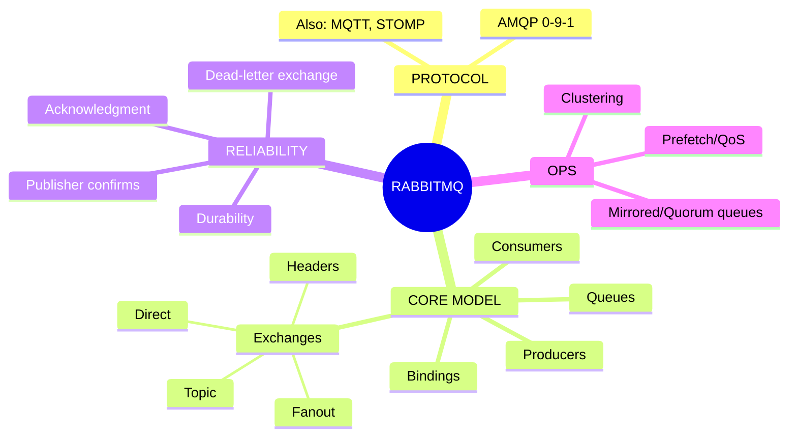
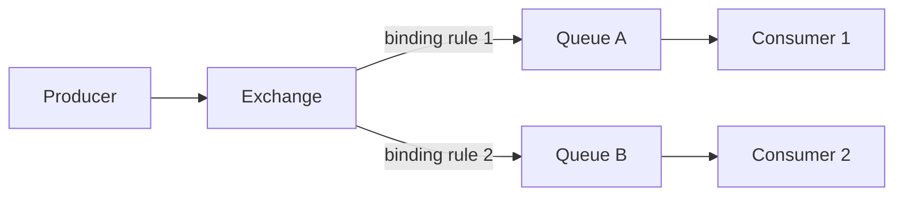
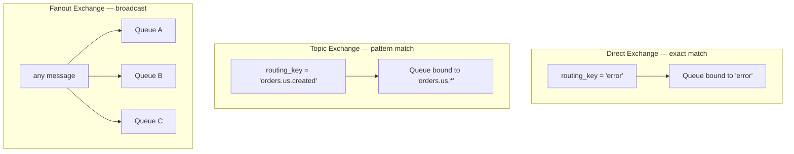
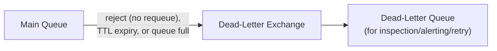

# The Complete Guide to RabbitMQ

*A senior-engineer reference: AMQP, exchanges & routing, queues & bindings, acknowledgment & dead-lettering, clustering & HA, and interview traps.*

> **How to read this guide.** Every topic starts with a plain **Definition**, then **Where it's used**, then the mechanics. Jargon gets a short definition in parentheses the first time it appears. Skim the mind map first to build the skeleton, then dive in.

---

## Table of Contents

1. [Mind Map — the whole landscape on one screen](#0-mindmap)
2. [What RabbitMQ Actually Is](#1-what-is-rabbitmq)
3. [Core Model: Exchanges, Queues, Bindings](#2-core-model)
4. [Exchange Types](#3-exchange-types)
5. [Message Acknowledgment & Reliability](#4-ack)
6. [Dead-Lettering & Retry Patterns](#5-dlq)
7. [Clustering & High Availability](#6-clustering)
8. [Common Messaging Patterns](#7-patterns)
9. [RabbitMQ vs Kafka vs SQS](#8-comparison)
10. [Common Problems & Debugging Playbook](#9-debugging)
11. [Tricky Interview Questions & Answers](#10-tricky-qa)
12. [Cheat Sheets & Decision Tables](#11-cheatsheets)

---

<a name="0-mindmap"></a>
## 1. Mind Map — the whole landscape on one screen



**Reading the map:** RabbitMQ's whole model is: a producer never sends a message to a queue directly — it sends to an **exchange**, which uses **bindings** to decide which **queue(s)** get a copy. That one indirection (exchange → binding → queue) is what makes RabbitMQ's routing far more flexible than a plain queue system.

---

<a name="1-what-is-rabbitmq"></a>
## 2. What RabbitMQ Actually Is

**Definition.** RabbitMQ is a **message broker** implementing **AMQP** (Advanced Message Queuing Protocol — an open standard for how producers, brokers, and consumers exchange messages) — it routes discrete messages from producers to one or more consumer queues based on flexible rules, and removes a message once it's been successfully consumed.

**Where it's used.** Task/work queues (background jobs), RPC-style request/reply between services, complex routing scenarios (route orders by region, priority, or type), decoupling services in a traditional microservices architecture.

**The core distinction from Kafka:** RabbitMQ is a traditional **broker** — a message is typically deleted once consumed and acknowledged (it's not retained for replay). Kafka is a **durable, replayable log** where messages persist regardless of consumption (see the [Kafka guide](./Kafka-Guide.md)). RabbitMQ's strength is **flexible routing** (send this message to exactly these queues, based on rich rules); Kafka's strength is **throughput and replay**.



---

<a name="2-core-model"></a>
## 3. Core Model: Exchanges, Queues, Bindings

| Concept | Definition |
|---|---|
| **Producer** | An application that publishes messages — always to an **exchange**, never directly to a queue. |
| **Exchange** | A routing agent — receives messages and decides which queue(s) to deliver them to, based on its type and its bindings. |
| **Binding** | A rule connecting an exchange to a queue, optionally with a **routing key** or pattern that determines which messages get routed there. |
| **Queue** | An ordered buffer holding messages until a consumer takes and acknowledges them. |
| **Consumer** | An application that subscribes to a queue and processes messages from it. |
| **Routing key** | A string attached to a message by the producer, used by the exchange (depending on type) to decide where it goes. |
| **Virtual host (vhost)** | A logical namespace within a broker — isolates exchanges/queues/permissions between different applications or teams sharing one RabbitMQ cluster. |

---

<a name="3-exchange-types"></a>
## 4. Exchange Types

**Definition.** The exchange type determines *how* a routing key (and headers) are matched against bindings to pick destination queues. This is RabbitMQ's core flexibility — the same broker can do simple work queues and rich content-based routing depending only on which exchange type you choose.



| Type | Definition | Use case |
|---|---|---|
| **Direct** | Delivers to queues whose binding key **exactly matches** the message's routing key | Route by an exact category, e.g., log level `error` vs `info` |
| **Topic** | Delivers based on **wildcard pattern matching** on the routing key (`*` = one word, `#` = zero or more words), e.g. `orders.us.*` | Rich, hierarchical routing — "all US orders," "all created events regardless of region" |
| **Fanout** | Ignores the routing key entirely — delivers to **every** bound queue | Broadcast/pub-sub, e.g., invalidate a cache on every instance |
| **Headers** | Matches on message header key/value pairs instead of the routing key | Routing decisions based on multiple independent attributes, rarely used in practice |

**The default exchange** — every vhost has a nameless default direct exchange where every queue is auto-bound with a routing key equal to its own name; this is the simple "publish straight to a named queue" mode most tutorials start with, and is really just Direct exchange routing under the hood.

---

<a name="4-ack"></a>
## 5. Message Acknowledgment & Reliability

**Definition.** RabbitMQ needs to know when a message has been *successfully* processed before it's safe to remove it from the queue — that confirmation is the **acknowledgment** (ack).

| Mechanism | Definition |
|---|---|
| **Consumer ack** | The consumer explicitly tells RabbitMQ "I've fully processed this message" (`basic.ack`). If the consumer disconnects before acking, the message is **requeued** for another consumer. |
| **Auto-ack** | RabbitMQ considers a message acknowledged the instant it's delivered, regardless of whether processing actually succeeds. Fast, but a crash mid-processing silently loses the message — avoid for anything that matters. |
| **Negative ack (nack) / reject** | The consumer explicitly says "I can't process this" — optionally requeueing it, or routing it to a dead-letter exchange (§6). |
| **Publisher confirms** | The mirror image on the producer side — the broker confirms it has safely received and persisted the message, so the producer knows a publish actually succeeded (not just that the TCP write didn't error). |
| **Durability** | A queue and its messages must both be marked **durable/persistent**, or they're lost on a broker restart — durability is opt-in, not the default. |
| **QoS / prefetch count** | Limits how many unacknowledged messages a consumer can hold at once — prevents one greedy consumer from grabbing the whole queue while a slower one starves. |

**The reliable-delivery baseline:** durable queue + persistent messages + publisher confirms + manual consumer ack. Skip any one of these and you have a specific, well-known way to silently lose messages.

---

<a name="5-dlq"></a>
## 6. Dead-Lettering & Retry Patterns

**Definition.** A **dead-letter exchange (DLX)** is where RabbitMQ routes a message that couldn't be processed normally — rejected without requeue, expired via TTL, or the queue hit its max length — so a bad message doesn't get stuck retrying forever or silently vanish.



**Common retry pattern** — since RabbitMQ has no built-in delayed retry, teams build one from these primitives: reject a failed message → it dead-letters into a "retry" queue with a **message TTL** (Time To Live) → when that TTL expires, the message dead-letters *again*, back into the original queue → it's retried. Chaining several such queues with increasing TTLs gives you an exponential-backoff retry mechanism entirely out of standard RabbitMQ features (or use the **delayed-message exchange plugin** for a more direct version of the same idea).

---

<a name="6-clustering"></a>
## 7. Clustering & High Availability

**Definition.** A RabbitMQ **cluster** is multiple broker nodes that share exchange/binding/user definitions, but by default a given queue's messages live on only *one* node unless explicitly replicated.

| Concept | Definition |
|---|---|
| **Classic queue** | The original queue type; not replicated by default — if its node dies, the queue (and its messages, unless durable and the node recovers) is unavailable. |
| **Quorum queue** | The modern, recommended replicated queue type — uses the **Raft consensus algorithm** to replicate a queue's data across multiple nodes, so it survives a node failure with no data loss. Replaces the older, now-deprecated "mirrored queues" approach. |
| **Node** | One RabbitMQ broker instance in a cluster. |

**Production guidance:** use **quorum queues** for anything where losing a node shouldn't lose messages — this has been the recommended default over classic/mirrored queues for several years now.

---

<a name="7-patterns"></a>
## 8. Common Messaging Patterns

| Pattern | How it's built |
|---|---|
| **Work queue (competing consumers)** | Multiple consumers on one queue, each message processed by exactly one of them — for distributing background jobs |
| **Pub/sub (fanout)** | A fanout exchange bound to many queues, one per subscriber — every subscriber gets every message |
| **Topic-based routing** | A topic exchange with wildcard bindings — route messages to interested consumers based on a hierarchical key |
| **RPC (request/reply)** | Producer publishes with a `reply_to` queue name and a `correlation_id`; the consumer processes and publishes the response to `reply_to`, tagged with the same `correlation_id` so the original caller can match request to response |
| **Priority queue** | A queue configured with a max priority level; higher-priority messages are delivered before lower-priority ones |

---

<a name="8-comparison"></a>
## 9. RabbitMQ vs Kafka vs SQS

| | **RabbitMQ** | **Kafka** | **SQS** |
|---|---|---|---|
| Model | Smart broker, flexible routing | Distributed log, replayable | Managed simple queue |
| Message lifecycle | Deleted after ack (typically) | Retained per a retention policy, regardless of consumption | Deleted after ack |
| Routing flexibility | Very high (4 exchange types, patterns) | Low — partition key only | None — just a queue |
| Ordering | Per-queue (FIFO within a queue, if single consumer) | Per-partition, strict | FIFO queues only |
| Throughput ceiling | High | Very high | High, fully managed |
| Best for | Complex routing, RPC-style messaging, task queues | Event streaming, replay, high-throughput pipelines | Simple decoupling in AWS, zero ops |

See the [Kafka guide's comparison section](./Kafka-Guide.md#11-comparison) for the Kafka side of this in more depth.

---

<a name="9-debugging"></a>
## 10. Common Problems & Debugging Playbook

| Symptom | Likely cause | Fix |
|---|---|---|
| Queue length growing unbounded | Consumers too slow, crashed, or not connected | Check consumer health; scale consumers; verify prefetch isn't starving them |
| Messages disappear on broker restart | Queue or messages not marked durable/persistent | Declare the queue durable and publish messages as persistent |
| One consumer hogs all messages, others idle | Prefetch count too high (or unset/unlimited) on a fast-then-slow consumer mix | Set a sensible QoS/prefetch count per consumer |
| Messages stuck redelivering forever | Consumer keeps nacking/rejecting with requeue on a message it can never process ("poison message") | Reject without requeue and route to a dead-letter queue after N attempts |
| `PRECONDITION_FAILED` on queue declare | Queue already exists with different arguments (e.g., durability mismatch) | Delete and redeclare consistently, or use a new queue name |
| Cluster split-brain / node can't rejoin | Network partition between cluster nodes | Configure partition handling policy (e.g., `pause_minority`); investigate network stability |
| Publisher thinks a message sent but it never arrives | No publisher confirms in use — a TCP-level success doesn't guarantee broker persistence | Enable publisher confirms and handle negative acknowledgments |

---

<a name="10-tricky-qa"></a>
## 11. Tricky Interview Questions & Answers

**Q: Why does a producer never publish directly to a queue?** It always publishes to an *exchange*; the exchange's type and bindings decide which queue(s), if any, receive the message. This indirection is what lets you change routing logic (add a new interested consumer, re-route by content) without touching producer code.

**Q: Direct vs Topic exchange — when would you use each?** Direct for exact-match routing on a single known value (e.g., a log level). Topic when you need hierarchical/wildcard matching (e.g., route `orders.*.created` to one consumer and `orders.us.#` to another) — Topic is a strict superset of Direct's behavior.

**Q: What happens if a consumer crashes without acking?** RabbitMQ detects the lost connection and requeues any unacknowledged messages that consumer was holding, making them available to other consumers — this is why manual acking (not auto-ack) is the safe default.

**Q: How do you get exactly-once-like behavior in RabbitMQ, given there's no native exactly-once?** You don't get it natively — you combine at-least-once delivery (durable queues, manual ack) with an **idempotent consumer** (e.g., dedupe by a message ID before applying an effect), the same practical pattern used across most messaging systems, including Kafka.

**Q: Classic vs Quorum queues?** Classic queues aren't replicated by default (or use the older, deprecated mirroring approach) — a node failure can mean data loss or unavailability. Quorum queues use Raft consensus to replicate across nodes and are the modern recommended default for anything requiring durability guarantees.

**Q: How would you build a delayed-retry mechanism in RabbitMQ?** Chain a "retry" queue with a message TTL behind a dead-letter exchange pointing back at the original queue — when a message's TTL expires in the retry queue, it dead-letters back to be retried, giving you delay without any special broker feature (or use the delayed-message-exchange plugin directly).

**Q: RabbitMQ vs Kafka — the one-sentence answer?** RabbitMQ is a smart router for discrete messages that are typically consumed once and gone; Kafka is a durable, replayable log optimized for very high throughput and multiple independent consumers reading the same data at their own pace.

---

<a name="11-cheatsheets"></a>
## 12. Cheat Sheets & Decision Tables

### Pick an exchange type
```
Exact match on one value              → Direct
Hierarchical / wildcard routing       → Topic
Broadcast to everyone                 → Fanout
Match on multiple header attributes   → Headers (rare)
```

### Reliable delivery checklist
```
1. Durable queue
2. Persistent messages
3. Publisher confirms enabled
4. Manual consumer ack (not auto-ack)
5. Reasonable prefetch/QoS set per consumer
6. Dead-letter exchange configured for poison messages
```

### Pick a message broker
```
Complex routing / RPC / task queues            → RabbitMQ
High-throughput event streaming with replay    → Kafka
Simple decoupling, fully managed, AWS-native   → SQS
```

### Final principles
1. **Producers publish to exchanges, never to queues directly** — routing logic lives in bindings, not producer code.
2. **Durable queue + persistent message + publisher confirm + manual ack** is the reliable-delivery baseline — treat each as opt-in, not default.
3. **Use quorum queues** for anything where a node failure must not lose data.
4. **Poison messages need a dead-letter path** — infinite requeue loops are a self-inflicted outage.
5. **Prefetch/QoS keeps a fast consumer from starving the others** — tune it deliberately, don't leave it unlimited.
6. **RabbitMQ trades throughput ceiling for routing flexibility** — pick it when the routing logic is the hard part, not the volume.
