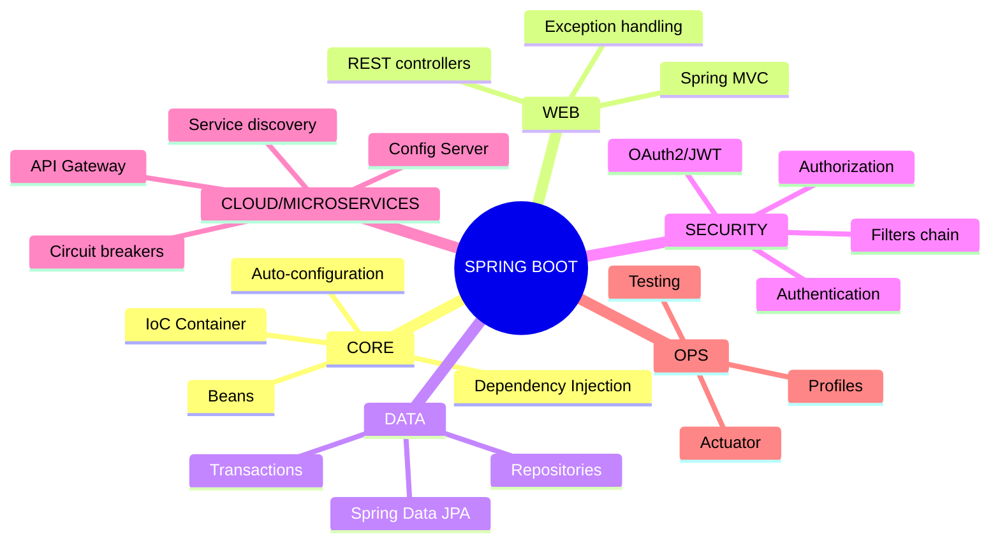
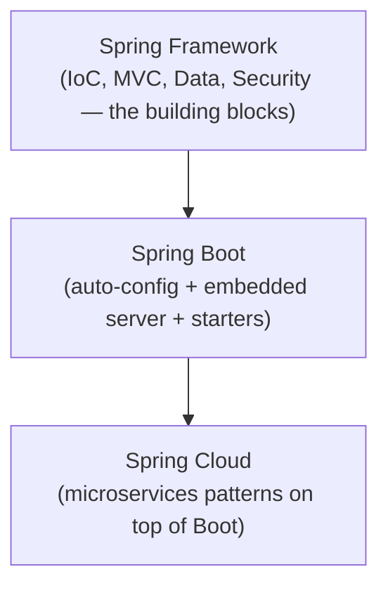

# The Complete Guide to Spring Boot & Spring Web Services

*A senior-engineer reference: IoC/DI, auto-configuration, Spring MVC/REST, Spring Data JPA, Spring Security, Spring Cloud, testing, Actuator, REST vs SOAP, and interview traps.*

> **How to read this guide.** Every topic starts with a plain **Definition**, then **Where it's used**, then the mechanics. Jargon gets a short definition in parentheses the first time it appears. Skim the mind map first to build the skeleton, then dive in. Security concepts here build on the general model in the [Auth/Identity guide](./Authentication-Authorization-Identity-Cryptography-Guide.md).

---

## Table of Contents

1. [Mind Map — the whole landscape on one screen](#0-mindmap)
2. [What Spring & Spring Boot Actually Are](#1-what-is-spring)
3. [IoC & Dependency Injection](#2-ioc-di)
4. [Auto-Configuration & Starters](#3-auto-config)
5. [Spring MVC & Building REST APIs](#4-mvc)
6. [Spring Data JPA](#5-data-jpa)
7. [Spring Security](#6-security)
8. [Configuration & Profiles](#7-config)
9. [Spring Cloud & Microservices](#8-cloud)
10. [Actuator & Observability](#9-actuator)
11. [Testing in Spring Boot](#10-testing)
12. [REST vs SOAP Web Services](#11-rest-vs-soap)
13. [Common Problems & Debugging Playbook](#12-debugging)
14. [Tricky Interview Questions & Answers](#13-tricky-qa)
15. [Cheat Sheets & Decision Tables](#14-cheatsheets)

---

<a name="0-mindmap"></a>
## 1. Mind Map — the whole landscape on one screen



**Reading the map:** Spring's foundation is one idea — the **IoC container** manages object creation and wiring so your code never does `new` for its own dependencies. Every other layer (MVC, Data, Security, Cloud) is a set of beans that plug into that same container, which is why they compose so cleanly.

---

<a name="1-what-is-spring"></a>
## 2. What Spring & Spring Boot Actually Are

**Definition.** **Spring Framework** is a Java application framework built around **Inversion of Control** (§3) — it manages object lifecycles and wiring so components stay decoupled and testable. **Spring Boot** is an opinionated layer on top of Spring that eliminates most manual configuration via **auto-configuration** (§4) and embedded servers, so you can run a production-ready app from a single `main()` method with minimal setup.

**Where it's used.** REST APIs and microservices, enterprise backend systems, batch jobs, messaging consumers — the dominant framework in the Java backend ecosystem.

**Spring vs Spring Boot, the interview-ready distinction:** Spring is the framework (IoC container, MVC, Data access, Security, etc.) — historically configured via verbose XML or manual `@Configuration` classes. Spring Boot doesn't replace any of that; it *auto-configures* it based on what's on your classpath, bundles an embedded server (Tomcat/Jetty/Netty) so there's no separate app-server deployment step, and packages sensible defaults (**starters**, §4) so adding a capability is one dependency, not a page of XML.



---

<a name="2-ioc-di"></a>
## 3. IoC & Dependency Injection

**Definition.** **IoC** (Inversion of Control) means an object's dependencies are provided *to* it, rather than the object creating them itself — control over object creation/wiring is inverted, from your code to the framework. **Dependency Injection (DI)** is the specific mechanism Spring uses to implement IoC: the container constructs your objects (**beans**) and hands each one whatever it declares it needs.

```java
// Without DI: OrderService creates its own dependency — tightly coupled, hard to test
class OrderService {
    private PaymentGateway gateway = new StripeGateway();
}

// With DI: Spring injects whatever PaymentGateway bean is configured
@Service
class OrderService {
    private final PaymentGateway gateway;

    OrderService(PaymentGateway gateway) {   // constructor injection — the recommended form
        this.gateway = gateway;
    }
}
```

| Concept | Definition |
|---|---|
| **Bean** | An object whose lifecycle (creation, wiring, destruction) is managed by the Spring **ApplicationContext** (the IoC container), instead of by your own code. |
| **`@Component` / `@Service` / `@Repository` / `@Controller`** | Stereotype annotations marking a class to be auto-detected and registered as a bean during classpath scanning — they're functionally near-identical to `@Component`, but the more specific ones convey intent and, for `@Repository`, add automatic exception translation. |
| **Constructor injection** | Dependencies passed via the constructor. ✅ The recommended default — makes dependencies explicit, required, and immutable (`final` fields), and is trivially testable without Spring at all. |
| **Field injection** (`@Autowired` on a field) | Dependencies injected directly into a field. ❌ Common in tutorials, but hides required dependencies, prevents `final`, and makes plain unit testing harder — avoid for new code. |
| **Bean scope** | How many instances exist: **singleton** (default — one shared instance per container) vs **prototype** (a new instance every time it's requested) vs web-specific scopes (**request**, **session**). |
| **ApplicationContext** | The IoC container itself — holds bean definitions, wires them together, manages their lifecycle. |

**Why this matters beyond "less boilerplate":** DI is what makes unit testing painless — swap a real `PaymentGateway` for a mock in a test without touching `OrderService`'s code at all, because it never knew *which* implementation it would get.

---

<a name="3-auto-config"></a>
## 4. Auto-Configuration & Starters

**Definition.** **Auto-configuration** inspects what's on your classpath and what beans you've already defined, then automatically registers the beans a typical app would need for that setup — e.g., seeing an embedded H2 database and Spring Data JPA on the classpath triggers auto-configuring a `DataSource` and `EntityManagerFactory`, with zero XML.

**Where it's used.** Every Spring Boot application — it's the mechanism that makes `spring-boot-starter-web` alone enough to run a working REST server.

| Concept | Definition |
|---|---|
| **Starter** | A curated dependency bundle (`spring-boot-starter-web`, `spring-boot-starter-data-jpa`, `spring-boot-starter-security`) that pulls in everything a capability needs, at compatible versions — you stop hand-picking library versions and version-conflict debugging. |
| **`@SpringBootApplication`** | A meta-annotation combining `@Configuration` (this class defines beans), `@ComponentScan` (auto-detect `@Component`s in this package and below), and `@EnableAutoConfiguration` (turn on the classpath-driven auto-configuration described above). |
| **Conditional annotations** (`@ConditionalOnClass`, `@ConditionalOnMissingBean`, etc.) | What auto-configuration classes are actually built from — "only register this bean if X is/isn't already present." This is also how you *override* an auto-configured bean: define your own, and the conditional backs off. |
| **`application.properties` / `application.yml`** | Externalized configuration auto-configuration reads from — e.g., `server.port=8081`, `spring.datasource.url=...` — instead of hardcoding values in Java. |

---

<a name="4-mvc"></a>
## 5. Spring MVC & Building REST APIs

**Definition.** **Spring MVC** is Spring's web framework, following the classic **Model-View-Controller** pattern; for REST APIs, "View" is typically just JSON serialization of the returned object, not an HTML template.

```java
@RestController                     // @Controller + @ResponseBody: return values are serialized straight to JSON
@RequestMapping("/api/orders")
class OrderController {

    private final OrderService orderService;

    OrderController(OrderService orderService) {
        this.orderService = orderService;
    }

    @GetMapping("/{id}")
    ResponseEntity<Order> getOrder(@PathVariable Long id) {
        return ResponseEntity.ok(orderService.findById(id));
    }

    @PostMapping
    ResponseEntity<Order> createOrder(@RequestBody @Valid OrderRequest request) {
        Order created = orderService.create(request);
        return ResponseEntity.status(HttpStatus.CREATED).body(created);
    }
}
```

| Annotation | Definition |
|---|---|
| **`@RestController`** | Marks a class as a REST endpoint handler; every method's return value is written directly to the response body (as JSON, by default), not resolved to an HTML view. |
| **`@RequestMapping` / `@GetMapping` / `@PostMapping` / etc.** | Maps an HTTP method + URL pattern to a handler method. |
| **`@PathVariable`** | Binds a URL path segment (`/orders/{id}`) to a method parameter. |
| **`@RequestParam`** | Binds a query-string parameter (`?status=open`) to a method parameter. |
| **`@RequestBody`** | Deserializes the request body (typically JSON) into a Java object. |
| **`@Valid`** | Triggers **Bean Validation** (`@NotNull`, `@Size`, etc. annotations on the request object) before the handler runs. |
| **`ResponseEntity<T>`** | Lets you control the full HTTP response (status code, headers, body), not just the body. |

### Exception handling
```java
@RestControllerAdvice   // applies across all controllers
class GlobalExceptionHandler {

    @ExceptionHandler(OrderNotFoundException.class)
    ResponseEntity<ErrorResponse> handleNotFound(OrderNotFoundException ex) {
        return ResponseEntity.status(HttpStatus.NOT_FOUND)
            .body(new ErrorResponse(ex.getMessage()));
    }
}
```
`@RestControllerAdvice` + `@ExceptionHandler` centralizes error handling — turning exceptions into consistent JSON error responses instead of scattering try/catch across every controller.

---

<a name="5-data-jpa"></a>
## 6. Spring Data JPA

**Definition.** **Spring Data JPA** eliminates most boilerplate data-access code by generating repository implementations at runtime from an interface you declare — no hand-written SQL or DAO implementation for standard CRUD.

```java
interface OrderRepository extends JpaRepository<Order, Long> {
    List<Order> findByStatus(String status);              // derived query — from method name
    List<Order> findByCustomerIdAndCreatedAtAfter(Long customerId, Instant since);

    @Query("SELECT o FROM Order o WHERE o.total > :amount") // explicit JPQL when derivation isn't enough
    List<Order> findLargeOrders(@Param("amount") BigDecimal amount);
}
```

| Concept | Definition |
|---|---|
| **`JpaRepository<T, ID>`** | Extend it and get `save`, `findById`, `findAll`, `delete`, pagination, and sorting for free — no implementation code. |
| **Derived query methods** | Spring Data parses the method *name itself* (`findByStatusAndCustomerId`) into a query — powerful, but readability suffers past a few conditions; fall back to `@Query` then. |
| **Entity** (`@Entity`) | A Java class mapped to a database table via JPA annotations (`@Id`, `@Column`, `@OneToMany`, etc.). |
| **`@Transactional`** | Wraps a method in a database transaction — commits on success, rolls back on an unchecked exception (by default). |
| **N+1 query problem** | Fetching a list of entities, then lazily fetching a related entity *per item* in a loop — one query becomes N+1 queries. Fix with `@EntityGraph`, a JPQL `JOIN FETCH`, or a DTO projection that fetches everything in one query. |
| **Lazy vs Eager fetching** | Lazy = related data loaded only when accessed (default for `@OneToMany`/`@ManyToMany`) — good for avoiding over-fetching, but the classic source of `LazyInitializationException` if accessed outside an open transaction/session. Eager = loaded immediately with the parent. |

---

<a name="6-security"></a>
## 7. Spring Security

**Definition.** **Spring Security** provides authentication and authorization for Spring applications via a chain of **servlet filters** that intercept every request before it reaches your controller — see the [Auth/Identity guide](./Authentication-Authorization-Identity-Cryptography-Guide.md) for the underlying AuthN/AuthZ concepts this implements.

```java
@Configuration
@EnableWebSecurity
class SecurityConfig {

    @Bean
    SecurityFilterChain filterChain(HttpSecurity http) throws Exception {
        http
            .authorizeHttpRequests(auth -> auth
                .requestMatchers("/api/public/**").permitAll()
                .requestMatchers("/api/admin/**").hasRole("ADMIN")
                .anyRequest().authenticated())
            .oauth2ResourceServer(oauth2 -> oauth2.jwt(Customizer.withDefaults()));
        return http.build();
    }
}
```

| Concept | Definition |
|---|---|
| **Filter chain** | An ordered sequence of servlet filters Spring Security installs — each handles one concern (CORS, CSRF, authentication, authorization) before the request reaches your `@RestController`. |
| **`SecurityFilterChain`** | Where you declaratively configure which URL patterns require what — authentication, specific roles/authorities, or public access. |
| **Authentication provider** | Pluggable strategy for *how* a user proves identity — username/password against a `UserDetailsService`, an OAuth2/OIDC provider, a JWT resource-server setup, etc. |
| **`@PreAuthorize` / `@PostAuthorize`** | Method-level authorization — `@PreAuthorize("hasRole('ADMIN')")` on a service method, enforced via AOP, independent of (or layered on top of) URL-level rules. |
| **OAuth2 Resource Server** | Spring Security's mode for validating incoming Bearer JWTs against an issuer's public keys (JWKS) — the standard setup for a Spring Boot microservice sitting behind an OAuth2/OIDC identity provider (see the Auth guide's [JWT](./Authentication-Authorization-Identity-Cryptography-Guide.md#8-jwt) and [OAuth2](./Authentication-Authorization-Identity-Cryptography-Guide.md#9-oauth2) sections). |
| **CSRF protection** | Enabled by default for browser-facing, cookie-authenticated apps; typically disabled for stateless, token-authenticated REST APIs (no session cookie to forge a request against). |

---

<a name="7-config"></a>
## 8. Configuration & Profiles

**Definition.** **Profiles** let the same application code run with different configuration depending on environment (`dev`, `staging`, `prod`) — different database URLs, log levels, feature flags — without branching code.

```yaml
# application-prod.yml
spring:
  datasource:
    url: jdbc:postgresql://prod-db:5432/orders
logging:
  level:
    root: WARN
```

```java
@Profile("prod")
@Bean
DataSource prodDataSource() { ... }
```

- Activate with `spring.profiles.active=prod` (env var, JVM arg, or `application.yml`).
- **`@ConfigurationProperties`** — binds a whole block of external configuration to a strongly-typed Java object (instead of many individual `@Value("${...}")` injections), and is the recommended pattern past a handful of properties.
- **Externalized secrets** — database passwords/API keys belong in environment variables or a secrets manager (see the Auth guide's [Secrets Management](./Authentication-Authorization-Identity-Cryptography-Guide.md#15-cloud-prod)), never committed in `application.yml`.

---

<a name="8-cloud"></a>
## 9. Spring Cloud & Microservices

**Definition.** **Spring Cloud** is a family of projects adding common distributed-systems/microservices patterns on top of Spring Boot — service discovery, centralized config, client-side load balancing, circuit breakers, and API gateways.

| Component | Definition |
|---|---|
| **Config Server** | Centralizes externalized configuration for many services in one Git-backed (or similar) repository, so config changes don't require redeploying the service. |
| **Service Discovery** (e.g., Eureka, or Kubernetes-native discovery) | Services register themselves and look each other up by name instead of hardcoded hostnames/IPs — essential once instances scale up/down dynamically. |
| **Spring Cloud Gateway** | An API gateway — routes, rate-limits, and applies cross-cutting concerns (auth, logging) to requests before they reach backend services. |
| **Circuit Breaker** (e.g., Resilience4j, integrated via Spring Cloud Circuit Breaker) | Stops calling a downstream service that's repeatedly failing, failing fast instead of piling up slow/timing-out requests — prevents one failing service from cascading failure through the whole system. |
| **Distributed tracing** (Spring Cloud Sleuth / Micrometer Tracing) | Attaches a trace ID that follows a request across service boundaries, so you can reconstruct the full call chain for one request (feeds into tools like Zipkin/Jaeger — conceptually the same idea as AWS X-Ray, see the [AWS guide](./AWS-Guide.md#8-observability)). |

**Where it's used.** Any Spring Boot system decomposed into multiple independently-deployed services that need to find each other, share configuration, and stay resilient to each other's partial failures.

---

<a name="9-actuator"></a>
## 10. Actuator & Observability

**Definition.** **Spring Boot Actuator** exposes production-ready HTTP endpoints for monitoring and managing a running application — health, metrics, environment, and more — with one starter dependency.

| Endpoint | Definition |
|---|---|
| `/actuator/health` | Is the app (and its dependencies — DB, disk space, message broker) healthy? Used by load balancers/Kubernetes for liveness/readiness checks. |
| `/actuator/metrics` | Application and JVM metrics (memory, HTTP request timings, thread counts), typically scraped by Prometheus/Micrometer-based monitoring. |
| `/actuator/env` | Current configuration properties (with secrets masked by default). |
| `/actuator/info` | Arbitrary build/app metadata you configure. |

**Production note:** most Actuator endpoints expose sensitive internals — only `/health` is exposed by default; explicitly enable and secure (via Spring Security) any others you need in production, rather than exposing everything.

---

<a name="10-testing"></a>
## 11. Testing in Spring Boot

| Approach | Definition |
|---|---|
| **Plain unit test** | Test a class in isolation with mocked dependencies (e.g., Mockito) — no Spring context loaded at all, fastest, and the majority of your tests should be this. |
| **`@WebMvcTest`** | Loads only the web layer (controllers, filters, `@ControllerAdvice`) — mocks out the service layer. For testing request mapping, validation, and serialization. |
| **`@DataJpaTest`** | Loads only the JPA/repository layer, against an in-memory or Testcontainers-backed database — for testing queries. |
| **`@SpringBootTest`** | Loads the *full* application context — closest to a real integration test, slowest, use sparingly for true end-to-end scenarios. |
| **Testcontainers** | Spins up real dependencies (Postgres, Kafka, RabbitMQ) in Docker containers for integration tests, instead of mocking them or relying on a fragile in-memory substitute — the current best practice for realistic integration testing. |

**The testing pyramid still applies:** many fast plain unit tests, a smaller number of slice tests (`@WebMvcTest`/`@DataJpaTest`), and a few full `@SpringBootTest`/Testcontainers integration tests — not the other way around.

---

<a name="11-rest-vs-soap"></a>
## 12. REST vs SOAP Web Services

**Definition.** Two different styles for exposing a service over the network — **REST** (Representational State Transfer) is an architectural style built on HTTP verbs/status codes and (usually) JSON; **SOAP** (Simple Object Access Protocol) is a strict, XML-based messaging protocol with a formal contract.

| | **REST** | **SOAP** |
|---|---|---|
| Format | Usually JSON (can be XML) | Always XML, strict envelope structure |
| Contract | Informal (often OpenAPI/Swagger as documentation, not enforcement) | Formal, machine-enforced (**WSDL** — Web Services Description Language) |
| Transport | HTTP, uses verbs (GET/POST/PUT/DELETE) and status codes meaningfully | Usually HTTP, but transport-agnostic by design (can run over other protocols) |
| Statefulness | Stateless by convention | Can support more complex stateful/transactional operations natively (WS-* extensions) |
| Spring support | Spring MVC / Spring WebFlux | Spring Web Services (`spring-ws`) |
| Best for | Public APIs, mobile/web clients, microservices | Enterprise integrations requiring strict contracts, legacy systems, formal transactional/security standards (banking, government, healthcare) |

**Why REST won for most new development:** simpler mental model, lighter payloads, maps naturally onto HTTP semantics, and doesn't require generating/consuming a rigid WSDL-derived client. **Why SOAP still shows up:** some enterprise/government/financial integrations mandate it for its strict, machine-verifiable contracts and mature standards for security (WS-Security) and reliable messaging that REST doesn't have direct equivalents for.

---

<a name="12-debugging"></a>
## 13. Common Problems & Debugging Playbook

| Symptom | Likely cause | Fix |
|---|---|---|
| `NoSuchBeanDefinitionException` | Bean not annotated/scanned, or in a package outside `@ComponentScan`'s reach | Verify the stereotype annotation and package location relative to `@SpringBootApplication` |
| `LazyInitializationException` | Accessing a lazy-loaded JPA association outside an open transaction/session | Fetch eagerly for that query (`JOIN FETCH`), use a DTO projection, or restructure to access it inside the transactional method |
| App works locally, fails in prod with a config-related error | Missing/incorrect environment-specific property, or wrong profile active | Verify `spring.profiles.active` and the environment's actual property values (check `/actuator/env` if exposed) |
| Circular bean dependency error at startup | Two beans depend on each other via constructor injection | Break the cycle by refactoring the shared logic into a third bean, or (last resort) use setter injection for one side |
| N+1 queries slowing down an endpoint | Lazy-loaded collection accessed in a loop | Use `@EntityGraph`/`JOIN FETCH`, or check actual SQL via `spring.jpa.show-sql=true` in a non-prod profile |
| `403 Forbidden` despite a seemingly correct `@PreAuthorize` | Method security not enabled, or the authority string doesn't match what the token actually carries | Add `@EnableMethodSecurity`; log/inspect the actual authorities on the `Authentication` object |
| Endpoint returns `200` with an empty/wrong body silently | An unhandled exception being swallowed, or a serialization mismatch (field name case, missing getter) | Add a global `@RestControllerAdvice` handler; check Jackson serialization config |

---

<a name="13-tricky-qa"></a>
## 14. Tricky Interview Questions & Answers

**Q: What problem does Dependency Injection actually solve?** Tight coupling and poor testability. Without DI, a class that creates its own dependencies (`new StripeGateway()`) can't be tested in isolation or swapped for a different implementation without editing that class's source. DI moves that decision to configuration, so the same class works with a mock in tests and a real implementation in production, unmodified.

**Q: Constructor injection vs field injection — why does it matter?** Constructor injection makes dependencies explicit and required (compile fails if one's missing), enables `final` fields (immutability, thread-safety), and lets you construct the object in a plain unit test without touching Spring at all. Field injection hides all of that behind reflection-based injection that only works inside a Spring context.

**Q: How does Spring Boot's auto-configuration actually decide what to configure?** It scans `META-INF/spring/org.springframework.boot.autoconfigure.AutoConfiguration.imports` (or the older `spring.factories`) for candidate auto-configuration classes, each guarded by `@Conditional*` annotations (`@ConditionalOnClass`, `@ConditionalOnMissingBean`, etc.) that check the classpath and existing bean definitions — so it only activates configuration relevant to what you've actually included, and always backs off if you've defined your own bean of that type.

**Q: What's the N+1 problem, concretely, and how do you spot it?** Fetching a list of N parent entities, then lazily triggering a separate query for each one's related data — 1 query becomes N+1. Spot it by enabling SQL logging in a non-prod environment and counting queries for a single logical operation; fix with a `JOIN FETCH`, `@EntityGraph`, or a purpose-built DTO projection query.

**Q: `@Transactional` — what actually rolls back, and what doesn't, by default?** Unchecked exceptions (`RuntimeException` and its subclasses) trigger a rollback by default; checked exceptions do **not**, unless you explicitly configure `rollbackFor`. This trips people up constantly — a checked exception thrown from a `@Transactional` method silently commits whatever happened before the throw, unless configured otherwise.

**Q: Spring MVC vs Spring WebFlux — when would you choose the reactive stack?** WebFlux (built on Project Reactor, non-blocking I/O) shines when you're I/O-bound with high concurrency and want to handle many simultaneous connections on a small thread pool (e.g., proxying/aggregating many downstream calls). Plain Spring MVC (blocking, one-thread-per-request) is simpler to reason about and debug, and is the right default unless you have a specific, measured reason to go reactive — reactive code has a real complexity and debugging cost.

**Q: How would you secure a Spring Boot microservice that receives requests with a JWT issued by an external identity provider (Okta/Auth0/Entra)?** Configure it as an **OAuth2 Resource Server** — Spring Security validates the incoming Bearer token's signature against the issuer's published JWKS, checks standard claims (`exp`, `aud`, `iss`), and exposes the token's claims/authorities to your `@PreAuthorize` rules — no password or session management in the service itself, consistent with the JWT/OIDC model in the [Auth guide](./Authentication-Authorization-Identity-Cryptography-Guide.md#8-jwt).

---

<a name="14-cheatsheets"></a>
## 15. Cheat Sheets & Decision Tables

### Pick an injection style
```
New code, anything with required dependencies   → Constructor injection
Optional dependency, rarely needed                → Setter injection
Avoid                                              → Field injection
```

### Pick a test type
```
Testing pure business logic                → Plain unit test + mocks
Testing controller/request mapping          → @WebMvcTest
Testing repository queries                  → @DataJpaTest (+ Testcontainers for realism)
True end-to-end scenario                    → @SpringBootTest (sparingly)
```

### Pick MVC vs WebFlux
```
Standard CRUD API, team wants simplicity     → Spring MVC (blocking)
Very high concurrency, I/O-bound, streaming  → Spring WebFlux (reactive)
```

### Pick REST vs SOAP
```
New public/mobile/microservice API           → REST
Strict formal contract, legacy enterprise    → SOAP
```

### Final principles
1. **Constructor injection by default** — it's what makes your classes testable without Spring.
2. **Let auto-configuration work for you, override with your own bean when it guesses wrong** — don't fight it with excessive manual `@Configuration`.
3. **Watch for N+1 queries** — the most common Spring Data JPA performance bug, and the easiest to miss in code review.
4. **`@Transactional` rolls back on unchecked exceptions only, by default** — know this before you rely on it.
5. **Security is a filter chain, not a single annotation** — URL-level rules and method-level `@PreAuthorize` are complementary, not either/or.
6. **Test pyramid, not test inverted-pyramid** — most tests should not need a Spring context at all.
