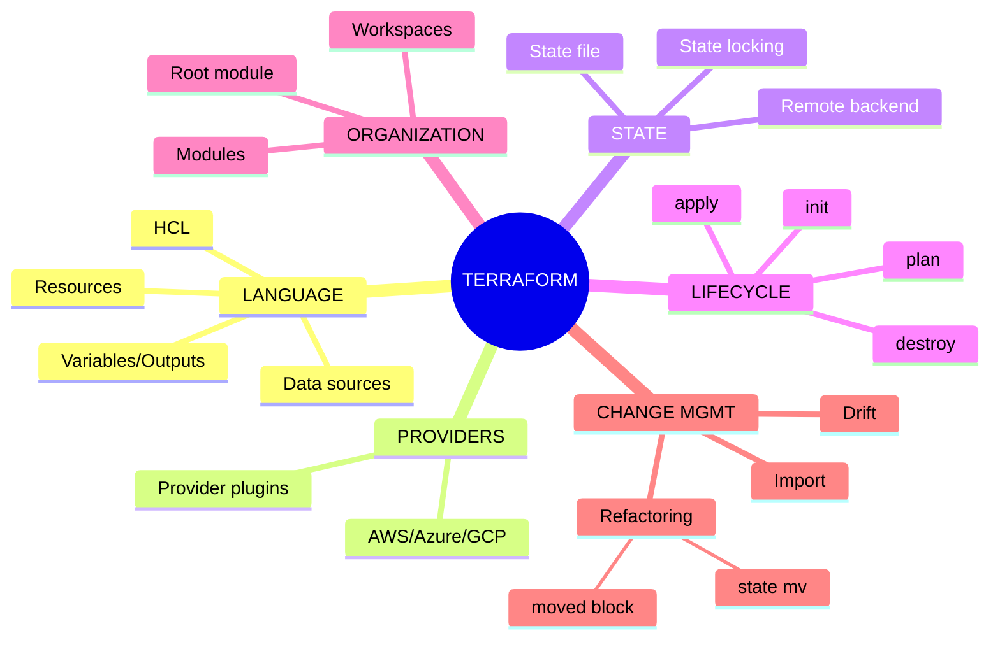
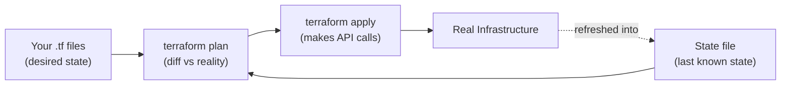
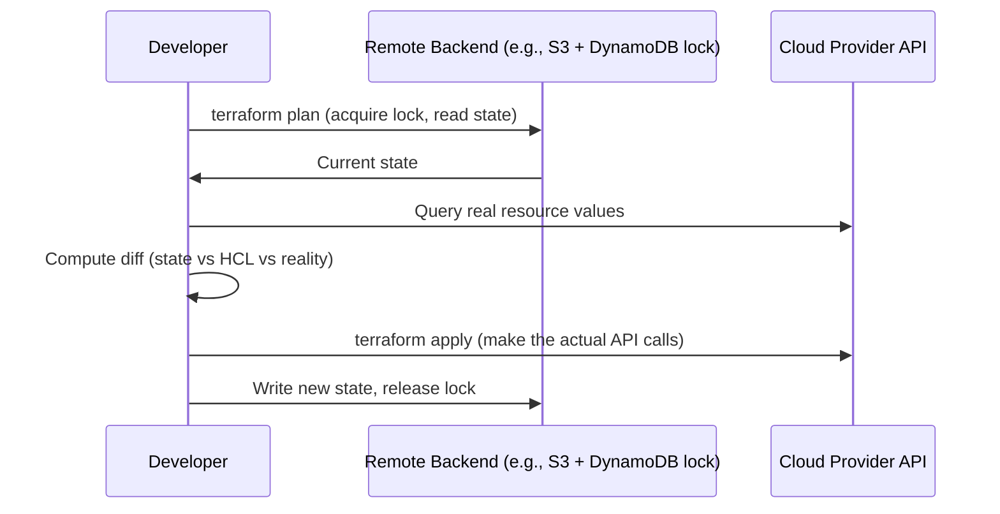

# The Complete Guide to Terraform

*A senior-engineer reference: HCL, providers & resources, state & locking, modules, workspaces, the plan/apply lifecycle, drift, best practices, and interview traps.*

> **How to read this guide.** Every topic starts with a plain **Definition**, then **Where it's used**, then the mechanics. Jargon gets a short definition in parentheses the first time it appears. Skim the mind map first to build the skeleton, then dive in.

---

## Table of Contents

1. [Mind Map — the whole landscape on one screen](#0-mindmap)
2. [What Terraform Actually Is](#1-what-is-terraform)
3. [HCL Basics: Resources, Data Sources, Variables](#2-hcl)
4. [Providers](#3-providers)
5. [State: the Most Important Concept](#4-state)
6. [The Plan/Apply Lifecycle](#5-lifecycle)
7. [Modules](#6-modules)
8. [Workspaces & Environments](#7-workspaces)
9. [Drift, Import & Refactoring](#8-drift)
10. [Terraform vs CloudFormation vs Pulumi](#9-comparison)
11. [Best Practices](#10-best-practices)
12. [Common Problems & Debugging Playbook](#11-debugging)
13. [Tricky Interview Questions & Answers](#12-tricky-qa)
14. [Cheat Sheets & Decision Tables](#13-cheatsheets)

---

<a name="0-mindmap"></a>
## 1. Mind Map — the whole landscape on one screen



**Reading the map:** Terraform's job is to keep three things in sync: **your HCL code** (what you want), **the state file** (what Terraform last knew to be true), and **real infrastructure** (what actually exists). Nearly every Terraform concept — plan, drift, import, locking — exists to manage the relationship between those three.

---

<a name="1-what-is-terraform"></a>
## 2. What Terraform Actually Is

**Definition.** Terraform is an **IaC** (Infrastructure as Code) tool that lets you declare the infrastructure you want in configuration files, then computes and executes the minimal set of API calls needed to make reality match that declaration — across any cloud or service with a Terraform **provider**.

**Where it's used.** Provisioning cloud infrastructure (VPCs, compute, databases, DNS, IAM) repeatably and reviewably, managing multi-cloud or hybrid environments from one tool, and any infrastructure change that should go through code review instead of console clicks.

**The core idea: declarative, not imperative.** You don't write "create a VPC, then create a subnet, then attach an internet gateway." You write *what the end state should look like*, and Terraform figures out the order of operations (via a dependency graph) and the diff between current and desired state on every run.



---

<a name="2-hcl"></a>
## 3. HCL Basics: Resources, Data Sources, Variables

**Definition.** **HCL** (HashiCorp Configuration Language) is Terraform's declarative configuration language — structured, human-readable blocks describing infrastructure.

```hcl
# A resource: something Terraform creates and manages
resource "aws_instance" "web" {
  ami           = var.ami_id
  instance_type = "t3.micro"

  tags = {
    Name = "web-server"
  }
}

# A data source: something Terraform reads but doesn't manage
data "aws_vpc" "default" {
  default = true
}

# A variable: an input to the configuration
variable "ami_id" {
  type    = string
  default = "ami-0123456789"
}

# An output: a value exposed after apply
output "instance_ip" {
  value = aws_instance.web.public_ip
}
```

| Block | Definition |
|---|---|
| **resource** | Declares an infrastructure object Terraform creates, updates, and destroys as needed. |
| **data source** | Reads information about something that already exists (managed by Terraform or not) — read-only, never modified. |
| **variable** | A named input, parameterizing the configuration (like a function argument). |
| **output** | A named value exposed after `apply` — for humans to read, or for another module/root config to consume. |
| **locals** | Named intermediate values computed within the configuration, to avoid repeating an expression. |

**Implicit dependency graph:** referencing `aws_instance.web.public_ip` in another resource automatically tells Terraform "create the instance first, then this." You almost never need to declare dependencies explicitly (`depends_on` exists for the rare case where a dependency isn't visible through a direct reference).

---

<a name="3-providers"></a>
## 4. Providers

**Definition.** A **provider** is a plugin that teaches Terraform how to talk to a specific API — AWS, Azure, GCP, Kubernetes, Datadog, GitHub, and hundreds more. It translates HCL resource blocks into that service's actual API calls.

```hcl
terraform {
  required_providers {
    aws = {
      source  = "hashicorp/aws"
      version = "~> 5.0"
    }
  }
}

provider "aws" {
  region = "us-east-1"
}
```

- **Provider registry** — the public catalog (registry.terraform.io) of official and community providers.
- **Version constraints** (`~> 5.0`) — pin provider versions so an unrelated provider upgrade doesn't silently change behavior on your next `apply`.
- A single configuration can use **multiple provider instances** (e.g., two AWS providers with different `alias`es for multi-region deployments).

---

<a name="4-state"></a>
## 5. State: the Most Important Concept

**Definition.** The **state file** (`terraform.tfstate`) is Terraform's record of what it *believes* exists — mapping each resource block in your HCL to the real-world object it created (e.g., `aws_instance.web` → actual instance ID `i-0abc123`). Without state, Terraform would have no way to know whether `aws_instance.web` needs to be created, updated, or already matches reality.

**Where it's used.** Every single `plan`/`apply` reads state first to know what already exists before computing a diff.

| Concept | Definition |
|---|---|
| **Local state** | The state file sits on disk on whoever's machine ran Terraform. ❌ Breaks immediately with more than one person/CI runner — no shared source of truth, easy to lose. |
| **Remote backend** | State stored in a shared location (S3, Terraform Cloud, Azure Blob, GCS) that everyone/every CI job reads from and writes to. ✅ The only sane choice past a solo experiment. |
| **State locking** | While one `apply` is running, the backend locks the state file so a second concurrent `apply` can't run against the same stale state and corrupt it (commonly implemented via a DynamoDB table alongside an S3 backend). |
| **`terraform refresh`** (now folded into `plan`/`apply`) | Reconciles state with the real infrastructure's current values before computing a diff. |
| **Sensitive values in state** | Secrets that pass through a resource (e.g., a generated DB password) land in the state file in plaintext by default — the state file itself must be treated and protected as a secret. |



**Never hand-edit the state file.** Use `terraform state` subcommands (`mv`, `rm`, `import`) or the `moved` block — direct edits are the single most common cause of "Terraform now thinks reality is something it isn't."

---

<a name="5-lifecycle"></a>
## 6. The Plan/Apply Lifecycle

| Command | Definition |
|---|---|
| `terraform init` | Downloads providers/modules, configures the backend. Run once per config, and again after adding a provider/module/backend change. |
| `terraform plan` | Computes and shows the diff between desired (HCL) and current (state + real infra) — **makes no changes**. |
| `terraform apply` | Executes the plan's changes against real infrastructure, then updates state. |
| `terraform destroy` | Computes and executes a plan that removes everything the configuration manages. |
| `terraform validate` | Checks HCL syntax and internal consistency without talking to any provider. |
| `terraform fmt` | Rewrites files into canonical formatting — run in CI to keep diffs clean. |

**Plan output symbols** — the most-read output in any Terraform-using team's PR review:
```
+  create
-  destroy
~  update in-place
-/+ destroy and re-create (a change that can't be done in-place)
```

**A `-/+` in a plan for a production resource is the single line worth stopping and reading carefully** — it usually means downtime (e.g., changing an RDS instance's engine version might force a replacement, not an in-place upgrade).

---

<a name="6-modules"></a>
## 7. Modules

**Definition.** A **module** is a reusable, parameterized bundle of resources — call it once per environment/team instead of copy-pasting the same 200 lines of HCL for every VPC you create.

```hcl
module "vpc" {
  source = "./modules/vpc"

  cidr_block = "10.0.0.0/16"
  azs        = ["us-east-1a", "us-east-1b"]
}
```

- **Root module** — the top-level configuration Terraform is actually run against; it composes other modules.
- **Child module** — any module called from another (via `source`), local or from the public registry.
- Modules take **input variables** and expose **outputs**, exactly like the root configuration does — a module is really just "a config you can call with parameters from somewhere else."
- **Versioning** — modules pulled from a registry/Git should be version-pinned (`source = "...?ref=v1.2.0"`), for the same reason as provider version pinning: an unpinned module update can silently change what the next `apply` does.

---

<a name="7-workspaces"></a>
## 8. Workspaces & Environments

**Definition.** A Terraform **workspace** lets one configuration manage multiple, state-isolated instances of the same infrastructure (e.g., the same VPC module, once for staging and once for production) without duplicating HCL files.

**Where it's used.** Lightweight environment separation for small/simple setups.

**The common alternative, and usually the better one for real environment separation:** separate root configurations (or separate state files/backends) per environment, sometimes via a directory-per-environment layout or a tool like Terragrunt on top of Terraform. Workspaces are convenient but easy to misuse — it's dangerously easy to `apply` against the wrong workspace (production) by forgetting to `terraform workspace select` first, since the HCL looks identical. Many teams deliberately avoid workspaces for prod-vs-staging separation for exactly this reason, preferring the extra directory-boilerplate but harder-to-mistake separate-state-file approach.

---

<a name="8-drift"></a>
## 9. Drift, Import & Refactoring

| Concept | Definition |
|---|---|
| **Drift** | When real infrastructure no longer matches what state says it should be — usually caused by a manual console change, or another tool touching the same resource. `terraform plan` surfaces drift as an unexpected diff. |
| **`terraform import`** | Brings an existing, unmanaged resource under Terraform's management by mapping it into state — for adopting infrastructure that was created outside Terraform. |
| **`moved` block** | Declares "this resource used to be named X, it's now named Y" so a refactor (renaming a resource, moving it into a module) doesn't make Terraform think the old one was destroyed and a new one created. |
| **`terraform state mv`** | The imperative, CLI equivalent of a `moved` block — same purpose, run once rather than declared in code. |
| **Lifecycle `prevent_destroy`** | A safety flag on a resource that makes Terraform refuse to destroy it, even if a plan would otherwise do so — a guardrail for critical resources like a production database. |

**Why drift matters:** if someone hand-edits a security group in the console, the *next* `terraform apply` will either silently revert their change (surprise!) or, if the config was also changed, produce a confusing diff that mixes their manual edit with your intended one. This is the core argument for disciplined "everything through Terraform, nothing through the console" workflows.

---

<a name="9-comparison"></a>
## 10. Terraform vs CloudFormation vs Pulumi

| | **Terraform** | **CloudFormation** | **Pulumi** |
|---|---|---|---|
| Scope | Multi-cloud (any provider) | AWS-only | Multi-cloud |
| Language | HCL (declarative DSL) | YAML/JSON | Real programming languages (TypeScript, Python, Go, etc.) |
| State | Explicit state file you manage (or a managed backend) | Managed by AWS, invisible to you | Explicit state, similar model to Terraform |
| Ecosystem | Very large (thousands of providers/modules) | Deep AWS-native integration, less relevant elsewhere | Smaller, growing |
| Best for | Multi-cloud or mixed-cloud shops, the de facto industry standard | AWS-only shops wanting zero extra tooling | Teams that want IaC in a general-purpose language, not a DSL |

---

<a name="10-best-practices"></a>
## 11. Best Practices

- **Remote backend with locking, from day one** — never local state for anything beyond a personal experiment.
- **Pin provider and module versions** — an unpinned upgrade changing behavior mid-`apply` is a self-inflicted incident.
- **Small, composable modules** over one giant monolithic configuration — easier to review, test, and reuse.
- **Separate state per environment** (or be very disciplined with workspaces) — production and staging should never share one state file.
- **Run `plan` in CI on every PR**, require a human to read the diff before `apply` — this is where most bad changes get caught.
- **Never hand-edit `.tfstate`**, and never commit it to Git (it can contain secrets) — `.gitignore` it and rely on the remote backend.
- **Use `prevent_destroy` on anything catastrophic to lose** (production databases, critical S3 buckets).

---

<a name="11-debugging"></a>
## 12. Common Problems & Debugging Playbook

| Symptom | Likely cause | Fix |
|---|---|---|
| `Error acquiring the state lock` | Another `apply` is running, or a previous one crashed without releasing the lock | Wait for the other run; if genuinely stale, `terraform force-unlock` (carefully, after confirming no other run is active) |
| Plan wants to destroy/recreate a resource you didn't touch | A dependency's change forces replacement, or drift | Read the "reason for replacement" in plan output; check for out-of-band manual changes |
| `Error: resource already exists` on apply | The real resource exists but isn't in Terraform's state | `terraform import` it instead of trying to create it again |
| Plan shows changes every single run, even with no code changes ("perpetual diff") | A provider computing a value non-deterministically, or a config value that doesn't match the API's normalized form | Check provider docs/known issues for that resource/attribute; sometimes needs an `ignore_changes` lifecycle rule |
| Renaming a resource in code destroys and recreates it | Terraform sees a rename as "delete old address, create new one" unless told otherwise | Add a `moved` block (or `terraform state mv`) instead of just renaming |
| Module update breaks unrelated resources | Unpinned module/provider version pulled in a breaking change | Pin versions; review changelogs before bumping |
| Secrets visible in state file | Expected behavior — state isn't encrypted by default | Use a backend with encryption at rest (e.g., S3 with SSE), restrict state file access tightly |

---

<a name="12-tricky-qa"></a>
## 13. Tricky Interview Questions & Answers

**Q: Why does Terraform need a state file at all — why not just query the cloud provider directly every time?** Two reasons: performance (querying every resource's full details on every command would be slow at scale), and because state is what lets Terraform *map* an HCL resource block to a specific real-world object and detect resources that should be destroyed because they were removed from code — the API alone can't tell you "this resource block used to exist and now doesn't."

**Q: What's the danger of local state, precisely?** No locking (two people can `apply` concurrently and corrupt/race on the same infrastructure), no shared source of truth (each person's local state can drift from what the others believe), and it's a single point of loss (one deleted laptop = the map to your infrastructure is gone).

**Q: `terraform plan` shows a resource will be destroyed and recreated — what does that actually mean, and why does it happen?** Some attribute changes can't be applied in-place by the provider's API (e.g., changing an EC2 instance's AMI usually forces replacement) — Terraform has to tear down the old resource and stand up a new one, which for stateful resources (a database, a queue with data) can mean data loss or downtime. Always read *why* a `-/+` is happening before applying.

**Q: How do you safely rename a resource in Terraform without destroying it?** Use a `moved` block (or `terraform state mv`) to tell Terraform "the object currently tracked as X is now named Y" — without it, a rename in HCL looks identical to "delete the old one, create a new one" from Terraform's perspective.

**Q: Workspaces vs separate root configurations for environments — what's the trade-off?** Workspaces are less HCL duplication but higher risk (identical code, easy to `apply` against the wrong workspace by mistake — production and staging *look* the same in the terminal). Separate configurations/state per environment are more boilerplate but structurally harder to point at the wrong environment by accident. Most teams managing real production infrastructure lean toward the latter.

**Q: What causes drift, and how do you find it?** Anything that changes real infrastructure outside Terraform — a manual console edit, another automation tool, an auto-scaling event modifying a tag. `terraform plan` surfaces it as an unexpected diff on the next run (Terraform refreshes real values before comparing).

**Q: Terraform vs CloudFormation — when would you pick CloudFormation anyway?** When you're AWS-only, want zero additional tooling/state-backend to manage (AWS manages CloudFormation's state internally), and value the very deep, same-day support for new AWS features that CloudFormation gets before third-party providers catch up.

---

<a name="13-cheatsheets"></a>
## 14. Cheat Sheets & Decision Tables

### The lifecycle, in order
```
terraform init      → download providers/modules, configure backend
terraform validate  → check syntax (optional, fast sanity check)
terraform plan       → compute the diff, review it
terraform apply       → execute the diff, update state
terraform destroy    → tear down everything this config manages
```

### Pick an environment-separation strategy
```
Solo/small project, low risk of mistakes    → Workspaces
Real production infrastructure               → Separate root configs / separate state per environment
```

### Refactoring safely
```
Renaming a resource                → moved block / terraform state mv
Adopting an existing resource       → terraform import
Splitting a monolith config         → moved block across module boundaries
```

### Final principles
1. **Remote backend with locking is not optional** past a solo experiment.
2. **State is the source of truth Terraform reasons from** — protect it, never hand-edit it, never commit it to Git.
3. **Read the plan, especially every `-/+`**, before `apply` — that line is where downtime hides.
4. **Pin provider and module versions** — reproducibility depends on it.
5. **Nothing touches production infrastructure outside Terraform** — or `plan` becomes a lie the next time it runs.
6. **Small modules, versioned and composed**, beat one giant configuration every time.
